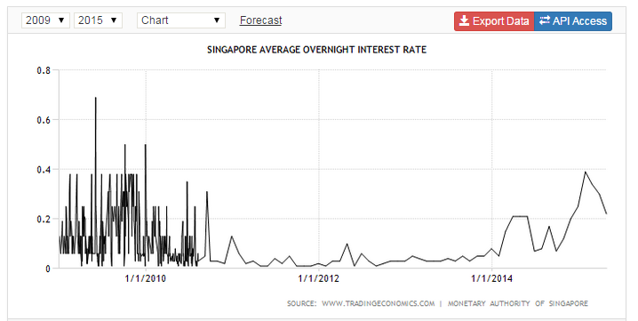
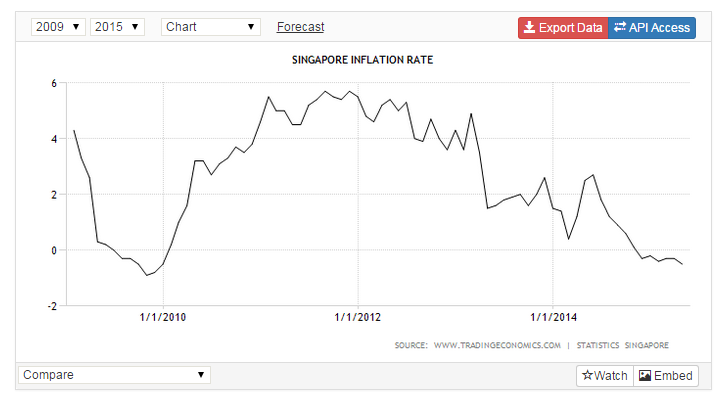
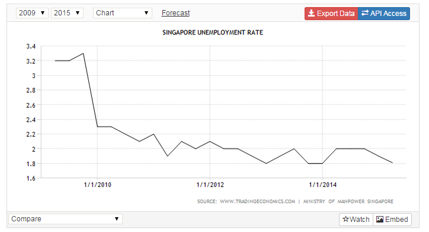

While I was in transit back from New Mexico, [Scott Sumner](http://www.themoneyillusion.com/?p=29715) noticed [my criticisms](http://informationtransfereconomics.blogspot.com/2015/06/this-analysis-is-so-bad.html) of his (and Mark Sadowski's) austerity analysis. This blog being the farthest from the bright center of the econoblogosphere it might take me awhile to get to all the comments resulting from being linked by a real blog, but I will do my best \[1\]! I appreciate all kinds of criticism. That may seem like some sort of platitude, but I genuinely mean it. Arguing about things generally creates a better understanding -- even if it is just for those watching.

The first "comment" addressed will be Sumner's post itself (linked above).

Let me get one thing out of the way. The theory I'm working my way through that Scott (probably sarcastically) refers to as "revolutionary" actually reduces to something that effectively looks like monetarism under certain conditions ([here](http://informationtransfereconomics.blogspot.com/2014/06/reconciling-expectation-and-information.html) is a discussion of expectations, [here](http://informationtransfereconomics.blogspot.com/2014/01/strange-new-monetary-worlds.html) is how the theory partially reproduces Sumner's view of interest rates). For an [information transfer (IT) index](http://informationtransfereconomics.blogspot.com/2014/06/money-unit-of-information-and-medium-of.html) _κ = 1/2_, the theory is the quantity theory of money (imagine _κ_ as part of a model for velocity in _MV = PY_). So I agree that the monetarist position is sometimes correct -- and that there exists data out there that confirms the monetarist model (if there wasn't, that would be hard for my model to explain). Even Paul Krugman believes in the monetarist model when countries aren't at the "zero lower bound" (ZLB). So the basic issue here is whether there exist conditions under which monetary policy is ineffective.

My argument against Scott's and Mark Sadowski's analysis was that it failed to properly select data given the conditions and then failed to properly measure effectiveness (on the graph at [the original post](http://www.themoneyillusion.com/?p=29692) from Scott has issues with both the selection of points to use and their x-axis and y-axis positions). They failed to treat the monetarist model and the Keynesian model on equal footing.

> _So what’s my defense? Here’s how I look at it. The Keynesians did several studies of the relationship between austerity and growth that were highly flawed, for too many reasons to mention. Confusing real and nominal GDP. Mixing countries with and without an independent central bank. Wrongly assuming correlation implied causality. Mixing countries at the zero bound with countries not at the zero bound. Just a big mess. ... And then the Keynesians did blog posts suggesting that these studies provided some sort of scientific justification for the claim that austerity slows growth._

Basically -- other people do it too. _Modus omnia facere_. I do agree that there is some pretty bad analysis out there on the internet from a technical standpoint. I used to blog about that (one of my favorite posts was [this one](http://spittlefleckedire.blogspot.com/2011/12/youre-killing-me-nasa.html) about NASA's artist's conceptions).

But then looking at the list Scott provides we see that he is mostly upset the Keynesians didn't use his model. The liquidity trap happens when inflation is low (too low to push real interest rates below the negative natural rate of interest) -- in that case, it doesn't matter if you use RGDP or NGDP. With inflation _i ≈ 0_, _ΔRGDP/RGDP ≈ ΔNGDP/NGDP_. Mixing countries with and without an independent central bank is also fine in the Keynesian model -- liquidity trap conditions are effectively identical to lacking an independent central bank. In both cases monetary policy isn't going to offset fiscal policy. In a liquidity trap, because it can't; without a independent central bank, because monetary policy isn't looking at your country for indicators (and/or gold discoveries don't care about your fiscal policy).

The old maxim about correlation and causation is the last refuge of scoundrels -- you can't develop any theory without first noticing correlations. You see a correlation and come up with a theory. If your theory reproduces those correlations _and other correlations_, that's a good model of the way the world works. I think a better way to phrase that maxim is: correlations do not imply their theory of causation. In any case, that complaint covers Scott and Mark's analysis as well.

> _I find it interesting that our critics are outraged that we included some non-zero bound countries, when the Keynesians did as well. For instance, the 18 eurozone countries were certainly not at the zero bound for the vast majority of this period. Their main interest rate fluctuated between 0.75% and 1.50% between early 2009 and 2013._

So Scott is right -- the ECB didn't have zero interest rates, yet Krugman referred to the ECB being at the ZLB or in a liquidity trap. Confusing? Yes. This is exactly the kind of thing that made me want to create my own theory (which in fact [clears this up](http://informationtransfereconomics.blogspot.com/2014/06/krugman-keynes-and-liquidity-trap.html)). Interest rates being zero tends to be a good indicator of a liquidity trap, but it is not perfect. It is also important to note that Keynes' original liquidity trap could happen at any interest rate.

The entire econoblogosphere should be much more careful about what is meant by the "zero lower bound" (ZLB) -- I am as guilty of being sloppy here, too. Sometimes it is used to mean interest rates are actually zero. Sometimes it is used to mean the appropriate target nominal interest rate (from e.g. a Taylor rule for nominal rates, or estimate of the real rate of interest after accounting for inflation) is less than zero (i.e. because of the ZLB, you can't get interest rates low enough). I've usually stuck to the latter definition (so does the SF Fed -- see e.g. [here](http://www.frbsf.org/economic-research/publications/economic-letter/2009/may/fed-monetary-policy-crisis/)). I was under the impression Scott understood that this latter definition is generally what is meant by the ZLB when economists talk about it. Apparently not (and Krugman's blogging seems to be a source of this confusion).

[Here is the SF Fed again](http://www.frbsf.org/economic-research/publications/economic-letter/2011/june/monetary-policy-europe/) with its view that the periphery Eurozone countries have a negative interest rate implied by the Taylor rule (the core has a positive rate). This would seem to mean that you should include Spain, Greece, etc but not Germany or France when doing the regressions in Scott's original post to test the Keynesian hypothesis and see if austerity is contractionary.

So if interest rates are above zero, the "ZLB" can still be a problem. But what about being at zero nominal interest rates? That surely indicates a liquidity trap, right?

Was Singapore at the ZLB from 2009 to 2014? Looks like it from the interest rate:

Of course, there could of course be lots of effects here -- e.g. possible importation of the US interest rate from holding US currency dollar denominated debt. But if we look at unemployment and inflation, it appears Singapore had no problem getting its real interest rate to go negative -- almost -6% -- likely hitting its Taylor Rule (I admit I'm too lazy to check right now and see  \[1\]):

[Israel did so well with this](http://esoltas.blogspot.com/2012/06/israel-targets-ngdp.html) that it never really took part in the global recession. It had almost zero nominal rates briefly, but no liquidity trap. I also [show here that Iceland](http://informationtransfereconomics.blogspot.com/2015/06/you-forgot-to-use-my-model-non-case-of.html) seems to have had no problem getting its real interest rate to go strongly negative (it never had zero nominal rates, though). 

The ZLB language is problematic and we can probably fault Paul Krugman for popularizing it, especially when he says "at the zero lower bound". While that language is true for the US, it obviously leads to misinterpretations (even by trained economists like Scott). The liquidity trap language is better -- it implies an entire model, but tends to be too technical. Brad DeLong's "shortage of safe assets" version is good, but also a bit technical. This lowly blog isn't going to change the language by itself. I could suggest a minor tweak from "at the ZLB" to "because of the ZLB".

The information transfer model [has a good answer](http://informationtransfereconomics.blogspot.com/2014/06/krugman-keynes-and-liquidity-trap.html) -- we could refer to high IT index ("liquidity trap") or low IT index ("monetarist") economies \[2\].

Scott might not remember, [but we had this same argument just over a year ago](http://informationtransfereconomics.blogspot.com/2014/05/models-matter.html). I made the same points about the ZLB. The main point then as now is that _**models matter**_ \-- you have to treat the Keynesian model correctly in order to test it. You also have to have a model of how fiscal and monetary pieces come together in order for your data to have a context.

I'm not personally defending the Keynesian view because I think it is the correct model. I think it was misunderstood by Scott in such a way that led to an unfair treatment. I do have some personal stake here though -- the information transfer framework view overlaps with the Keynesian view under the basic conditions that Keynesians refer to as a liquidity trap. I actually came up [with a pretty good case](http://informationtransfereconomics.blogspot.com/2015/03/the-keynesian-part-of-abenomics-is-part.html) that Abenomics was successful as a result of its Keynesian component. It's a model-dependent result, sure. But its a model that lets the data select either a monetarist model (IT index _κ ~ 0.5,_ where monetary offset happens) or a Keynesian model (IT index _κ ~ 1.0_ where the IS-LM model is a good approximation). The data say you should select the Keynesian one.

And that is my main point in my strong criticism of Scott and Mark's analysis. They're not putting the Keynesian model and monetarist model on equal footing (and sure _omnia facere_ -- everyone does it) and letting the data decide. I mention in [the post Scott saw](http://informationtransfereconomics.blogspot.com/2015/06/this-analysis-is-so-bad.html) the ways the analysis could be fixed to not give a leg up to the monetarist version. And even Paul Krugman believe there are cases where monetarist economics are the better model (where inflation and interest rates are "high"). You just have to be fair. And _modus omnia facere_ isn't a solution.

**Footnotes:**

\[1\] My best includes accounting for the fact that I have just returned from a two week work trip, so spending some time with my wife on a rather beautiful day in Seattle is a little higher priority.

\[2\] Actually, the model [makes all of macroeconomics](http://informationtransfereconomics.blogspot.com/2015/02/information-equilibrium-paper-draft_23.html) much easier. Here is the [Solow growth model](http://informationtransfereconomics.blogspot.com/2015/05/the-rest-of-solow-model.html) for example.
