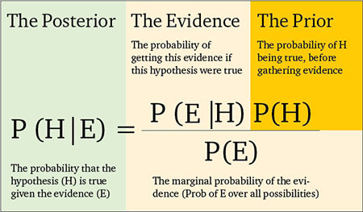

Nick Rowe has [a great post up today](http://worthwhile.typepad.com/worthwhile_canadian_initi/2015/06/fiscal-policy-and-indifference-about-the-size-of-government.html) that really lays out the prior behind monetarism. He simply holds that the government may be good at providing some things, but progressively worse at providing more and more of the economy.

Why? That's just assumed as the prior before gathering evidence. The government is made of people just like businesses, but when a person works for the government, that person's marginal product is lower for some unexplained reason. My marginal product for the company I work for is _X_, but my marginal product in a government job is _α X_ with  _0 < α < 1_ because reasons. Let's just cede that point to Nick. Maybe it's true.

However! Regardless of what my marginal product _α X_ is, it simply must be greater than a position in what Matt Yglesias called the [unemployment sector](http://www.slate.com/blogs/moneybox/2012/06/21/it_is_easy_to_beat_the_productivity_of_the_unemployment_sector.html). That is to say _α X_  _\> 0_ for all reasonable estimates of _α_.

And fiscal policy directed at companies (via e.g. government contracts to build stuff) to hire at full marginal product _X > 0_ also is better than people working in the unemployment sector. Therefore fiscal policy should essentially be directly correlated with the unemployment rate. The only way the unemployment sector should be large in a country is if you have simply run out of things to do -- everyone's marginal product is zero.

Nick's argument ignores the existence of a very unproductive sector of the private economy ... the unemployment sector.
