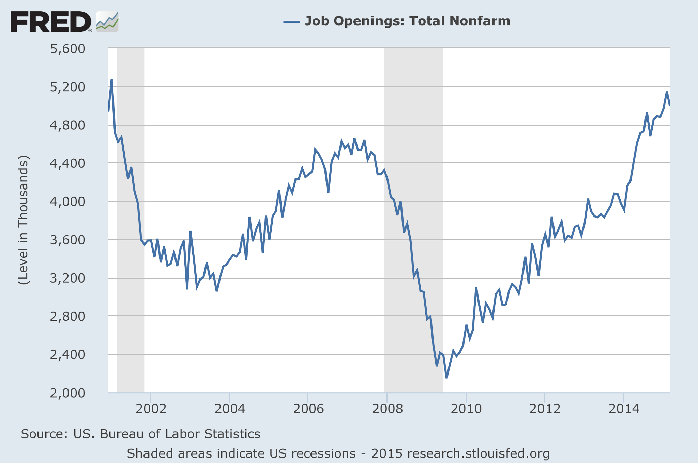
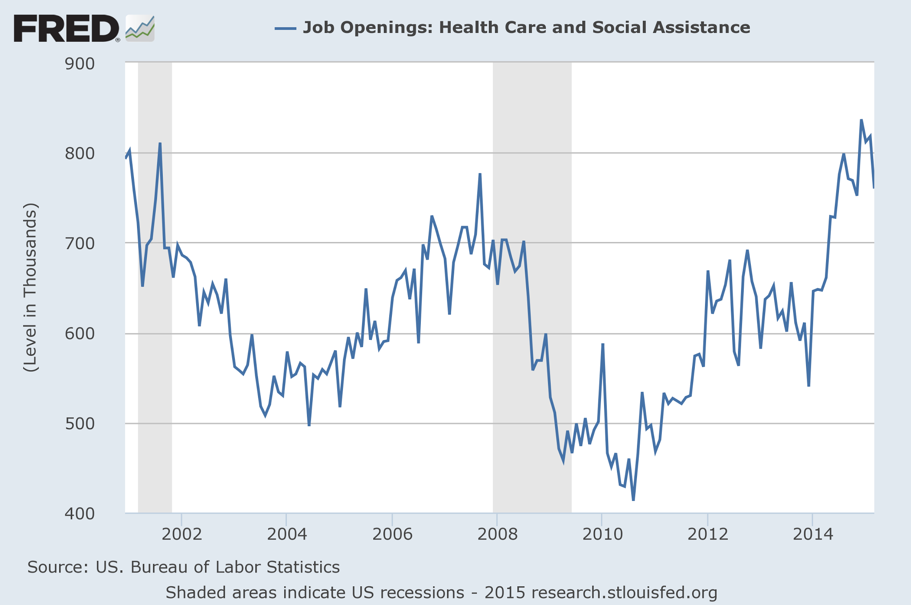
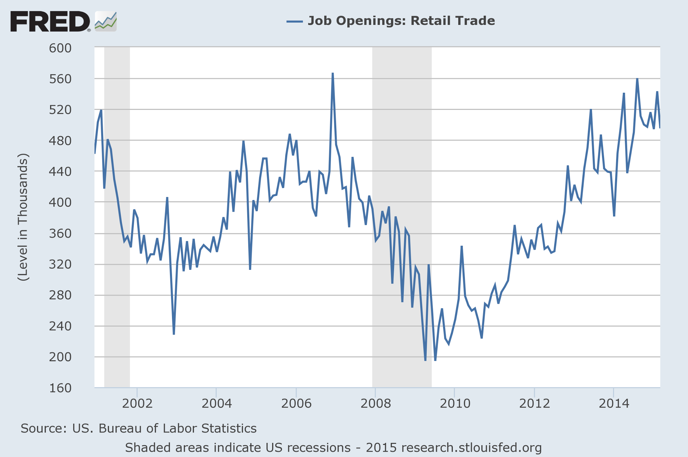

The question that's come up in the econoblogosphere is this: shouldn't we be getting out of the liquidity trap at some point? [Brad DeLong](http://www.bradford-delong.com/2015/06/watching-a-discussion-the-omega-point.html) puts this in terms of the "omega point" -- shouldn't the long run (the omega point) be getting closer? Krugman says we should expect a long slog.

Brad DeLong is right -- persistent low interest rates [should be puzzling](http://informationtransfereconomics.blogspot.com/2014/09/the-great-stagnation-information.html) from a mainstream economic view.

[Scott Sumner](http://www.themoneyillusion.com/?p=29523) agrees mostly with Krugman and DeLong, but has a just so story that allows him to hold onto his priors.

> _On the other hand Krugman’s right that \[a persistent low interest rate\] isn’t actually unprecedented, we had near-zero rates from 1932 to 1951, and then again in Japan beginning in the late 1990s, and still ongoing. ..._ 

> _In my view we had a perfect storm of shocks that just barely added up to zero rates for 7 years in the US, but not enough for Australia, and more than enough for Japan (and perhaps going forward, Europe.)_

I ask you: which story is better from a scientific/Occam's razor point of view ...

1.  A perfect storm of slightly different shocks lead to different effects for different countries (with no empirical data shown). 
2.  A monetary model of interest rates that compares favorably with empirical data and has two regimes ("quantity theory" and "liquidity trap/IS-LM") that [continuously deform into each other](http://informationtransfereconomics.blogspot.com/2014/06/krugman-keynes-and-liquidity-trap.html). BTW, that's the [same model](http://informationtransfereconomics.blogspot.com/2015/02/information-equilibrium-paper-draft_23.html) in the graphs below. It describes short and long term interest rates simultaneously. For different countries.

The basics of that model are that interest rates are in information equilibrium with the price of money and the price of money is a detector of information flowing in order to maintain information equilibrium between nominal output (NGDP) and the monetary base.

Or we can look at the perfect storm ... starting with an unexplained 30 year trend:

> _A 30-year downtrend in the Wicksellian equilibrium real interest rate. And the last step down after 2008 was aided by a structural shift in the US and Europe from investment to consumption, as an after effect of the housing bust and tighter lending standards._

> _For instance, after unemployment compensation returned to the usual 26 weeks in early 2014, job growth accelerated._

He's right. It did. But what happened? Again, you need a model and the best economic model is a matching model. It's completely mainstream, but here's [the information equilibrium version](http://informationtransfereconomics.blogspot.com/2014/03/information-transfer-and-cobb-douglas.html).

What happens is that a job opening and a job seeker are "matched" and form a "hire". Now job seekers have outnumbered openings by more than is typical since the recession. At least until the start of 2014 when **job openings jumped up**. Have a look at this chart:

So a drop in unemployment compensation caused businesses to offer more jobs? It may well be true, but that paints a sick view of business owners. They waited around until people were more desperate and then put out some ads for jobs?

If you look into this a little bit more than _not at all_, you can actually see that **about a quarter of that boom** is actually in the health care industry (no boom is visible in retail, the jobs most people have):

Note that January 2014 is when the PPACA (aka Obamacare) went into effect. The jobs boom has little to do with unemployment compensation and is pretty much mostly Obamacare -- insurers, doctors' offices and hospitals had to hire staff to deal with the influx of newly insured patients. 

Or you can hold onto your prior that unemployment insurance is not a free market therefore it must have some sort of bad effect ... it's just gotta!

Finally, there's this:

> _Maybe it’s just my imagination, but on occasion I think I see \[Paul Krugman\] “peeking” at markets, to confirm his (often excellent) intuition about where things are going. And when he fails to do so, as in early 2013, he pays a heavy price in lost prestige._

[Not this again](http://informationtransfereconomics.blogspot.com/2015/01/scott-sumner-data-mangler.html)! Sumner's analysis was mathematically incorrect and a rather cheesy Keynesian model gets the order of magnitude about right. Actually, that Keynesian story it [gets it about right for Japan as well](http://informationtransfereconomics.blogspot.com/2015/03/the-keynesian-part-of-abenomics-is-part.html)!
