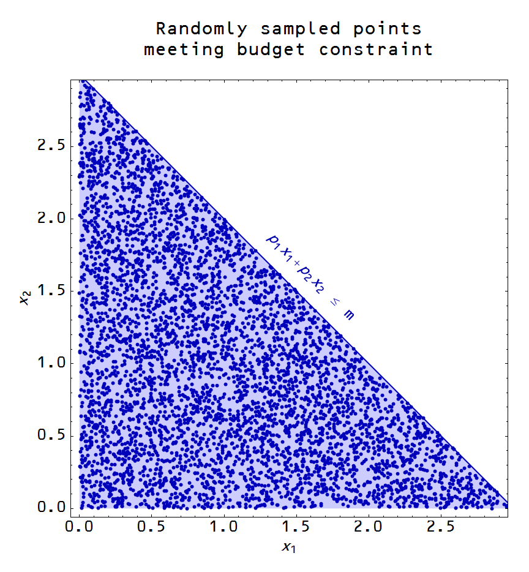

Noah Smith [wrote](http://www.bloombergview.com/articles/2015-06-01/a-dose-of-psychology-does-economics-field-some-good) about behavioral economics the other day. He makes the claim that there is no one theory of human behavior, no one psychology, so it is unlikely to replace the utility maximization framework of economics:

> _... psychology itself has no unified theory, at least not yet. Cognitive and social psychology are basically pre-paradigmatic sciences ... Psychology, therefore, will be able to furnish econ with a large grab bag of anomalies, but there’s a good chance it will never provide a grand unified theory that will render the rational maximization of classical economics entirely obsolete._

**1\. Rational maximization is a psychology**

It is not a particularly fulfilling theory of human behavior, but at least it's an ethos a psychology. Therefore there is a default assumption and that should be recognized.

**2\. Rational maximization can follow from random behavior**

[Random behavior in high dimensional spaces](http://informationtransfereconomics.blogspot.com/2015/03/utility-in-information-equilibrium-model.html) can look like the results of optimization. It's really cool. And it means we can know nothing about psychology and still study economics!

**3\. Paradigms aren't just theoretical**

I personally would lump economics into the group of pre-paradigmatic sciences as well. There may be a paradigm, but it isn't empirically successful (with notably rare exceptions including [a case where behavior was taken to be random](http://noahpinionblog.blogspot.com/2014/03/a-grand-unified-theory-of-behavioral.html)). [There is no framework](http://informationtransfereconomics.blogspot.com/2015/05/frameworks-and-bohr-model-analogy.html), just a collection of models. Unless you use information equilibrium! Both [empirically successful](http://informationtransfereconomics.blogspot.com/2015/02/information-equilibrium-paper-draft_23.html) (and [here](http://informationtransfereconomics.blogspot.com/2015/06/ny-fed-dsge-model-predictions-are-not.html)) and [theoretically sensible](http://informationtransfereconomics.blogspot.com/2015/04/information-theory-and-economics-primer.html).
