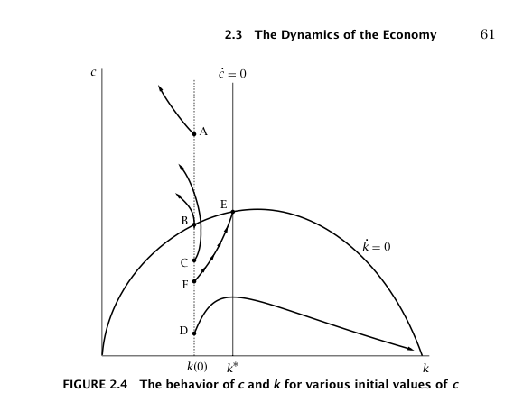
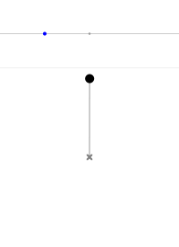
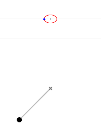
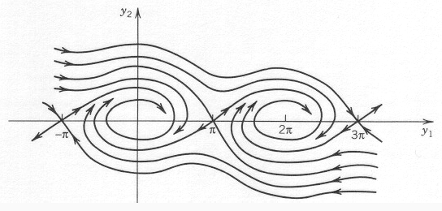

Also in Romer's _Advanced Macroeconomics_ is the Ramsey-Cass-Koopmans model (here is [Wikipedia](https://en.wikipedia.org/wiki/Ramsey%E2%80%93Cass%E2%80%93Koopmans_model)'s version). It has some of the same flavor as the Solow model, but it has a rather silly (from this physicist's perspective) equilibrium growth path:

We are expected to believe that an economy not only will start out (luckily) somewhere on the path from F to E in the diagram above (you can extend F back towards the origin), but will in fact stay on that (lucky) path until reaching E at which point it will stay there (with a bit of luck).

This is a bit like a believing a damped pendulum, given just the right swing from the just the right height, will go all the way around and just come to a stop so that it is "bob-up" like in [this picture from Wikipedia](https://en.wikipedia.org/wiki/Pendulum_\(mathematics\)):

My first reaction to seeing that growth phase diagram was to laugh out loud. Economists couldn't be serious ... could they? Now it isn't strictly impossible, but the likelihood is so small that the tiniest air current will cause it to fall back to one of the more normal equilibria:

But the phase diagram from the Ramsey-Cass-Koopmans model is basically equivalent to the phase diagram of a damped pendulum near one of its unstable equilibria:

So basically, according to the Ramsey-Cass-Koopmans model, all economies head towards being all capital or all consumption. Who thought this was a good model?

Now there is some jiggery-pokery in the model -- economists include "transversality conditions" that effectively eliminate all other possible paths. If I eliminate all other paths besides the ones that lead to the unstable equilibria in the pendulum case, I get magic pendulum that stands on its head too!
