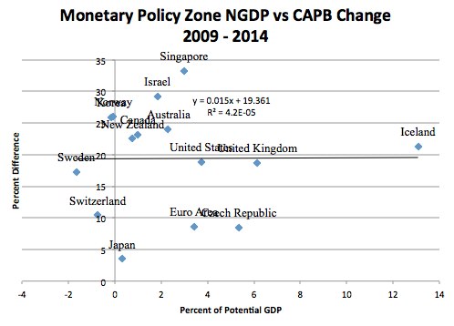

The third sentence (or actually part of the second sentence) of Scott Sumner's post is:

> _Keynesian: Fiscal austerity is contractionary at the zero bound regardless of whether you have an independent central bank._

Note: "at the zero bound" and "regardless of  ... independent central bank". Sumner recognizes the Keynesian model ...

Then he says that this graph shows fiscal contraction has no effect in countries (some at the ZLB, some not ... who cares!) with exclusively independent central banks (forget the regardless above, that didn't matter) after throwing out the countries without independent central banks:

What???!!!

Basically Scott Sumner undid his sentence:

_Keynesian: Fiscal austerity is contractionary at the zero bound regardless of whether you have an independent central bank._

You could even take out the "austerity" in that sentence as we see in the first point below. This is not what Keynesian's say at all. This is the same garbage analysis I've seen before from Sadowski and Sumner:

1\. **Iceland is a garbage data point.** It was never at the ZLB (at 6% back in 2014, today it's at 5.75%) and the fiscal consolidation treated as austerity is simply disingenuous (it happens after the finance minister declared victory over the recession!). It's just intellectual malpractice of the worst kind. You can go into the gory details [here](http://informationtransfereconomics.blogspot.com/2015/06/you-forgot-to-use-my-model-non-case-of.html).

2\. **Why eliminate countries without independent monetary policy?** Austerity at the ZLB doesn't care if you control your monetary policy or not. _That **assumes the market monetarist model** in order to prove the market monetarist model._ Those points should not be removed. Note Scott's sentence! It is contractionary at the ZLB **regardless of whether you have an independent central bank!**

As I say [here](http://informationtransfereconomics.blogspot.com/2015/01/scott-sumner-data-mangler.html):

> Sumner does [cite approvingly](http://www.themoneyillusion.com/?p=28381) of a purported "takedown" of Krugman's austerity graph, but that "takedown" assumes the market monetarist model in order to throw out data (basically, all the liquidity trap countries) that make up the bulk of the correlation.

Let's just throw out all the bulk of the liquidity trap countries engaging in austerity! Lo and behold, what's left over says austerity isn't contractionary.

3\. **You can't include countries that aren't at the ZLB in order to say something about austerity at the ZLB.** South Korea (2% in 2014, 1.5% today), Australia (it was at 2.5% in 2014, 2% today), and New Zealand (3.5% back in 2014, 3.25% today) weren't at the ZLB in 2014. So not only have we thrown out all the liquidity trap countries, but we get to add in a bunch that aren't in a liquidity trap! Sumner does recognize the zero lower bound -- remember his sentence quoted at the top of this post. But somehow it only selectively applies to data that he wants to include.

Overall, this is Sumner's blog post where we replace "austerity isn't contractionary at the ZLB" with "all swans are black"

> All swans are black. So let's throw all the white swans out of the data set and put in a bunch of black ducks. Look: all birds are black!

Really???!!!

I used to think Sumner was the best advocate of the monetarist position. I mean he even pulled Matthew Yglesias [over to the dark side](http://informationtransfereconomics.blogspot.com/2015/02/market-monetarism-quicker-easier-more.html). But this is really disappointing. You can't assume your model in order to include or leave out data points that favor or disfavor your model. You just can't do that. It's wrong.

Does this really pass for economic research? It makes me sad.

No wonder there hasn't been any uptake of the information transfer model. Economists don't know what good research looks like.
