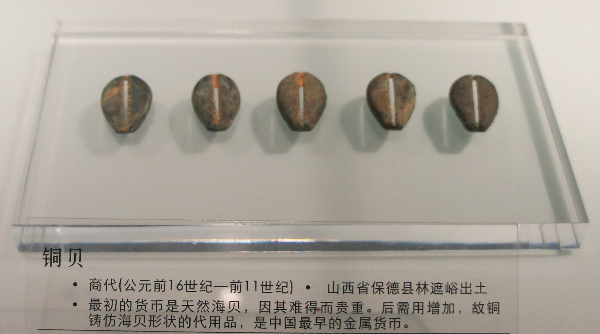

How is that for a bold title? Well, you're in for a (surprisingly short) strange ride from abstract mathematics to ancient history.

I have made the argument several times (first [here](http://informationtransfereconomics.blogspot.com/2015/03/utility-in-information-equilibrium-model.html), most recently [here](http://informationtransfereconomics.blogspot.com/2015/06/minimac-as-information-equilibrium-model.html)) that the most likely allocation against a _n_ dimensional budget constraint with _n >> 1_, even when allowing states that don't saturate it, is actually at the budget constraint (_M_) because the location of the centroid of the _n_\-dimensional polytope gets closer to the _n − 1_ dimensional budget constraint hyperplane as _n → ∞_. Here is a picture:

The hyperplane is the blue triangle (with maximum values of _Cᵢ = M_ at the corners), and there are random points uniformly distributed along axes _C₁ - C__₃_. You can see how the centroid (black) is a bit closer to the hyperplane than you'd expect for the 2D triangle that appears in the edge-on view of the budget constraint hyperplane. 

Let's imagine that budget constraint represents the total amount of money in the economy at a given time being used in transactions for various goods, services, investments, etc _C__₁__, C₂, C₃, ... Cn_.

What does the argument above imply? It means that (at any given time) money, if there isn't some coordinating factor, will most likely be completely allocated towards goods, services, investment, etc and that the difference between the information content in the money allocation \[the information required to e.g. store everyone's bank balance\] and the information content of the allocation of all goods and services \[the information required to store the list of which goods belong to whom\] _I(N) − I(M)_ will be minimized so that if  _I(N) ≥ I(M)_

_α_ _I(N) = I(M)_

for some  _0 < α ≤ 1_, and the [information transfer equation](http://informationtransfereconomics.blogspot.com/2013/04/the-information-transfer-model.html) (in the system _N→M_) becomes:

_α_ _(N/dN) log kn = (M/dM) log km_

_N/dN = k' M/dM_ 

with _k' = (1/α) (log km/log kn)_. That is to say we've recovered an effective version of the original information transfer equation with a modified information transfer index _k'_ but without non-ideal information transfer where _N/dN_  _≥_  _k M/dM._ Maximum entropy results in the ideal information transfer condition _I(N) = I(M)_ we've just assumed in the past (or taken to be [a first order approximation](http://informationtransfereconomics.blogspot.com/2015/05/information-equilibrium-as-economic.html)).

Because of the increased number of identical states when goods are measured in terms of money, money helps saturate the entropy bound and therefore the budget constraint hyperplane. Combined with [this post](http://informationtransfereconomics.blogspot.com/2015/05/money-defined-as-information-mediation.html) on how money can be introduced to mediate information equilibrium between two quantities leaving you with a theory that only requires one of the quantities and money when the information equilibrium equation holds ... we have a pretty complete theory of what money is and does.

> _Money is a thing that mediates transactions and has high information entropy_

It maximizes information entropy when it has no intrinsic purpose other than mediating transactions -- i.e. if it is one of the commodities (or goods, or services, or investments, etc) _C__₁, C₂, C₃, ... Cn_ \-- it will more likely line up along that dimension, resulting in _C__₁ + C₂ + C₃ + ... + Cn <_ _M_.

Note that we will fail to have ideal information transfer if the dimension is low (there will be larger fluctuations away from saturation) or the allocation of money becomes coordinated (e.g. panic and race towards one of the commodities _Cᵢ_). So a large, diverse economy that is totally random \[1\] is an ideal information transfer system -- **an effectively ideal market.**

...

The above definition leads to an interesting theory of the evolution of money. If gold or other metals were valuable and had intrinsic purposes besides mediating transactions (like being made into things), it is unlikely they would lead directly to money. Instead, the theory above suggests we should start out with the tokens of Mesopotamia that were likely used to keep track of transactions (see e.g. [here](http://www.maa.org/publications/periodicals/convergence/mathematical-treasure-mesopotamian-accounting-tokens)):

These are already intrinsically worthless except in exchange -- meeting the first definition of money above. One of these would have marginally greater information entropy than the others (and it likely wouldn't be the least valuable one or most valuable one), leading it to be taken in lieu of other tokens at various (market) rates, and eventually leading to that one becoming the precursor to money.

Now here's some wild speculation: what if we ended up with coins (flattish round things) in the West and Middle East because that was the shape of the Mesopotamian token with the highest information entropy? Like that one at the top left \[2\] ... eventually cast in metal because it needed to be durable (high information entropy means it's traded a lot), not because of the value of the metal (although there could have been some [mixing of the two paradigms](https://en.wikipedia.org/wiki/Oxhide_ingot)).

**Update 6/17/2015:**

Added "effective" in the narrative above. The result isn't an ideal market where _I(N) = I(M)_ but rather an effectively ideal market where _I(N) = α I(M)_ with _α_ being some constant less than one.

**Update 7/14/2015:**

Here is some more evidence for my wild speculation: in China, cowrie shells were used as an early currency and subsequently cast in bronze/copper. See [here](https://zh.wikipedia.org/wiki/%E9%93%9C%E8%B4%9D). Picture below ...

**Footnotes**

\[1\] This suggests that news coverage of markets (the WSJ, CNBC, Bloomberg, etc) actually make markets less ideal as they can lead to coordinated behavior.

\[2\] I don't really mean it has to be the one in the picture. But there seem to have been [a lot of similar-looking disc shaped ones that dealt with clothing, sheep, wool, etc](http://en.finaly.org/images/thumb/Precursor_Writing_08.jpg/1700px-Precursor_Writing_08.jpg). Even to the point of where a whole sheep probably had some interest rate relative to the wool of one sheep, leading to 5 wool = one sheep and the invention of exact change. The [industrial revolution can be seen as revolving around clothing](http://delong.typepad.com/sdj/2010/05/the-3000-shirt.html), why not the invention of money?
