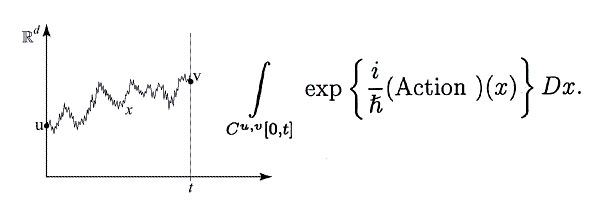

There has been some fun and interesting discussion of the Ramsey-Cass-Koopmans \[RCK\] model on [this post of mine](http://informationtransfereconomics.blogspot.com/2015/06/ramsey-model-and-unstable-equilibrium.html). Sorry to those in the discussion that I haven't gotten back to the comments yet -- I've been taking my time to think about what's been brought up. I noted at the end of my post that:

> Now there is some jiggery-pokery in the \[RCK\] model -- economists include "transversality conditions" that effectively eliminate all other possible paths \[in the phase diagram\].

This was not some throw-away line in the conclusion; it was the key point of the post. I think LAL's comment is a really useful way to understand how Nick Rowe and I ended up talking past each other:

> _I think you should pay more attention to the transversality conditions...there is a lot more economic content to them than you are realizing..._

I completely agree that there is a lot of economic content! I think this is what Nick Rowe thought I kept missing when he metaphorically threw the eraser at me sitting in the back of the class (_"What's the difference between pendulums and people? People have plans and expectations about the future, that affect their current actions."_). However, my main point was that the transversality conditions (enforcing those plans and expectations about the future) are practically all of the economic content of the RCK model -- the RCK equations are somewhat superfluous.

Let me start with the explicit numerical model, parameters and all:

This system of differential equations has a "saddle path" solution that runs from from a pair of initial conditions for capital and consumption to the equilibrium point. In the next graph I show the saddle path (black), the (approximate) equilibrium (black point) along with 2000 paths randomly distributed within 1% of the initial conditions that lead to the saddle path:

As you can see, most of these paths diverge from the saddle path -- and that's just for being 1% off. So given measurement error and random events, you are unlikely to find yourself exactly on the saddle path.

One of the main purposes of the transversality conditions is to say nearly all of those 2000 paths don't make economic sense. I borrowed this particular description of the argument/intuition from [these lecture notes](http://eml.berkeley.edu/~webfac/obstfeld/e202a_f12/lecture2.pdf) \[pdf\], but in general this is what Nick was getting at:

> _Imagine a path along which consumption is falling and k is therefore growing very large. Along such a path the product u'(c) k would grow rapidly, probably causing the limit \[to violate the transversality conditions\]. Such a path could not be optimal, however, because the economy is accumulating excessive hoards of capital, the output of which never gets consumed because it is reinvested instead. It would pay for the economic planner to slightly and permanently increase consumption, an option that is perfectly feasible given the rapid growth in k._

What this means in the context of the RCK model is that if the economy finds itself on one of those 2000 paths that aren't the saddle path, the economic agents realize a better deal can be had by reducing capital (or reducing consumption) in order to bring the economy back to the optimal saddle path. The result of that (exaggerated for clarity) is a set of path segments of the RCK model (blue) along with corrections (orange dashed) intended to bring the economy back to the saddle path (black line):

You can think of the blue segments as the times when the economy is obeying the RCK model and the orange loops as the times when the economics enforcing the transversality conditions is driving the economy. And this is where we come to my point: most paths would consist of mostly those loops since nearly all paths in the neighborhood of the saddle path diverge from the equilibrium point.

That is to say **the typical path would be incredibly jagged** \[1\]. Most of the time it would not be following the RCK saddle path -- or even obeying the RCK model equations, but instead would be on some correction jog taking the economy back to the saddle solution because of the transversaility conditions \[2\]. A typical path would look like this:

It would be entirely orange corrections (due to transversality conditions), rather than blue RCK solution paths. An ensemble (or path integral) of such paths would average (integrate) to the RCK saddle solution (which I mentioned in my reply to Nick Rowe). But an ensemble would also do that **_without_** the transversality conditions. If we just average all the 2000 paths \[3\] in the graph at the top of this post, we get the result we want (the saddle path, approximately) without assuming the transversality conditions or the economics they entail:

That means the necessary transversality conditions that end up representing most of the economics of the RCK model if understood in the neoclassical sense (i.e. why only 1 of those 2000 paths turns out to be valid) are actually unnecessary. The RCK model equations (at the top of the post) should be understood as establishing all possible ways to consistently divvy up capital and consumption over time. The transversality conditions say that only one of those ways is valid by fiat. An ensemble approach says that all ways are valid, but observations should be consistent with the most likely path.

**Update 6/30/2015**

If I understand Nick Rowe's comment below (_"If rational,_ \[Robinson Crusoe\] _would jump_ \[to the Saddle path\] _immediately, and stay on it forever."_) the picture looks more like this:

I agree that is the rational (model-consistent) expectations view, but in that view the transversality conditions do next to nothing. They apply once when Robinson Crusoe is first stranded and calculates how much rum he has. After that, Crusoe lives a 'feet up, mind in neutral' beach bum life -- not having to worry about having drunk too much of the rum or too little. He's no longer an optimizing agent, but passively obeying the differential equations at the top of this post.

There are also the questions of a) how do you know what the saddle path is? and b) how do you determine if you're on it? Robinson Crusoe has to spend a finite amount of time figuring out the path and his location relative to it to a given (finite) accuracy ... something that gets infinitely harder as you approach the equilibrium. And valuable drinking time to boot!

**Footnotes:**

\[1\] This is actually what happens in Feynman path integrals -- the set of smooth paths has measure zero, so a typical path contributing to the path integral is a noisy path "near" the classical solution.

\[2\] These corrections would be the inputs to control the inverted triple pendulum in the example Tom Brown mentioned. In that example, the controller spends most of its time making tiny corrections (analogous to the orange paths in the graphs above), not letting the pendulum follow the laws of physics (analogous to the blue paths).

\[3\] It becomes numerically unstable in the brute force way that I've implemented the model and the actual solution wasn't exact so I was unable to show the whole path on account of an outbreak of laziness in finding the exact solution and making sure the random path initial conditions weren't biased (as they seem to be ... towards the all-consumption solutions).
