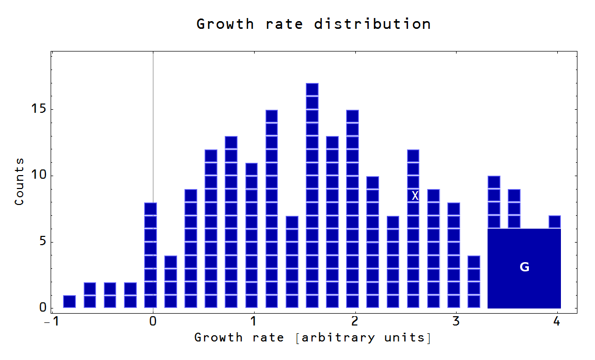

There seem to be a lot of closet Keynesian monetarists out there. I [noticed](http://informationtransfereconomics.blogspot.com/2015/06/always-look-at-data-keynesian-economics.html) that a large fraction of the massive deficit reduction in the U.S. from 2012 to 2013 was due to dividends paid by Fannie Mae and Freddie Mac, and the [big question](http://www.themoneyillusion.com/?p=29802) that's come out of it is whether it should count as a negative _∆G_. That is to say we've apparently figured out it's relevant and now we're just arguing over the multiplier. And now the monetarists are the ones arguing that its multiplier should be large (in order to show that the Keynesian view is wrong, of course, but still).

Now I'm not really an economist; I just play one on the internet. I'm a physicist. But I have constructed an economic framework that allows you to build some basic monetarist and Keynesian models from information theory (the main purpose of this blog). In the most empirically accurate versions of the Keynesian model, all that really matters in a recession are [strongly coordinated movements of government output](http://informationtransfereconomics.blogspot.com/2015/01/keynesian-economics-in-three-graphs.html). The negative impacts of tax increases would be diffused. Effectively the multipliers are large for spending and small for taxes, As a result you get the "paleo-Keynesian" finding that even deficit neutral expansions of government spending are expansionary in a recession. But the framework also allows you to construct a monetarist model (it's not as empirically accurate over the past few decades, though \[1\]), so that puts me right where ... well, where many modern Keynesians are as they believe in monetary policy when outside a liquidity trap and fiscal policy when in one.

The more traditional analysis of multipliers looks at their effect on people's behavior -- in particular current consumption. For example, government spending on a building a bridge employs someone who might not be otherwise employed (in a recession), financing their consumption which is spent at stores who then don't have to cut back the hours of their employees which finances their consumption, and so on. Integrating this effect results in a multiplier greater than 1 ... a bigger bang for your government spending buck.

Tax cuts have less of an impact in most (Keynesian) analyses. They apply to people already with jobs, and since the problem of a recession (in the Keynesian view) is an outbreak of frugality, they tend to get saved. At least if you're already saving money; tax cuts for people living paycheck to paycheck are more likely to get spent.

Roughly the opposite reactions with the same multipliers should occur for government "austerity" (increasing taxes and cutting spending).

So how do we treat the dividend payout from Fannie and Freddie?

[Matt Yglesias viewed it at the time as being wasted](http://www.slate.com/articles/business/moneybox/2013/08/fannie_mae_and_freddie_mac_dividends_pay_to_the_public_not_the_treasury.html) -- it could have been better paid out as government spending, tax cuts or a "helicopter drop" of cash. And that's true.

[Sumner says](http://www.themoneyillusion.com/?p=29802) Matt said the _"GSE dividends were a contractionary “disaster.”"_, but I think Matt's view is better characterized as a comparison between a positive and a zero multiplier use of the dividends -- between high multiplier spending and zero multiplier deficit reduction (he said thw word _disaster_, but not the word _contractionary_):

> _The only problem is that this gusher of federal revenue is actually an economic disaster. ..._

> _... the profits aren’t letting us spend more, they aren’t letting us tax less, and they aren’t freeing up private investment capital either. They’re doing nothing. It’s as if the money were sitting around as cash in a storage locker somewhere._

[Some commenters](http://informationtransfereconomics.blogspot.com/2015/06/always-look-at-data-keynesian-economics.html) and even Sumner suggest that somehow the dividends should be treated as contractionary with a multiplier greater than zero. 

If we view the dividends as a confiscatory tax on those who would have done something with the money if they had held the stock, the multiplier would be small. It's a progressive tax increase applied to people already "saving" (holding the stock). It is unlikely to have financed current consumption. In that case it would be very slightly contractionary.

It could also be viewed as a tax on people paying their home loans, but unlike income taxes in the U.S. the people paying these taxes are getting something directly (housing) in return. It is not a tax that requires people to cut back their consumption. The contractionary effect would be very small indeed -- approximately zero.

[Commenter LAL](http://informationtransfereconomics.blogspot.com/2015/06/always-look-at-data-keynesian-economics.html?showComment=1435452310569#c8651133672410046542) puts forward the idea that the money is leaving the flow of money around the economy and something like this is probably the best argument that it is contractionary. The effect would come though the "shortage of safe assets" view of a liquidity trap -- the dividends mean that additional US treasury bonds (safe assets) aren't issued. Every treasury bond gets us that much closer to a sufficient stock of safe assets that we exit the liquidity trap so in not issuing bonds we're deeper in the trap than we would be if we had.

However, all of these "it's a tax" views are based on a counterfactual world in which the dividends exist and end up in the hands of the private economy and we're looking at the contractionary effect of the opportunity cost.

My original take in a comment [on Sumner's post](http://www.themoneyillusion.com/?p=29788) was that the money could be treated as simply a 20 dollar bill on the sidewalk snatched up by the government. Fannie and Freddie were bankrupt and were bailed out. The money otherwise wouldn't have existed ... not otherwise be financing consumption. In that sense, it almost seems like [seigniorage](https://en.wikipedia.org/wiki/Seigniorage): the money booked by the Treasury when it prints physical currency. Before the currency existed, there was no money. Before the US government took over Fannie and Freddie completely, there was no (actually negative) company value or stream of profits.

As I said I am not an economist, so I'm not sure what the correct treatment should be. I will ask [Robert Waldmann](http://rjwaldmann.blogspot.com/), the only Keynesian who'll (potentially) take my questions at this point. From my rudimentary knowledge (and [the workings of the information transfer model](http://informationtransfereconomics.blogspot.com/2014/02/the-effect-of-arra.html)) it seems that the multiplier should be in the small to zero range.

Overall, there is a strange methodology at work here, though. The monetarist premise seems to be that the Keynesian theory multiplier must be large (_m ~ 1_) in order for the Keynesian theory to be wrong. That is just odd to me. The evidence is that if the Keynesian theory (_K_) is correct, the multiplier is small (_m ~ 0_)

_P( m ~ 0 |K) >  P( m ~ 1 |K) ≈ 0_

So that the Bayesian view with Keynesian prior is:

_P(K | m ~ 0) =  P(m ~ 0 | K) P(K)/P(m ~ 0)_

which is greater than zero here. But the monetarist premise contains the factor:

_P(m ~ 1 | K) P(K)_

where they are trying to show **_both_** probabilities are near zero. But _P( m ~ 1 |K)_ is small (approximately zero), so _P( m ~ 1 |K)_ _P(K)_ _≈ 0_ even without _P(K)_ _≈ 0._

Basically the result you should get out this analysis is that the multiplier isn't large, not that the Keynesian view is wrong.

**Footnotes:**

\[1\] Actually, it can be written as a single model that has two limits: an ISLM-like model and a QTM-like model. The ISLM limit is more accurate today, while the QTM limit was more accurate in the 1970s. At least for the U.S. -- other countries like Russia and China are in the QTM limit, Japan is in the ISLM limit, and Canada is at the transition.
