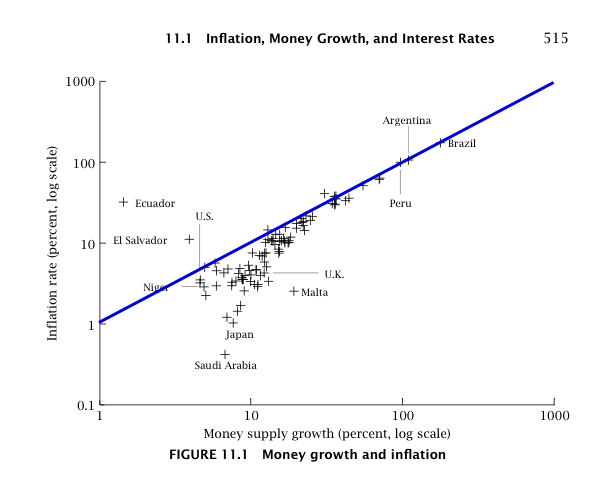

Using the [partition function approach of this post](http://informationtransfereconomics.blogspot.com/2014/06/the-macroeconomic-partition-function.html), I looked at the distribution of inflation rates given a [log-normal distribution](https://en.wikipedia.org/wiki/Log-normal_distribution) of monetary base sizes and growth rates. The intent was to figure out this picture from David Romer's _Advanced Macroeconomics_:

I added the naive quantity theory of money result (inflation = monetary base growth) in blue to the figure above.

For a simple model, it was pretty successful (10000 random economies made up of 1000 random markets). The colors indicate density of those random economies (red = highest). The results mostly fall just below the quantity theory line (in black on this figure) just like the case in the picture from Romer's textbook.

We've essentially reproduced the quantity theory as an ensemble average of random markets, that is to say:

〈_i_〉= 〈_m_〉

where _i_ is inflation and _m_ is monetary base (minus reserves) growth (angle brackets mean ensemble average).

For completeness, this followed entirely from the price level calculation in the partition function post linked above. The expected value of the price level of the economies looked like this (showing 100 random economies -- each line -- with 1000 random markets):

