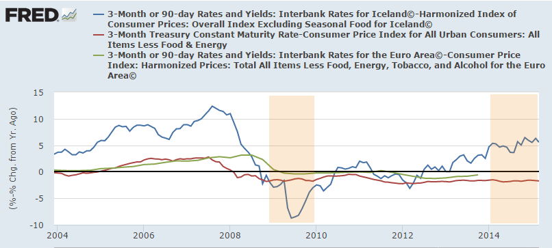

Scott Sumner has [two](http://www.themoneyillusion.com/?p=29600) [posts](http://www.themoneyillusion.com/?p=29606) up in a row now that quote others (Britmouse and Mark Sadowski) wherein everyone involved is invoking what is usually called straw man argument: proving an argument is wrong by inventing a different easier argument no one has made to prove wrong.

In the first post, Scott does attempt to deal with the problem of making a straw man argument in comments -- saying his post only shows the Keynesian interpretation isn't obvious given the data. But that's another straw man: no one is saying any interpretation is _prima facie_ obvious. Everyone from Diane Coyle to John Cochrane to Janet Yellen to Paul Krugman knows that all economic data requires a model to interpret it. Therefore "obviousness" (or lack thereof) is model dependent. I attempted to show what obviousness looks like in a completely non-economic model (namely my background in physics) in [this post](http://informationtransfereconomics.blogspot.com/2015/06/counterfactuals-and-second-derivative.html).

In science, if you're trying to show some model is incorrect you have to bend over backwards to not only understand the model you're attacking but also bend over backward show how that model can be consistent with observations. That is to say obviousness or lack thereof is always a straw man argument.

You should actually assume any data is obvious in any given model! And that brings me to my key point: if you are trying to prove a model wrong with data, you need to find out how any given data is obvious given the model \[1\]. If you are trying to prove me wrong, don't forget to use my model ... and use it correctly \[2\].

This is where Britmouse and Sadowski fail. Britmouse doesn't account for the possibilities of different counterfactuals -- that's why I called the graph a derp Rorschach test: you come away with your prior because everyone's prior is consistent with any data given the right counterfactual.

Sadowski's post is more nuanced. He fails to correctly set up the antecedent. I'll forego quibbles with the specific measures of government spending data \[3\] and cede that Iceland did engage in fiscal consolidation between 2009 and 2014. I'll even cede that fiscal austerity was offset by monetary policy. I'll even emphasize it with an indented block ... in bold type!

> **Iceland engaged in fiscal consolidation at some point between 2009 and 2014 that was offset by monetary policy.**

My question is this: who cares? This is the basic economic consensus of how fiscal and monetary policy work. This totally misses the point of the austerity debate. For that, you need to address several points:

1.  Was Iceland at the zero lower bound from 2009 to 2014?
2.  Was Iceland in a liquidity trap from 2009 to 2014?
3.  Was the austerity implemented when monetary policy couldn't offset it?

For that, let's get some data from FRED. Sadowski and Sumner have argued that the EU wasn't at the zero lower bound because nominal rates were above zero. Now this doesn't matter in the information transfer model, but I'll try and address their concerns by looking at real rates. The idea of a liquidity trap is that nominal rates and inflation are too low to push real interest rates down far enough to spur private borrowing. In a sense, you can't get the real rate to where the Taylor rule says it should be. Inflation can't credibly be pushed higher to bring real rates lower because everyone thinks the central bank will just take any base increase back.

I also had to use year-over-year inflation because there doesn't seem to be any seasonally adjusted price level data from European countries \[4\], so there's more correlated noise in this data than I'd like. But I think it still shows rather well that Sadowski isn't addressing the austerity debate.

[real interest rate data](https://research.stlouisfed.org/fred2/graph/?g=1fEc)

1.  **Was Iceland at the zero lower bound from 2009 to 2014?** No -- either in terms of nominal interest rates or real interest rates. The massive deflation devaluation allowed real interest rates to reach well below the values for the US and the EU.
2.  **Was Iceland in a liquidity trap from 2009 to 2014?** No -- Iceland was never in a liquidity trap. It was able to push real interest rates to large negative values and now real interest rates are positive. 
3.  **Was the austerity implemented when monetary policy couldn't offset it?** According to the liquidity trap model, Iceland seems to have never been in a liquidity trap and could likely have always offset fiscal policy.

So Iceland and Sadowski's post is basically irrelevant to the austerity debate. But there's a bit more.

The thing is that Sadowski's time period from 2009 to 2014 is a bit disingenuous. Austerity from 2009 to 2012 could ostensibly be called "austerity" in the sense that the term is used: cutting government spending during a downturn in order to spur business investment because government borrowing won't crowd out private borrowing. The finance minister of Iceland declared victory over the recession in 2012 (as Sadowski points out). And we can look at the table that Sadowski points to himself:

> Iceland (cyclically adjusted general government balance)
>
> From Table A4 \[[pdf](http://www.imf.org/external/pubs/ft/fm/2015/01/pdf/fm1501.pdf)\] 

> 2006    4.7  

> 2007    3.1 

> 2008   −4.6 

> 2009   −6.9 <--- start austerity (Sadowski)

> 2010   −4.9 

> 2011   −1.8 

> 2012    0.4 <--- Finance minister of Iceland 

> 2013    2.3         declares victory 

> 2014    6.2 <--- end austerity (Sadowski)

Since the finance minister declared victory over the recession in 2012 (which makes sense in terms of the interest rate trend in the graph above -- it's where it crosses through zero -- as well as the table), it is disingenuous to declare any of the fiscal consolidation from 2012 to 2014 "austerity". Austerity is "we must cut back because the economy isn't recovering" not "we must cut back because the economy has recovered". In Sadowski's graph that Sumner reproduces, this moves Iceland from a 13.1 percentage point shift to a 5.1 percentage point shift leaving it just to the left of the Netherlands and Denmark (ceding that the other amounts are valid). Note that puts Iceland to the right of any of the countries in the news about austerity being wrong-headed: Greece, Spain, Ireland, Portugal and the UK.

When Sadowski says this:

> _This is because it includes the increase in spending attributable to rising interest payments on the national debt._

You should immediately know he's talking rubbish. Rising interest payments is a key indicator that the government should start reigning in spending -- reigning in spending because of rising interest payments is not "austerity".

Sadowski's refusal to look at what the Keynesian model says for Iceland not only led him to make an argument that is tangential to the austerity debate, but to make a disingenuous use of data that hurts the credibility of the monetarist model. It's going to be hard for me to look at an argument from Sadowski and not say: "OK, where is he trying to trick me this time?"

It's always good advice: try and understand things from the perspective of someone who would disagree with you \[5\]. As everyone disagrees with me, I've become somewhat of an expert!

Before you say that I don't get the monetarist argument note that 1) I actually ceded the primary argument of Sadowski's post: Iceland offset monetary fiscal policy, 2) the information transfer model cannot be distinguished from a monetarist model for an information transfer index _κ ~ 0.5_ -- even I believe in monetary offset in certain cases! and 3) I can see how the liquidity trap doesn't make sense given a determined central bank in the monetarist model \[6\].

**Footnotes:**

\[1\] This is not the only way to disprove a model. You can show the model predicts something that doesn't happen (falsify the model). You can show the model isn't falsifiable ([market monetarism isn't falsifiable](http://informationtransfereconomics.blogspot.com/2015/06/falsifiabilite-simplicite-succes-ou-la.html)). You can also show a different model is [much better at explaining data](http://informationtransfereconomics.blogspot.com/2014/11/because-empirical-success.html). If that different model is itself falsifiable, it can be used to disprove an unfalsifiable model. \[This is how e.g. science works against religious theories of the physical world.\]

\[2\] There is a corollary to this: if you say your model is consistent with the data, I can't come back and say you forgot to use my model which shows it isn't. I am showing the hypothesis _H_

_H(data | my model) = True_

not 

_H(data | my model ∪ your model) = True_

\[3\] [This doesn't look like austerity to me](http://research.stlouisfed.org/fred2/series/DEBTTLISA188A), but then that should be obvious given my model.

\[4\] FRED: Can we get a toggle to apply a seasonal adjustment to any data? You can add a disclaimer about it with all kinds of caveats. Yes, it's numerically complicated -- maybe just a toggle to switch between NSA and SA data if it's available on each graph?

\[5\] It's probably not good advice when trying to get internet traffic -- that seems to flow from straw man attacks and derp.

\[6\] I just don't like "[no true Scotsman](https://en.wikipedia.org/wiki/No_true_Scotsman)" arguments in my theories. Whether a central bank is "determined" or "credible" is rhetorically the same as a question of whether a central bank is a true Scotsman. I personally like to replace terms like "credible" and "determined" or even "competent" with "awesome" whenever they are modifying the noun "central bank". Here's a [good example](http://www.themoneyillusion.com/?p=16035):

> On theoretical, practical, and historical grounds, policy \[awesomness\] is simply not a problem for fiat money central banks.

Everything is awesome.
