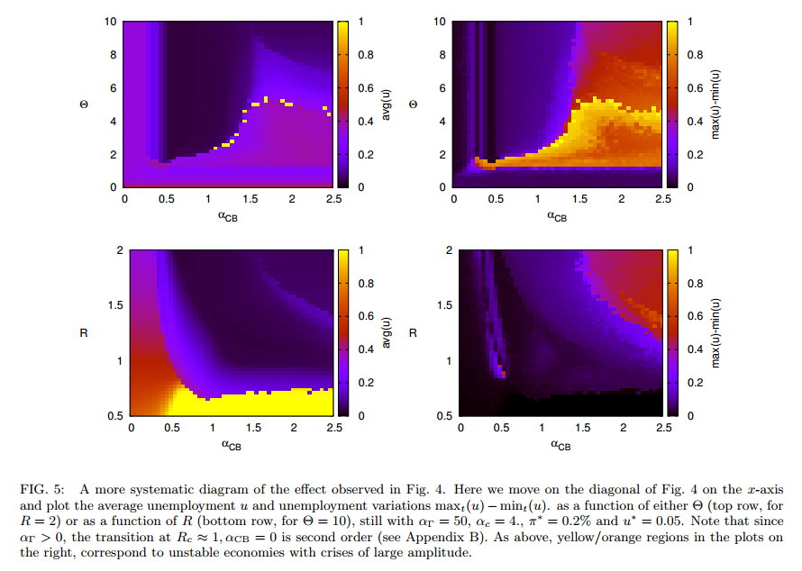

One thing I am importing into my approach to economics from my physics background (that may well be unwarranted) is the idea that physicists apply to fundamental physics: _simplicity_.

In physics, we generally think the fundamental theory of everything (and unification from EM to EW) is a simplification. This is deeply connected to the idea of a greater and greater number of symmetries of the universe as you look at smaller and smaller scales, from Lorentz symmetry to super-symmetry.

However, the simplicity I am trying to bring to macroeconomic theory is based on something entirely different: the law of large numbers. This is the simplification that happens in statistical mechanics. One interesting thing is that the law of large numbers generally has to happen as _N → ∞_ unless you believe in significant correlations; super-symmetry does not have to happen as _L → ℓp_.

[This philosopher of economics](http://opinionator.blogs.nytimes.com/2015/07/14/what-economics-can-and-cant-do/) thinks economics is complex. [These biologists](http://informationtransfereconomics.blogspot.com/2015/07/biologists-unoriginal-and-misguided.html) think economics is complex. The physicists who made the picture at the top of this post think economics is complex. Many economists think economics is complex. So do [these people](http://atlas.cid.harvard.edu/).

**1\. Economists can't predict things very well, therefore economics is complex.**

To go from this premise to concluding economics is complex requires one of two things: 1) some sort of proof or evidence that current economic theory is the only possible theory or class or theories or 2) economic theory that is correct for some other reason than predictions, but says predictions are hard (e.g. the three-body problem in Newtonian physics is complex and unpredictable, but Newtonian physics is pretty good for other reasons).

An example: Aristotelian physics didn't make good predictions about gravity. Did that mean the theory of gravity was complex and unpredictable? No, we just hadn't hit on Newton or Einstein yet.

That is to say the lack of correct predictions could be evidence your theory is _wrong_, not that the problem is complex.

**2\. Humans are complex, therefore economics is complex.**

A million 1000-variable human agents represents a billion-dimensional problem. If the state of the macroeconomy can be described by a few macroeconomic aggregates like NGDP, a couple of interest rates, inflation, money supply, (or whatever your choices are) and a handful of parameters (let's be generous and say it's 1000 variables/parameters), there has to be a massive amount of dimensional reduction \[1\].

If you haven't demonstrated that dimensional reduction does not happen, then the statement above is just an assumption that dimensional reduction does not happen. I'd say the onus is on you to tell us what the millions of additional relevant macroeconomic aggregates that must exist are.

**3\. We haven't figured it out yet, therefore economics is complex.**

This is the fallacy of the failure of imagination. Just because it is hard to imagine a simple theory of economics, doesn't mean there isn't a simple theory out there.

For example, "intelligent design" proponents (contra evolution) have an argument that some biological structures are so complex, they couldn't have evolved. That's just a failure of imagination of the particular pathway for them to have evolved.

**4\. Economists disagree, therefore economics is complex.**

**5\. There are a lot of little effects that must be considered, therefore economics is complex.**

This is #2 with microeconomic or game theory effects rather than human behavior. You still have a dimensional reduction problem.

**6\. DSGE (or whatever) models are complex, therefore economics is complex.**

**Conclusion**

Complexity is not a foregone conclusion. That doesn't mean economics isn't complex, just that you shouldn't assume complexity. In the end, you shouldn't assume simplicity, either. The best approach is to start with what you do know for sure (in the posts on this blog, essentially conservation of information) and move out from there.

My purpose here is not that the complexity of macroeconomics is a false assumption, but that we should be more aware of implicit assumptions ... and the complexity of macroeconomics is one of them.

**Footnotes:**

\[1\] I think the correct words for this are actually "dimensionality reduction", but I don't really care. I'm not sure there is a real technical term for the fact that e.g. an ideal gas reduces from a _3N_ dimensional problem to a 4-dimensional problem.
