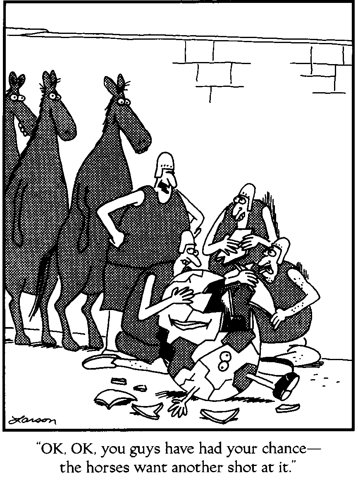

Mark Thoma [linked](http://economistsview.typepad.com/economistsview/2015/07/links-for-07-24-15.html) to [this article on biologists](https://www.newscientist.com/article/mg22730310-300-after-the-crash-can-biologists-fix-economics/) wanting to get in on redefining economics with the bold, revolutionary new ideas such as "agent based modeling", "imperfect information" and "adding human behavior". It's pretty funny and I begin to see why economics "as a whole is resistant to outside incursions". I at least took the time to read up on the use of information theory in economics (and basic economics) before jumping in.

In reading the article, it becomes clear that the biologists' ideas to fix economics are both unoriginal and doomed to failure. At least if the information transfer view is correct. Some specific comments are below. I put links the supporting/elaborating material for the specific claims below at the bottom of the page.

> _But \[mathematical formulae come\] at the price of ignoring the complexities of human beings and their interactions – the things that actually make economic systems tick._

So you know for a fact that the complexities of human decision-making matter? How? Did you already model an economic system as complex human beings and discover this? Why not just show us that research?

Snark aside, this is a fundamental assumption of economics as well, so this is not only an _ad hoc_ assumption, but an unoriginal _ad hoc_ assumption.

> _The problems start with Homo economicus, a species of fantasy beings who stand at the centre of orthodox economics. All members of H. economicus think rationally and act in their own self-interest at all times, never learning from or considering others. ... We’ve known for a while now that Homo sapiens is not like that ..._

Yes, we have known that for awhile, and yet very little has come of it. It's just another unoriginal idea.

In the information transfer view, _H. economicus_ is an effective description, like a [quasi-particle](https://en.wikipedia.org/wiki/Quasiparticle) in physics. Once you integrate out the degrees of freedom from the micro scale up to the macro scale, the very complicated _H. sapiens_ at the micro scale ends up looking like _H. economicus_ at the macro scale much like the very complicated short range interaction of quarks and gluons ends up looking like a simple charged hard sphere (proton) at long range scales.

> _How different is a stock price crash from a wildlife population crash?_

That is a figure caption and seemingly rhetorical in the article, but they're very different in the information transfer view. A school of fish can coordinate their direction to evade a predator. If an economic system coordinates, it collapses.

Wildlife population crashes are not usually due to coordination of the wildlife itself -- although population booms may lead to crashes. But in this case it is not the coordination itself that leads to a crash. The coordination of wildlife leads to a population boom that e.g. eats all the food resources, leading to starvation. In the information transfer framework, the coordination alone is the source of the fall in economic entropy that leads to a fall in price.

> _Taking into account \[some effects\] requires economists to abandon one-size-fits-all mathematical formulae in favour of “agent-based” modelling – computer programs that give virtual economic agents differing characteristics that in turn determine interactions._

This is definitely not original.

There is also a fundamental reason agent-based modeling is unlikely to be helpful. How many input parameters and variables does your agent have? 10? 100? How many agents do you have? 1000? 1,000,000? Your system is now a 100,000,000-dimensional problem.

How many equilibria does your 100,000,000-dimensional problem have? Well, if there aren't any symmetry considerations and your agents are complex enough to capture even a small fraction of the complexity of humans, you will have no idea. But that's supposed to be the point, right? We need to do bottom up simulations of agents because top down analysis doesn't work, or so the biologists (and well before them, micro-foundation obsessed economists) have said. But any particular equilibrium you find is going to critically depend on the initial conditions of your simulation. And that choice could give you any of the equilibria -- many of which probably look enough like a real economy to declare success even though you've just reduced the problem from solving an economy to finding the initial conditions that give you the economy you want.

A good example of how wrong-headed this approach is can be illustrated with protein folding. One thing the scientists who study protein folding don't do is just throw 5000 carbon, nitrogen, oxygen etc atoms in a box and turn the crank on the Schrodinger equation. You can get pretty much any structure you want this way (critically depending on initial conditions).

What they have noticed (empirically) are effective structures ([protein secondary structures](https://en.wikipedia.org/wiki/Protein_secondary_structure#Prediction)) that form many of the building blocks of proteins.

That is an example of dimensional reduction; the 45,000 dimensional problem of the 3D position and orientation of 5000 atoms has been reduced to a 90 dimensional problem of the position and orientation of 10 protein secondary structures.

If the information transfer model turns out to be correct, then a macroeconomy can be reduced from that 100,000,000-dimensional problem to a 20-dimensional problem (give or take). The agents -- and the extra 99,999,980 dimensions they contribute -- don't matter.

> _... economies are like slime moulds, collections of single-celled organisms that move as a single body, constantly reorganising themselves to slide in directions that are neither understood nor necessarily desired by their component parts_

This biologist thinks economic systems are an analog of biological system. Physicists (including myself) tend to think economics reduces to statistical mechanics. Some engineers think in terms of fluid flows. I imagine a geologist would think of economics with a plate tectonics metaphor. Politicians probably think economics is all about the coordinated desires of people. Remarkable how people in a given field tend to think in terms of their field.

It would be amazing if economics just happened to reduce to an analog of a system in your field, wouldn't it?

In my defense, in the information transfer approach (if valid) it's the difference between thermodynamics (where there is a second law) and economics (where there isn't) that is the new idea. It is this difference -- that economic entropy can decrease spontaneously due to coordinated agent behavior -- that comes into play in showing the slime mold analogy is misguided. Whenever the slime mold moves as a single body you'd get recessions; whenever the individual cells do their own thing you'd get economic growth. Coordination, even emergent coordination, is economic death.

[Econophysics for fun and profit](http://informationtransfereconomics.blogspot.com/2013/08/econophysics-for-fun-and-profit.html)
[Information theory and economics, a primer](http://informationtransfereconomics.blogspot.com/2015/04/information-theory-and-economics-primer.html)_H. economicus_
[Coordination costs money, causes recessions](http://informationtransfereconomics.blogspot.com/2014/10/coordination-costs-money-causes.html)
[What if money was made of vinegar?](http://informationtransfereconomics.blogspot.com/2014/06/what-if-money-was-made-of-vinegar.html)
[Against human centric macroeconomics](http://informationtransfereconomics.blogspot.com/2014/08/against-human-centric-macroeconomics.html)
[Is the demand curve shaped by human behavior? How can we tell?](http://informationtransfereconomics.blogspot.com/2015/01/is-demand-curve-shaped-by-human.html)
