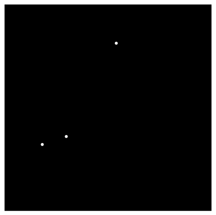
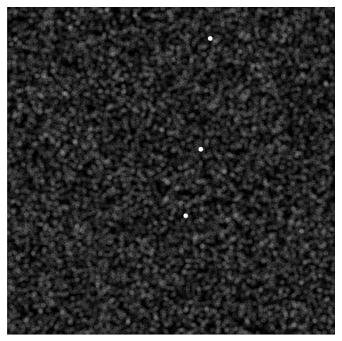

A [comment from Bill](http://informationtransfereconomics.blogspot.com/2013/08/visualizing-diminishing-marginal.html) made me recall how I'd looked at markets as an algorithm to solve a compressed sensing problem before starting this blog. This is mostly a placeholder post for some musings.

The idea behind "compressed sensing" is that if what you are trying to sense is sparse, then you don't need as many measurements to "sense" it if you measure it in the right basis \[1\]. A typical example is a sparse image that looks like a star field: a few points (_k = 3_) in mostly blank space (first image above). If you were incredibly lucky, you could measure exactly the three points (_m = k = 3_) and reproduce the image. However, information theory tells us that we need (see e.g. [here](http://people.engr.ncsu.edu/dzbaron/pdf/stanford102006.pdf) \[pdf\]):

_m > k log(n/k)_

measurements. As what you are trying to measure gets more complex, you start to need all of the points (_m ~ n_) which is behind the [Nyquist sampling theorem](https://en.wikipedia.org/wiki/Nyquist%E2%80%93Shannon_sampling_theorem). You can think of the economic allocation problem as fairly sparse -- most of the time any one person is not buying bacon (note the diagram on the upper right if you are viewing this on a desktop browser). And the compressed measurement (the _m_'s) happens when you read off the market price of bacon \[2\].

There are different algorithms that take advantage of the information provided by knowing your image is sparse. One of the least efficient algorithms is linear programming. [Sound familiar?](http://crookedtimber.org/2012/05/30/in-soviet-union-optimization-problem-solves-you/) That's also a very inefficient way to solve the market allocation problem.

The algorithms that solve the sparse problem also have a tendency to fail if _m_ is too low or if you add noise to the image (second image above). Additionally, the transition from failure to success can be fairly sharp -- referred to as a [Donoho-Tanner phase transition](https://sites.google.com/site/igorcarron2/donohotannerphasetransition) by Igor Carron. Does this tell us something about market behavior? I don't know. As I said, these are just some musings.

**Footnotes:**

\[1\] For natural images, this basis tends to be the wavelet basis. For something like our star field above, the Fourier basis works.

\[2\] Does a market create a basis for sparsifying an economic allocation problem?
