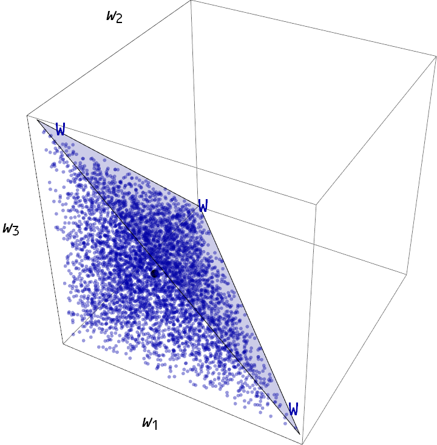
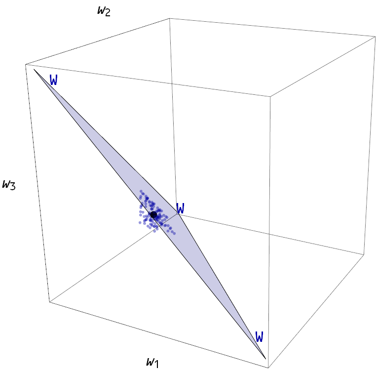
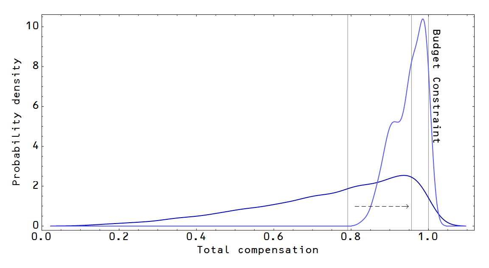

[is this](http://krugman.blogs.nytimes.com/2014/10/14/the-state-of-macro-six-years-later/)

> _Any time you make any kind of causal statement about economics, you are at least implicitly using a model of how the economy works. And when you refuse to be explicit about that model, you almost always end up – whether you know it or not – de facto using models that are much more simplistic than the crossing curves or whatever your intellectual opponents are using._

I think he's actually mentioned it a couple times. If you're not using an explicit model, the implicit model you're using is likely dumb. At the very least you're making assumptions that you haven't told us that tend to be just your gut feelings about things with frighteningly high probability.

I thought of this a couple times recently while reading some posts at Marginal Revolution (which I read to see what the latest arguments are in favor of comforting the comfortable). First, [Tyler Cowen](http://marginalrevolution.com/marginalrevolution/2015/07/u-s-minimum-wage-fact-of-the-day.html) is ... scared?

> _\[In places where the median wage is below 15 dollars\], a 15 \[dollar\] an hour minimum wage is…shall we say…risky?_

We have no idea what model Cowen is using here. And what is the risk? That aggregate supply (and thus the labor required) will fall to a level to where prices support the new wage scheme? That people will move out of Arkansas? That everything will be fine and economics 101 analysis will be discredited?

We can work out some of its properties -- for one Cowen assumes there's a significant probability that employees making less than 15 dollars per hour have sufficient market power to negotiate a wage roughly equal to their marginal product. Is this true? We don't really know for sure, but Cowen is assuming a high prior probability for it anyway.

Alex Tabarrok makes similarly implicit assumptions about the form of unobservable utility functions (and their parameter values!) in [his discussion](http://marginalrevolution.com/marginalrevolution/2015/07/the-happy-meal-fallacy.html) of the new proposed contractor/employee designation rules. In a sense, Tabarrok is making the same implicit assumption: that contractors have sufficient market power to negotiate the terms of their contractor status -- that they don't want to be employees. Is this true? Who knows, but Tabarrok is assuming it without telling us.

You have to let us know what your model is. If I analyze these two issues in the most naive possible way in the information equilibrium model, [there's no effect](http://informationtransfereconomics.blogspot.com/2014/06/seattles-new-minimum-wage-and.html) from a minimum wage. I'm not saying there's no effect -- there probably is -- it's just that the model has to get more complex.

For example, if we take a maximum entropy view of the intertemporal utility maximization problem, the consideration is whether the minimum wage is comparable to the budget constraint for total compensation. Take a three period model where wages paid in each period are subject to a budget constraint _w1 + w2 + w3 = W_. Here, _W_ represents the maximum profitable total pay for an employee over their career -- i.e. the total marginal product in all three periods. The typical employee is paid 0.75 _W_ over the three periods (and most likely _w1 = w2 = w3 =_ 0.25 _W_). The median wage is about 0.79 _W_. If we set a minimum wage at (0.8/3) _W =_ 0.27 _W_ in each period (i.e. higher than the median wage), we actually bump median total compensation to about 0.96 _W_ (typically realized as _w1 = w2 = w3 =_ 0.32 _W_). This is illustrated in the graphics below:

Note, this doesn't throw the other people out of the distribution -- they just all get concentrated at in the new allowed volume. I didn't show it in the picture because it made it hard to see what was going on. The distribution just shifts to higher wages, reducing the probability of occupying a wage state below 0.8 _W_ to zero:

