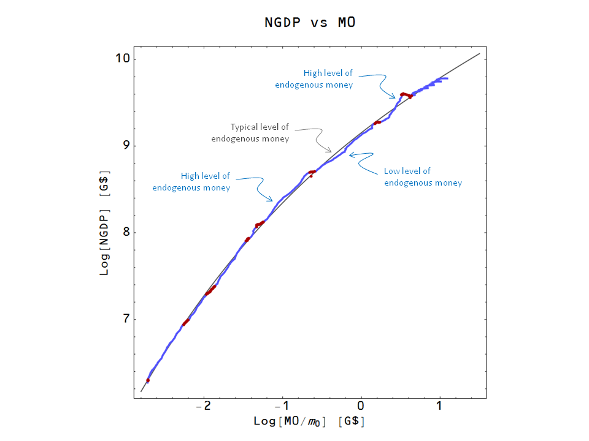

[Nick Edmonds read](http://monetaryreflections.blogspot.com/2015/06/kaldor-on-endogenous-money.html) Kaldor's "The New Monetarism" (1970) a month ago and put up a very nice succinct post on endogenous money.

> _The first point is that, for Kaldor, the question over the exogeneity or endogeneity of money is all about the causal relationship between money and nominal GDP.  The new monetarists ... argued that there was a strong causal direction from changes in the money supply to changes in nominal GDP ..._ 

> _Endogenous money in this context is a rejection of that causal direction.  Money being endogenous means that it is changes in nominal GDP that cause changes in money or, alternatively, that changes in both are caused by some other factor._

I've talked about [causality in the information transfer framework](http://informationtransfereconomics.blogspot.com/2014/05/causality-in-information-transfer.html) before, and I won't rehash that discussion except to say causality goes in both directions.

The other interesting item was the way Nick described Kaldor's view of endogenous money

> _As long as policy works to accommodate the demand for money, we might expect to see a perpetuation in the use of a particular medium - bank deposits, say - as the primary way of conducting exchange.  ...  But any stress on that relationship \[between deposits and money\] will simply mean that bank deposits will no longer function as money in the same way. The practice of settling accounts will adapt, so that we may need to revise our view of what money is._

One interpretation of this (I'm not claiming this as original) is that we might have a hierarchy of things that operate as "money":

-   physical currency
-   central bank reserves
-   bank deposits
-   commercial paper
-   ... etc

In times of economic boom, these things are endogenously created (pulled into existence by \[an entropic\] force of economic necessity). The lower on the list, the more endogenous they are. When we are hit by an economic shock stress on the system causes these relationships to break, one by one. And one by one they stop being (endogenous) money. In the financial crisis of 2008, commercial paper stopped being endogenous money.

Additionally, a central bank attempting to conduct monetary policy by targeting e.g. M2 can stress the relationship between money and deposits causing it to behave differently (which Nick reminds us is similar to the Lucas critique argument).

This brings us to an interpretation of [the NGDP-M0 path](http://informationtransfereconomics.blogspot.com/2014/08/are-interest-rates-good-indicator-of.html) as representing a "typical" amount of endogenous money that is best measured relative to M0. Call it _α M0_ (implicitly defined by the gray path in the graph below). At times, the economy rises above this value (NGDP creating 'money' e.g. as deposits via loans, as well as other things being taken as money like commercial paper). When endogenous money is above the "typical" value _α M0_, there is a greater chance it will fall (the hierarchy of things that operate as money start to fall apart when their relationship is stressed).

Another way to put this is that the NGDP-M0 path represents the steady state (or vacuum solution in particle physics) and fluctuations in endogenous money are the theory of fluctuations from the NGDP-M0 path. The theory of those endogenous fluctuations aren't necessarily causal from M2 to NGDP; however the NGDP-M0 relationship is causal both ways (in the information transfer picture).

At a fundamental level, the theory of endogenous fluctuations is a theory of non-ideal information transfer -- a theory of deviations from the NGDP-M0 path in both directions (see the bottom of [this post](http://informationtransfereconomics.blogspot.com/2015/05/money-defined-as-information-mediation.html)).
