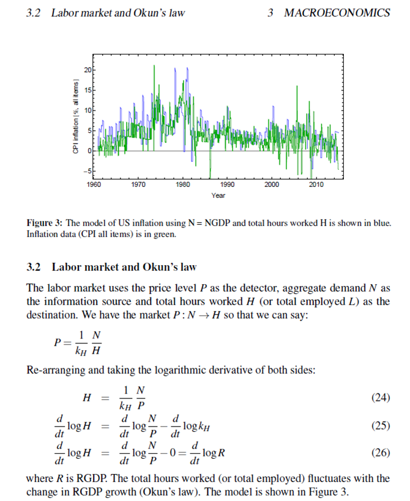

I'm still working on the paper and I hope to have a draft uploaded in the next week or two (somewhere ... probably my Google Drive as a public document initially, then submission to the economics e-journal).

As it stands, the outline is:

_Information equilibrium as an economic principle_

**1 Introduction**

**2 Information equilibrium**

   _2.1 Supply and demand_

   _2.2 Alternative motivation of the information equilibrium equation_

**3 Macroeconomics**

   _3.1 AD-AS model_

   _3.2 Labor market and Okun's law_

   _3.3 IS-LM model and interest rates_

   _3.4 Solow-Swan growth model_

   _3.5 Price level and inflation_

   _3.6 Summary_

**4 Statistical economics**

   _4.1 Entropic forces and emergent properties_

**5 Summary and conclusion**

And a couple of screenshots ...

