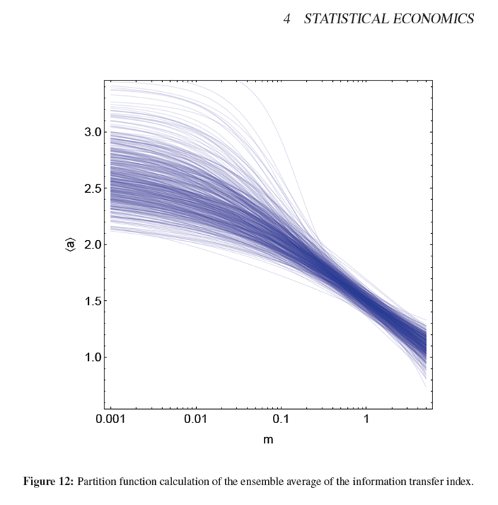

Noah Smith mentions [random utility discrete choice models](https://wiki.ece.cmu.edu/ddl/index.php/Introduction_to_random_utility_discrete_choice_models) again, this time at [Bloomberg View](http://www.bloombergview.com/articles/2015-07-30/econ-101-chicago-m-i-t-nope-berkeley-s-on-top): 

> _These models, which are used to predict consumer choices in a huge variety of situations, have been so accurate and successful that they are regularly cited as the canonical example of "economics that works."_

As I pointed out in a [comment awhile ago on his blog](http://noahpinionblog.blogspot.com/2014/03/a-grand-unified-theory-of-behavioral.html?showComment=1395595103817#c5267639198961743384), there is a lot of overlap between the approach and the [partition function approach](http://informationtransfereconomics.blogspot.com/2014/06/the-macroeconomic-partition-function.html) to the information transfer model. In fact, one can see the information transfer macro model as a specific choice of the utility function that is proportional to _log M_ (where _M_ is a measure of the money supply). Entropy maximization (partition function) and utility maximization aren't necessarily completely at odds -- the differences are described in [this post](http://informationtransfereconomics.blogspot.com/2015/03/utility-in-information-equilibrium-model.html).
