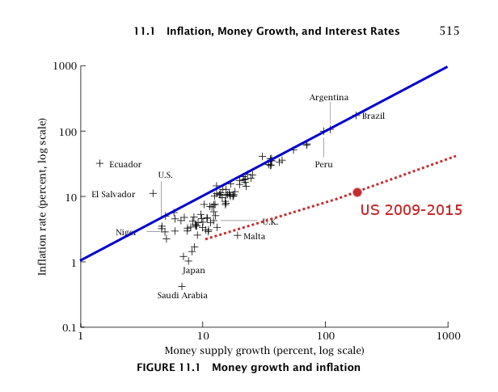

Tom Brown mentioned Mark Sadowski has [another post over at Marcus Nunes' blog](https://thefaintofheart.wordpress.com/2015/06/30/a-simple-baseline-var-for-studying-the-us-monetary-base-and-the-channels-of-monetary-transmission-in-the-age-of-zirp-part-1/); it includes what might be the most hilarious monetarist volley yet. But intriguingly it points to an opening for full scale acceptance of the information transfer model. I'll call it the Sadowski Theory of Money (STM). Mark first shows us a plot of the monetary base (SBASENS) and CPI. I have no idea what happens next or in the follow up post because this is effectively what he shows:

When I was back in college in the 1990s, I once was watching some local cable access program late at night. In it there was some suited presenter -- likely at one of the Helium wells out near Amarillo -- going through a model of how Helium escapes from underground traps. It was quite detailed. In the end, he came out with the result that the measured levels of Helium meant that the Earth couldn't be older than 6000 years old. I started weeping.

Regardless of how adept people are at mathematics or statistics, it does not indicate of how good they are at the pursuit of knowledge. The reasons range from being blinded by ideology or religion to a lack of curiosity about the results they produce. I think Mark is part of the former.

I'm not quite as emo as I was back in college, so the reason I couldn't get past the first graph in Mark's post was that I busted out laughing. If you zoom out from the graph, you can see why:

Over the course of the history of economic thought (starting from Hume and continuing through Milton Friedman and beyond), there was a theory that was called the Quantity Theory of Money. In its most rudimentary form, it said that increases in the amount of money (say, the monetary base _MB_) led to an increase in the price level (_P_),

_P ~ MB_

_log P ~ log MB_

_log P ~ k log MB_

And we are living in a new modern era of monetary policy effectiveness, so only data since 2009 is relevant! So Mark studies the correlation between _log P_ and _log MB_, scaling the variables and the axes in order to derive a value for _k_. An excellent fit is given by \[1\]

_log P ~ 0.125 log MB_

"Monetary policy is (a tiny bit) effective!" Mark shouts from the hilltops (after doing some rather unnecessary math I guess so he doesn't have to come out and state the equation above), "We are governed by the Sadowski Theory of Money!"  We can see how Mark has thrown hundreds of years of economic thought out the window by putting the STM on this graph of the QTM from David Romer's Advanced Macroeconomics (along with a point representing the US from 2009 to 2015):

Ok, enough with the yuks. Because in truth Mark Sadowski might be my first monetarist convert. That's because the model

_log P ~ k log MB_

is effectively an information transfer model (I had the codes ready to fit that data above) ... but just locally fit to a single region of data. You could even find support to change the value of _k_, allowing _k_ to change from about 0.763 to about 0.125 \[2\] going through the financial crisis. Here is the fit to 1960-2008:

You're allowed to do what Mark did in his graph in the information transfer model. But then you have to ride the trolley all the way to the end. That change in _k_ from 0.763 to 0.125 over the course of the financial crisis  would be interpreted as a monetary regime change. Let's explore what happened to the relationship bewtween a variation in _P_ and _MB_:

_δ (log P) ~ δ (k log MB)_

_δP/P ~ k δMB/MB_

So the fractional change in _P_ (inflation) is k time the fractional change in _MB_ (monetary base growth rate). Between 2008 and 2010, according to the STM, that dropped by a factor of about 0.763/0.125 ~ 6. That is to say monetary policy suddenly became six times less effective than it was before the financial crisis.

Before 2008, a 100% increase (a doubling) of the monetary base would have lead to a 70% increase in the price level. After 2008, it leads to a 9% increase in the price level.

Monetary policy suddenly becoming far less effective ... sounds exactly like a liquidity trap to me.

The Sadowski Theory of Money is an information transfer model with a sudden onset of a liquidity trap during the financial crisis \[3\].

**Footnotes:**

\[1\] There is a constant scale factor for the price level of about 84.1 for the CPI given in units of 1984 = 100; I will call it a "Sadowski" in honor of the new theory and its discoverer. The equation is shown in the graphs.

\[2\] Note that _k = (1/κ - 1)_ so _k_ = 0.763 is _κ_ \= 0.57 (near the QTM limit of 1/2) and _k_ \= 0.125 is _κ_ \= 0.89 (near the IS-LM limit of 1).

\[3\] Of course, 'M0' (MB minus reserves) [works best empirically](http://informationtransfereconomics.blogspot.com/2014/02/models-and-metrics.html) and has no sudden onset of the liquidity trap, but rather a gradual change from the 1960s to today.
