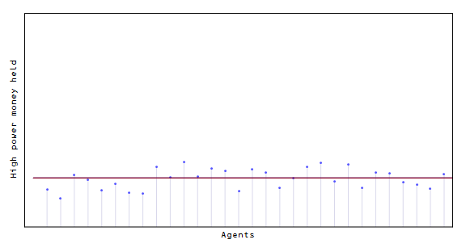
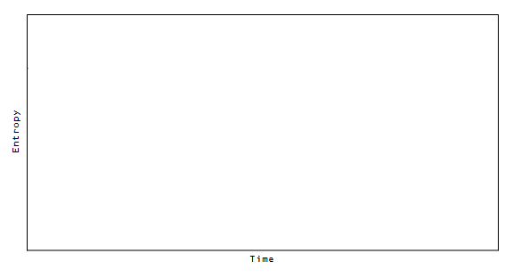

Scott Sumner's hot potato effect is a prime example of an entropic force. I wrote about [this in more detail a few months ago](http://informationtransfereconomics.blogspot.com/2015/03/the-hot-potato-effect-is-entropic-force.html), but I thought I'd update the graphics with a nice gif instead of a youtube video (the red line shows the median of the distribution) and add an accompanying plot of the entropy getting a shock and returning to normal:

