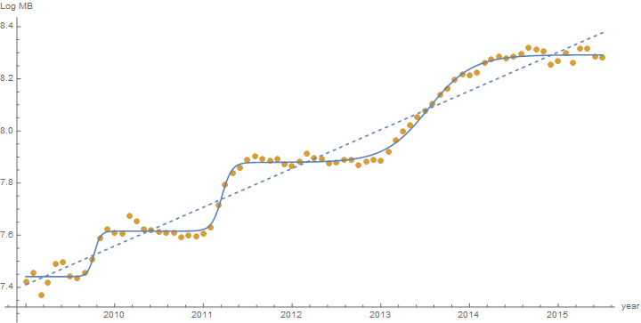
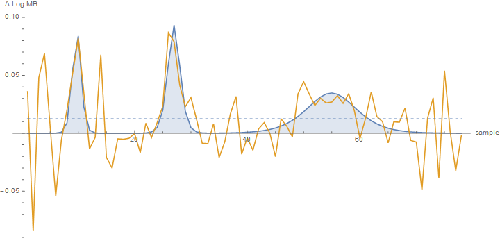
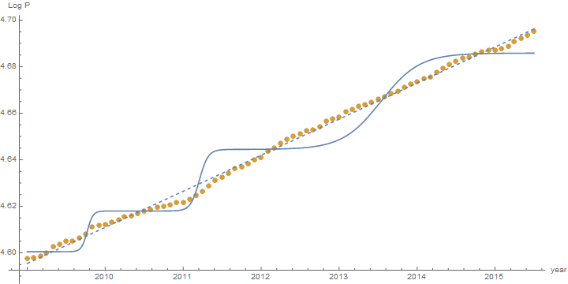
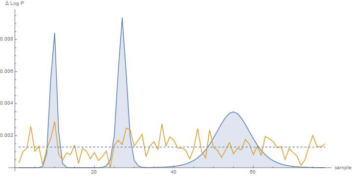
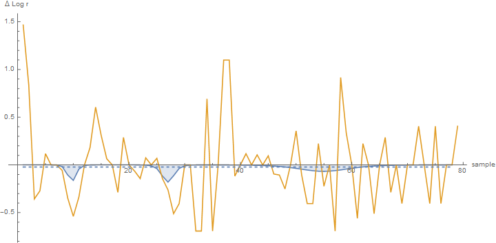
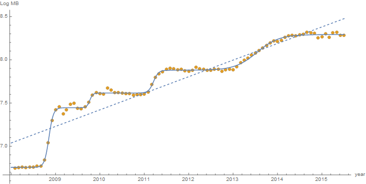
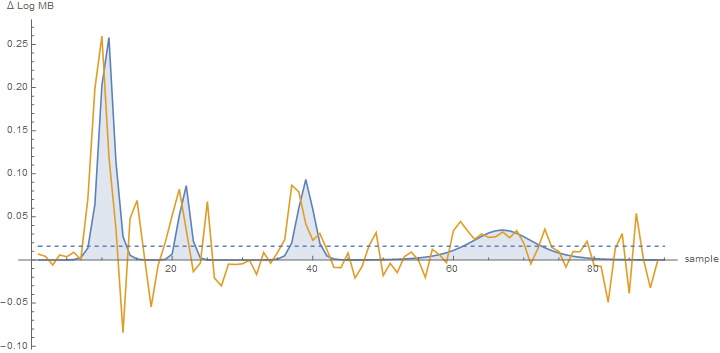
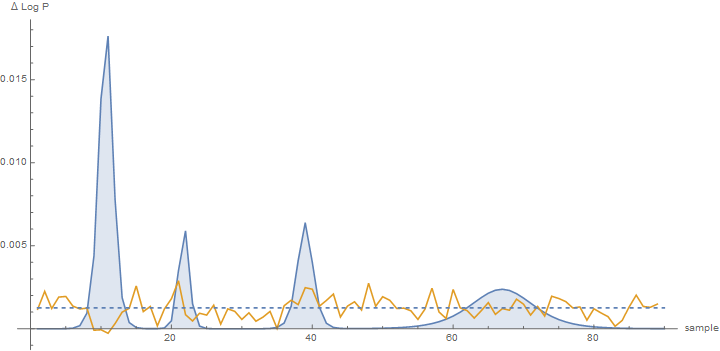
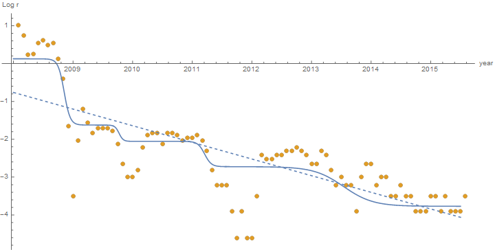
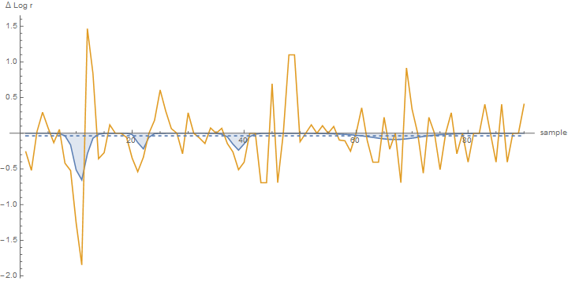

Not sure why I am doing this, but I thought it might be helpful to see "explicit" implicit models and how they frame the data. This is in regard to [this (ongoing) discussion](http://informationtransfereconomics.blogspot.com/2015/08/nonlinear-signals-of-unusual-size-nsuss.html) with Mark Sadowski.

Let's take (the log of the) monetary base (MB) data from 2009 to 2015 and fit it to two theoretical functions. One is a line (dashed) and the other is a series of three Fermi-Dirac distribution step functions (solid):

The first difference of the data (yellow), theoretical line (dashed) and theoretical steps (solid, filled) are shown in this plot:

If we expect a linear model, we can see the data as fluctuations around a constant level. If we expect the step model, we can see the data as fluctuations around three "pulses". It's not super-obvious from inspection that either of these is the better model of _Δ log MB_. The [Spearman test for correlation](https://en.wikipedia.org/wiki/Spearman%27s_rank_correlation_coefficient) \[1\] of the first differences is -0.07 (p = 0.53) for the line and 0.51 (p = 2e-6) for the steps.  The steps win this test. However if you use the data instead of the theoretical curves to compare to other variables, you can't actually conduct this test so you don't know which model of _Δ log MB_ is best. 

Now let's assume a linear model between the (log of the) price level P and log MB and fit the two theories:

Again, the first differences (data = yellow, line theory = dashed, step theory = filled):

Although it wasn't obvious from the difference data which model of _Δ log MB_ was better, it's now super-obvious which model of _Δ log MB_ is the better model of _Δ log P_ (hint: it's the line). The Spearman test for correlation of the first differences is 0.23 (p = 0.04) for the line and 0.006 (p = 0.95) for the steps (i.e. the line is correlated with the data). This would imply that:

-   If you believe the linear theory of _log MB_, then _log MB_ and _log P_ have a relationship.
-   If you believe the step theory of _log MB_, then _log MB_ and _log P_ don't have a relationship.

This is what I mean by model dependence introduced by the underlying theory. If you think _log MB_ is log-linear, you can tease a relationship out of the data.

Now if you go through this process with (the log of) short term interest rates (3-month secondary market rate), you end up with something pretty inconclusive on its face:

You might conclude (as Mark Sadowski does corrected; see comment below) that short term interest rates and the monetary base don't have a relationship. The Spearman test for correlation of the first differences says otherwise; it gives us -0.09 (p = 0.44) for the line and 0.29 (p = 0.01) for the steps (i.e. the steps are correlated with the data).

However, Mark left off the first part of QE1 in his investigation -- he started with Dec 2008.  So what happens if we include that data? It's the same as before, except now we use 4 Fermi-Dirac step functions for the step model:

Note that the linear model already looks worse ... here are the first differences:

The Spearman test for correlation of the first differences is -0.03 (p = 0.77) for the line and 0.59 (p = 6e-10) for the steps (i.e. the steps are correlated with the data).

The step theory (filled) captures many more of the features of the data (yellow) than the linear model (dashed). The price level first differences are pretty obviously the line, and pretty obviously not the step:

The Spearman test for correlation of the first differences says both are uncorrelated with the data; it gives -0.01 (p = 0.93) for the line and 0.04 (p = 0.72) for the steps (i.e. neither are correlated with the data).

But the really interesting part is in the (log of the) short term interest rates:

In the first differences, you can see the downward pulses associated with each step of QE:

The Spearman test for correlation of the first differences is -0.1 (p = 0.36) for the line and 0.25 (p = 0.02) for the steps (i.e. the steps are correlated with the data).  Actually, in the plot above there seems to be a market over-reaction to each step of QE -- rates fall too far, but then rise back up. The linear theory just says its all noise.

-   _log MB_ is not related to _log P_
-   _log MB_ is related to _log r_

**all of these results are model-dependent (linear vs steps).**

**Footnotes:**

\[1\] I used Spearman because Pearson's expects Gaussian errors and on some of the data, the errors weren't Gaussian. _Mathematica_ automatically selected Spearman for most of the tests, so I decided to be consistent.
