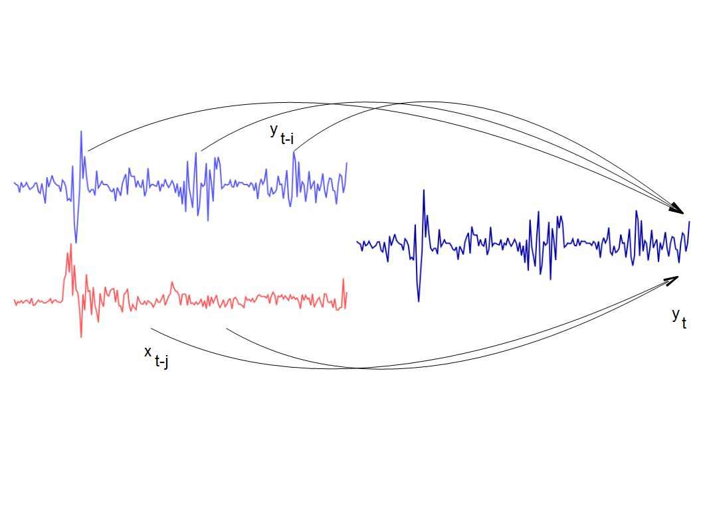

In the [continuing discussion with Mark Sadowski](http://informationtransfereconomics.blogspot.com/2015/08/nonlinear-signals-of-unusual-size-nsuss.html), I've realized that [Granger causality](http://www.scholarpedia.org/article/Granger_causality) between log-linear variables is equivalent to an information equilibrium model. Let's posit the equilibrium (so direction of the arrow doesn't matter) markets:

This is the information transfer model depicted in the diagram at the top of this post. If we log-linearize we have:

where $y_{t} = \log Y_{t}$ and $a^{(0)}$ represents the collected constant terms. The method of a Granger causality test is then first fitting the models $Y_{t} \rightarrow Y_{t - i}$, and then using the results to fit the combined models $Y_{t} \rightarrow Y_{t - i}, Y_{t} \rightarrow X_{t - j}$ (as well as looking at the reverse structure with $X_{t}$ as the information source).

[here](https://thefaintofheart.wordpress.com/2015/07/27/the-monetary-base-and-the-channels-of-monetary-transmission-in-the-age-of-zirp-conclusion/)

> -   _monetary base → price level_
> -   _monetary base → industrial production index_
> -   _monetary base → TIPS (5-year breakeven)_
> -   _monetary base → DJIA_
> -   _monetary base → ten-year rate_
> -   _ten-year rate → industrial production index_
> -   _monetary base → exchange rates_
> -   _monetary base → deposits_
> -   _monetary base → credit_

using the notation _source → destination._ The markets _monetary base → price level_ ($MB \rightarrow P$), _monetary base → TIPS_ ($MB \rightarrow (d/dt) \log P$) and _monetary base → ten-year rate_ ($MB \rightarrow r_{10y}$) both make the mistake of looking at a market as supply transferring information to the price instead of the price functioning as the detector of information transfer and are [better represented as the markets](http://informationtransfereconomics.blogspot.com/2014/06/the-information-transfer-model.html):

where $p$ is the price of money. The price level is the price in the market for nominal output and the interest rate is in information equilibrium with the price of money in the market for nominal output. The residuals are even lower if $M0$ is used instead of $MB$ in the above markets. The monetary base is best used in the short term (e.g. 3 month) interest rate market:

Here are the results for the long and short interest rates for the US and UK, for example:

So when Mark says:

> _But as we have seen here there is really is no monetary transmission channel that works primarily, much less exclusively, through expected short-term interest rates._

(even though he does not present an analysis of the monetary base and short term interest rates -- which will be forthcoming from me), we can take the model $(r_{3m}\rightarrow p)&nbsp;: NGDP \rightarrow MB$  as evidence of the large class of models \[1\] excluded from his analysis. 

Additionally, the market _monetary base → exchange rates_ is also incorrect as [exchange rates](http://informationtransfereconomics.blogspot.com/2014/09/what-do-exchange-rates-measure.html) are better represented straightforwardly as the ratio of the prices of money for the two countries in the markets 

The monetary aggregate can be various aggregates like M1 or M2 as the data does not really pick one over the other.

Maybe the information transfer framework is the wrong way to think about economics. However, if it turns out to be a correct theory of macroeconomics, then most of Mark's analysis represents spurious correlation as he has set up the flow of information incorrectly.

...

**Update 8/10/2015**

Corrected sign error and changed figure for the US per Tom Brown's comment below. Thanks for catching that!

**Footnotes:**

\[1\] Funnily enough, Scott Sumner's model of expectations is also excluded because if the reason the price level hasn't risen massively due to QE is that monetary base is expected to vanish, MB should have no impact on other variables -- changes in MB should not Granger-cause anything. If changes in MB does Granger-cause other variables and we take that model seriously, then Scott Sumner's expectations theory is wrong.
