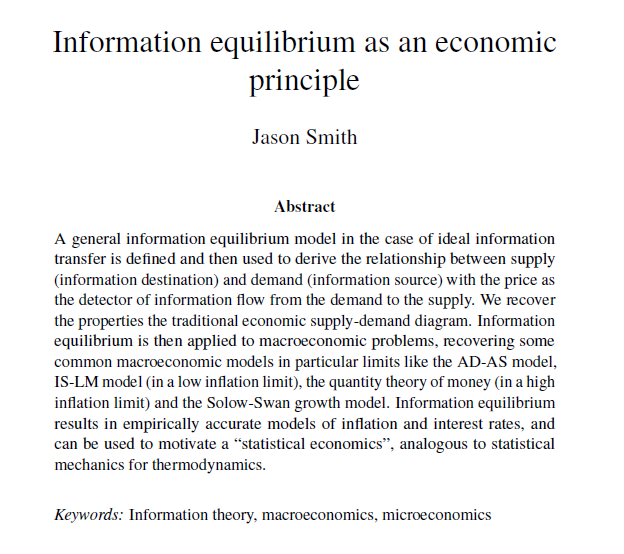

I have finished the first public _**draft**_ of the information equilibrium paper I [started to write back in February](http://informationtransfereconomics.blogspot.com/2015/02/information-equilibrium-paper-draft.html). Here is a link (please let me know if it doesn't work -- I think I've set my Google Drive settings properly) and the outline below:

\[Now a pre-print on arXiv. Updated the draft paper with edits from Peter Fielitz, Guenter Borchardt and Tom Brown. Version from 9/26/2015 is available [here](https://drive.google.com/file/d/0B6qAxdK1gOgwakJTdV9pWllRZmM/view?usp=sharing). Previous version was 8/21/2015 and is available [here](https://drive.google.com/file/d/0B6qAxdK1gOgwVFhSS3gtM05TNUU/view?usp=sharing).\]

_Information equilibrium as an economic principle_
[http://arxiv.org/abs/1510.02435](http://arxiv.org/abs/1510.02435)
[http://econpapers.repec.org/RePEc:arx:papers:1510.02435](http://econpapers.repec.org/RePEc:arx:papers:1510.02435)
[http://ssrn.com/abstract=2894072](http://ssrn.com/abstract=2894072)

1 Introduction
2 Information equilibrium
   _2.1 Supply and demand
   2.2 Physical analogy
   2.3 Alternative motivation_
3 Macroeconomics
   _3.1 AD-AS model
   3.2 Labor market and Okun's law
   3.3 IS-LM model and interest rates
   3.4 Price level and inflation
   3.5 Solow-Swan growth model
   3.6 A note on constructing models
   3.7 Summary_
4 Statistical economics
   _4.1 Entropic forces and emergent properties_
5 Summary and conclusion
