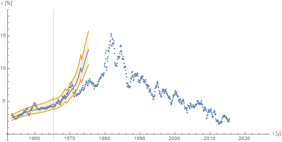

I've been playing around with the time series forecasting tools with my home-use copy of _Mathematica_ 10.2. Below is an animation of  the 10-year forecast of the [information equilibrium model](http://informationtransfereconomics.blogspot.com/2015/02/information-equilibrium-paper-draft_23.html) (or see [here](http://informationtransfereconomics.blogspot.com/2014/06/the-information-transfer-model.html); _update: added links_) starting from the 1960s to today. A couple of the frames failed to fit using the default settings for **TimeSeriesModelFit** (for the extrapolations) and **NonlinearModelFit** (to fit the model), so instead of fixing what was wrong I took the lazy way out and just deleted them. Here's the animation:

There are three key things about the data we'd hope a model could see before they happened: 1) the 'great inflation', 2) the end of the great inflation and 3) the 'great moderation' and the trend toward lower interest rates. I'd argue the IE model sees all three of these things ...

**1) The great inflation**

**2) End of the great inflation**

**3) Trend towards lower rates**

Additionally, the [DSGE-form of the model](http://informationtransfereconomics.blogspot.com/2015/08/are-higher-interest-rates-inflationary.html) gives a nice way to organize how this works.

Also, a side note -- I discovered that smoothing the monetary base data in the model, but not NGDP data gives a better fit to 10-year interest rates (first figure ... as opposed to e.g. smoothing both, second figure):

**Update + 6 hours:**

[discusses the downward trend](http://johnhcochrane.blogspot.com/2015/08/the-decline-in-long-term-interest-rates.html)

**Update + 9 hours:**

[Stephen Williamson](http://newmonetarism.blogspot.com/2015/08/some-real-interest-rates-are-low-but.html)
