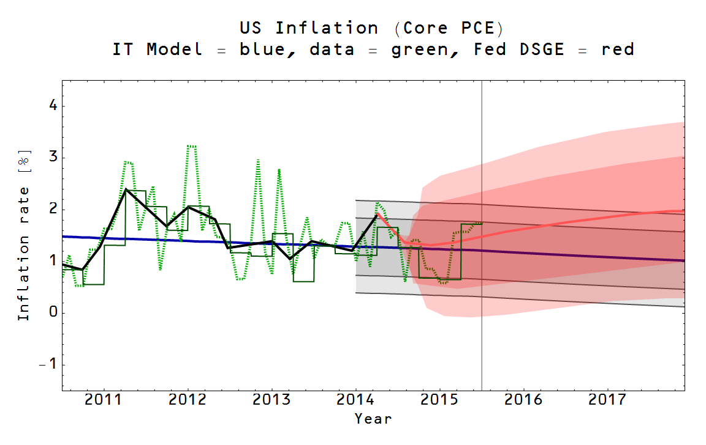

The new PCE inflation numbers are out and they've saved the NY Fed DSGE model from an ignominious early defeat. Granted, the probability was small that the information transfer model (ITM) would beat it in the first year (by "beat", I mean the DSGE model would be shown to be inconsistent with the data at roughly the 2-sigma level, not necessarily confirming the ITM).

Now we're just back to roughly a tie. Here is the updated graph (here's the [previous update](http://informationtransfereconomics.blogspot.com/2015/06/ny-fed-dsge-model-predictions-are-not.html)):

