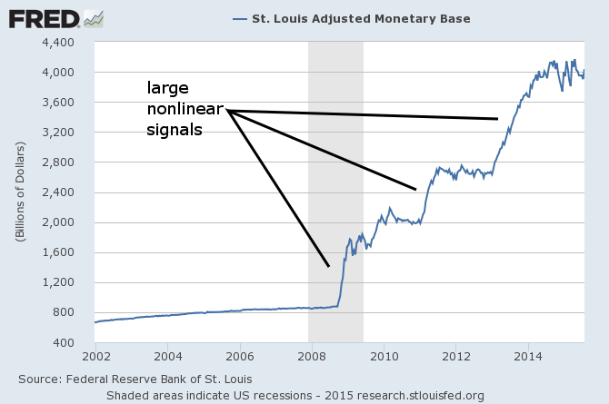

So the discussion continues (in comments [here](http://informationtransfereconomics.blogspot.com/2015/07/kaldor-endogenous-money-and-information.html), and a post and comments [here](http://informationtransfereconomics.blogspot.com/2015/08/statistical-significance-is-not-model.html)), but I think the TL;DR version of the Great Smith-Sadowski Row of 2015 is this:

> **Sadowski**: Changes in the monetary base Granger-cause changes in the economy. \[So the liquidity trap isn't real.\]

> **Smith**: You ignore large nonlinear signals in the monetary base data. 

> **Sadowski**: There were no targets for the monetary base before the ZLB, so I ignore the data before 2009. 

> **Smith**: If you ignore the large nonlinear signals, the data is log-linear and is likely spuriously correlated. 

> **Sadowski**: I know about spurious correlation. You have to de-trend the data. 

> **Smith**: You can't de-trend data with a large nonlinear signal in a model-independent way. 

> **Sadowski**: You are guilty of showing spurious correlation, too. 

> **Smith**: The data contains a large nonlinear signal that I don't ignore, so spurious correlation isn't an issue.

_update 8/10/2015_

> **Smith**: Look, here's [Dave Giles](http://davegiles.blogspot.com/2012/07/beware-of-tests-for-nonlinear-granger.html): _"Standard tests for Granger causality ... are conducted under the assumption that we live in a linear world."_

> **Sadowski**: The title of that post references nonlinear Granger causality.

> **Smith**: Huh? I was quoting the introduction that says why nonlinear Granger causality was invented.

> **Sadowski**: You can't interpret a post that's skeptical of nonlinear models to mean you should be skeptical of linear models.

> **Smith**: ???

> **Sadowski**: Here's [Chris House](https://orderstatistic.wordpress.com/2015/05/10/in-praise-of-linear-models/): _"In Praise of Linear Models …"_

> **Smith**: Chris House goes on to say (in that same post): _"There are cases like the liquidity trap that clearly entail important aggregate non-linearities and in those instances you are forced to adopt a non-linear approach."_ This is exactly the case that you are treating as linear when you say that the monetary base Granger-causes changes in the economy in order to say that the liquidity trap isn't real. ... I'm also now under the impression that you only read the titles of blog posts. 

After writing this, I think I've confirmed my feeling that this is just going in circles. You can't just sweep these under the rug:

I mean you can just sweep them under the rug, but the sweeping is strongly model-dependent.

**Update (+ 10 min):**

Example of model-dependent sweeping: QE is expected to be temporary, therefore changes in the base will not impact the price level.

Plausible? Sure. But completely dependent on a particular model of expectations.
