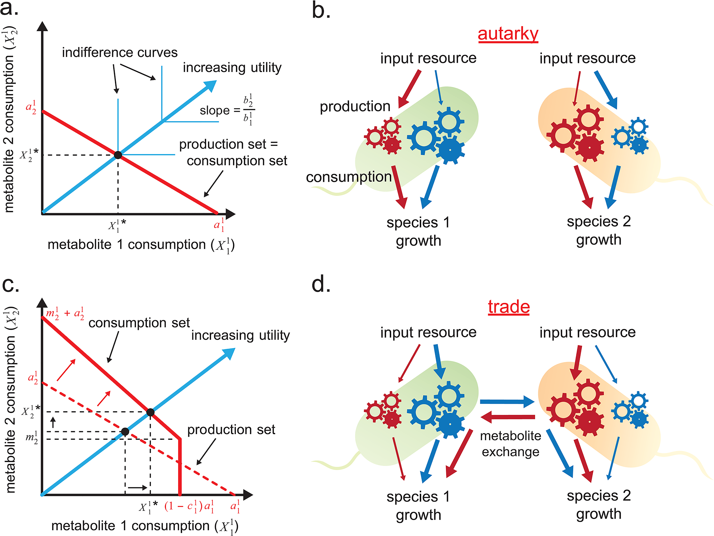

I think [this paper](http://journals.plos.org/plosone/article?id=10.1371/journal.pone.0132907) (_"An Economic Framework of Microbial Trade."_ H/T [Mark Thoma](http://economistsview.typepad.com/economistsview/2015/07/there-may-be-a-complex-market-living-in-your-gut-.html)) presents a serious challenge to the dominant paradigm of human decision-making in economics (expectations about the future, weighing opportunity costs).

[Tom Brown once asked me](http://informationtransfereconomics.blogspot.com/2014/08/against-human-centric-macroeconomics.html) if my framework would apply to non-human markets. At the time, I didn't have any good examples and so couldn't answer. This paper provides one: a community of _E. coli_. The mathematical model the researchers set up in the paper is a utility maximizing framework, but [generally similar results](http://informationtransfereconomics.blogspot.com/2015/03/utility-in-information-equilibrium-model.html) can be obtained from an entropy maximizing framework.

But _E. coli_ doesn't really plan for the future. It doesn't really make decisions in that would be considered remotely  the same as a human deciding between two different brands of bacon. Yet it seems to be effectively rationally maximizing utility. _**Without a brain**_.

So maybe, just maybe that whole idea of rational humans maximizing utility saves the phenomena of economic exchange, but doesn't really explain what is going on?
