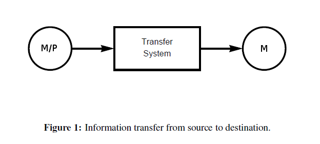

Earlier this month, [Scott Sumner started a blog post off](http://www.themoneyillusion.com/?p=30090) with an identity using the price level and the money supply:

and identified the numerator with the money supply and the denominator with real money demand allowing some conclusions to be teased out.

This is an information equilibrium model. We have the price of money being $1/P$ (a higher price level means money is less valuable -- see Sumner [here](http://www.themoneyillusion.com/?p=20177)), so this is inverted from our usual formulation:

Note that the differential equation is the correct marginal thinking in traditional economics -- the price of money should be the marginal exchange rate of a unit of demand (i.e. a unit of utility) for a unit of supply. [This equation appears in Irving Fisher's 1892 thesis](http://informationtransfereconomics.blogspot.com/2014/08/fishers-proto-information-transfer.html), and the information equilibrium model is only a minor generalization of it (adding the $k$). 

This is also [the simplest differential equation consistent with long run neutrality of money](http://informationtransfereconomics.blogspot.com/2014/02/i-quantity-theory-and-effective-field.html) (homogeneity of degree zero in supply and demand), Bennett McCallum's definition of the quantity theory of money \[1\].

First, let's replace $M/P$ with money demand $D$ and solve the differential equation (in general equilibrium where $D$ and $M$ vary):

where the $ref$ identifies constants introduced in integrating the differential equation. If we substitute Sumner's form for $D = M/P$ (or just by substituting the above equation in the definition of the price), we can show

i.e. the price level is constant in general equilibrium and there is no inflation. That's what we'd expect from $k = 1$. 

\[**Update 8/31/2015:** There was a sign error in the equations and incorrect discussion in these last paragraphs which should have referred to movement of the supply and demand curves ($X_{0} \rightarrow&nbsp;X_{0}&nbsp;+ \delta X$), not movement along them (changes in $ \Delta X = X - X_{ref} $). I marked the two changed sentences with an initial \*. _H/T Tom Brown in comments below._\]

Next, let's check out partial equilibrium. We can solve the differential equation (constraining $D$ or $M$ alternately to be slowly varying around $D_{0}$ and $M_{0}$, respectively) to arrive at:

which are supply and demand curves (this is essentially the same as [the AD-AS model in the information equilibrium framework](http://informationtransfereconomics.blogspot.com/2015/04/what-does-ad-as-model-mean.html)). \*In partial equilibrium, an increase in demand for money (a shift in the demand curve, $D_{0} \rightarrow&nbsp;D_{0}&nbsp;+ \delta D$) leads to a rise in the price of money ($1/P$) and a fall in the price level ($P$). \*An increase in supply of money (a shift in the supply curve $M_{0} \rightarrow&nbsp;M_{0}&nbsp;+ \delta M$) leads to a fall in the price of money ($1/P$) and a rise in the price level ($P$). In a sense, we only get inflation (or deflation) from changes in money demand and money supply. However, since $k = 1$, these should go away in the long run and inflation should be constant -- given the general equilibrium solution.

In Sumner's post, he says that $D$ is actually real GDP and "other stuff", thus we come to the conclusion that growth is deflationary.

So what about that "other stuff"? Well, in the information equilibrium model, we put the other stuff in two places -- (exogenous) [nominal shocks](http://informationtransfereconomics.blogspot.com/2015/08/employment-doesnt-depend-of-inflation.html) and a changing $k$. It's the latter that becomes Sumner's $V$ (velocity in the quantity theory of money). And the best place to see that model is in my draft paper available [here](http://informationtransfereconomics.blogspot.com/2015/08/information-equilibrium-as-economic.html).

**Footnotes:**

\[1\] _Long-Run Monetary Neutrality and Contemporary Policy Analysis_ Bennett T. McCallum (2004)
