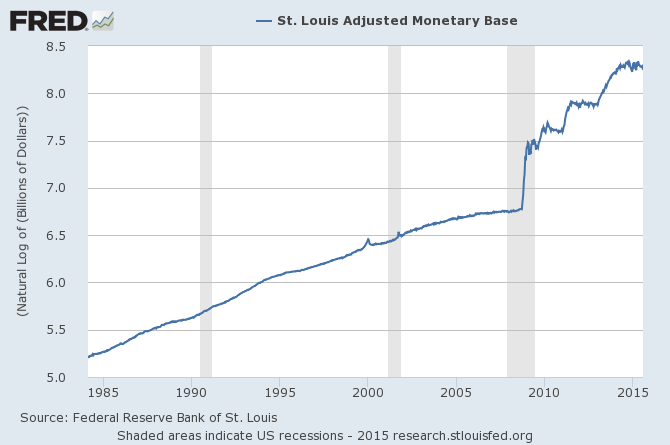

I have been having a discussion with Mark Sadowski [in comments here](http://informationtransfereconomics.blogspot.com/2015/07/kaldor-endogenous-money-and-information.html) about what his [series of posts at Marcus Nunes's blog](https://thefaintofheart.wordpress.com/2015/07/27/the-monetary-base-and-the-channels-of-monetary-transmission-in-the-age-of-zirp-conclusion/) actually show. My more general argument (that Mark's model [is actually an information transfer model](http://informationtransfereconomics.blogspot.com/2015/07/the-sadowski-theory-of-money.html) that demonstrates a liquidity trap) notwithstanding, here is a piece of the conversation:

> **Me:** The data are exponential and any two exponentials will be related by the above relationship \[_log P(t) = a log MB(t-q) + b_\]. You're not learning that your model or theory is correct. You're learning that economic systems tend to be exponential. Interpreting statistical significance as model correctness is an inference error. 

> **Mark:** Just because two variables both exhibit a similar trend does not mean there is a statistically significantly relationship between them. Moreover there is often statistically significant relationships between variables which do not exhibit similar trends. So frankly this statement is weirdly nonsensical.

I agree that there can be statistically significant relationships between variables with different trends, which is beside the point; my point was that if your data are all roughly samples of exponentially growing functions, you can almost always find a statistically significant relationship between them even if they isn't any relationship at all.  

I decided to demonstrate my assertion with a concrete example (the complete details are at the bottom of this post). Let's generate two randomly fluctuating exponentially growing data series (using normally distributed shocks to the growth rate):

Now let's say the red one is the data _V1_ and blue one is the explanatory variable _V2_ and fit the data to the model:

_log V1(t) = a0 log V2(t - t0) + b0_

Here is the model result (solid blue) -- the dashed blue line is _a0 log V2(t) + b0_, i.e. showing the data for _V2_ without the lag:

The fit has chosen a lag that lines up some of the random fluctuations in _V1_ to the random fluctuations in _V2_  a bit better (actually, statistically significantly better)_._

And the result is that the parameter p-values of the model fit are all _p_ < 0.01 ... a statistically significant relationship, worthy of publication in an economics journal for example.

So I did it 100 times -- and only a few percent of the results failed to achieve _p_ < 0.01 (showing the parameter _p_\-values with the worst _p_\-values):

And that is for random data with no relationship between the two except that they are both exponential. That is what I mean by "\[i\]nterpreting  statistical significance \[_p_ < 0.01\] as model correctness is an inference error."

Additionally, adding more data causes the previously identified relationship (the model with parameters _a0_, _t0_ and _b0_) to break down.

The big takeaway from this, and what brings it back to my more general argument, is that in order to make causal inferences you need to see strong changes in the trend of your data ... like the one that happens in 2008 here:

I once called this the [cleanest economic experiment ever](http://informationtransfereconomics.blogspot.com/2014/11/quantitative-easing-cleanest-experiment.html). Mark's analysis ignores this amazing source of potentially informative data by concentrating only on the post-2008 data (and thus contains only a single log-linear trend). 

_Mathematica_

