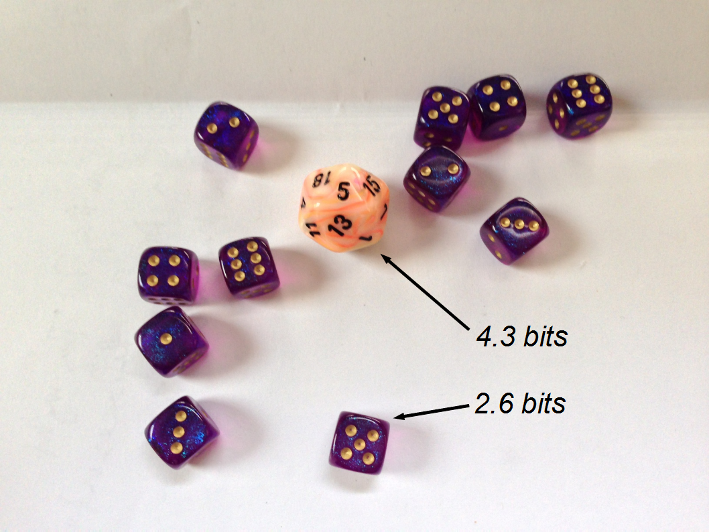

> _Editor's note: This post has been languishing in the drafts folder for several months, so I gave it a quick finish and posted it._

In a [footnote to the previous post](http://informationtransfereconomics.blogspot.com/2015/03/real-vs-nominal.html) I mentioned flipping a coin versus rolling a twenty sided die as a different way of thinking about the solution to paradox of value -- why diamonds cost more than water (we need water to survive, yet water is cheaper than diamonds).

[solution is marginal utility](http://en.wikipedia.org/wiki/Paradox_of_value)

If we look at the picture above, we need a total of about 33 bits to specify this particular result

In equilibrium, the supply effectively knows the demand's "roll". '[Quanta](https://en.wikipedia.org/wiki/Quantum)' of 4.3 bits are flowing back and forth in the diamond market and quanta of 2.6 bits are flowing back and forth in the water market. However if there is a change, a change in the 20-sided die in the demand's roll, it requires a flow of 4.3 bits to the supply side. A change in one of the six-sided dice requires a flow of 2.6 bits.

Therefore the information transfer index $k_{d}$ for diamonds is going to be larger than the index for water $k_{w}$. If there is something that functions as money (see [here](http://informationtransfereconomics.blogspot.com/2015/05/money-defined-as-information-mediation.html) and [here](http://informationtransfereconomics.blogspot.com/2015/06/the-definition-origin-and-purpose-of.html), _Ed. note: these are later posts that more clearly demonstrate my point_), then the information transfer index in terms of money will also be larger. Therefore, the price of diamonds will grow much faster than the price of water since for some $m$:

The absolute price is not knowable in the information transfer model, but by simply being rarer (i.e. lower probability so that more information is revealed by specifying its allocation) the price will grow much faster. Thus eventually, regardless of the starting point, diamonds will be more valuable than water. The one caveat (assumption) is that both things must continue to have a market.

...

**Update**: fixed typos of 4.6 bits where it should read 4.3 bits (H/T Tom Brown in comments below).
