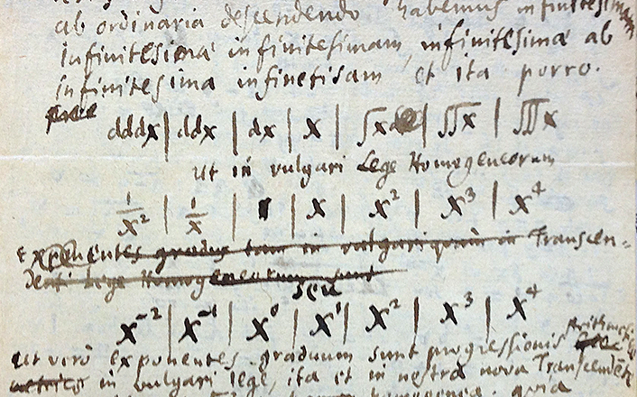

Peter Fielitz and Guenter Borchardt kindly sent me a review of [my draft paper](http://informationtransfereconomics.blogspot.com/2015/08/information-equilibrium-as-economic.html) and make excellent contributions (thanks also to Tom Brown for a thorough read and commentary). Among other things, they suggest the more pedagogical notation:

which is very good -- and makes more apparent a connection with chemical reactions. The double arrow notation has a unicode representation (however the subscripts D and S are not commonly available unicode).

_P : I(D) ⇄ I(S)_

The information notation _I(D)_ or $I_{D}$ (for information in process variable _D_) would get a bit more unwieldy were we to use variables like _I(NGDP)_ or $I_{NGDP}$. The unicode representation was one reason for using the single arrow notation

_P : D → S_

despite the notation being overloaded (category theory, functions, maps, fiber bundles). The other thing I did want to make clear was the relationship between the variables in the case of non-ideal information transfer where _I(D) ≥ I(S)_. However, that relationship is evident in the _D_ preceding the _S_.

_P : D ⇄ S_

potentially keeping the single arrow notation for non-ideal information transfer. For example, the price level model is:

_P : NGDP ⇄ M0_

One thing this notation helps avoid is concerns about the direction of information flow (source/destination designation) in the case of information equilibrium. [Commenter M](http://informationtransfereconomics.blogspot.com/2015/05/the-mathematical-properties-of.html?showComment=1433061989570#c5091514042451898348) previously mentioned the lack of symmetry in the single arrow notation as being unclear.

It also helps avoid the overloading problem of the single arrow notation -- so that all we now have to worry about is the overloaded term "information". I thought this post could serve as a reference on information transfer-/information equilibrium- specific notation as well.
