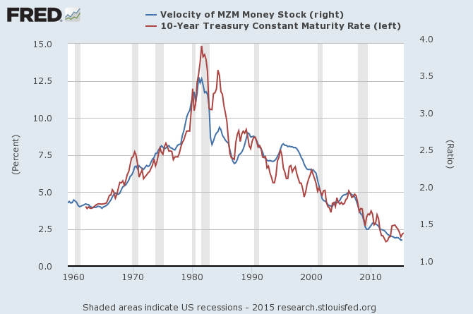

[Vincent Cate](http://informationtransfereconomics.blogspot.com/2015/09/the-classical-mechanics-of-wicksell.html?showComment=1443131122291#c20225450472562111) points out ([on his blog](http://www.howfiatdies.blogspot.com/2015/09/punchbowl-removal-difficulties.html)) that the velocity of MZM (money with zero maturity) matches up quite well with the 10-year Treasury interest rate (from [FRED](https://research.stlouisfed.org/fred2/graph/?g=1WNA)):

I had actually [noticed this before](http://informationtransfereconomics.blogspot.com/2014/04/broad-money-narrow-money-and-interest.html) based on a question from Tom Brown, but I hadn't seen the significance regarding the velocity of money [in the previous post](http://informationtransfereconomics.blogspot.com/2015/09/the-unobservables.html) until Vincent pointed it out. This version of the quantity theory looks like

_PY/M = V ~ a i + b_

where _i_ is the long term (10-year) nominal interest rate. So the quantity theory model where velocity isn't constant (_V ~ c_), but rather determined by the interest rate (_V ~ i_) does look like a successful model that avoids the issues of circularity involving unobservables in my previous post.

Interestingly, this is also an information transfer model where _PY =_ NGDP, _M =_ MZM with detector _i_, i.e. (_i_ ⇄ _p_) _:_ NGDP ⇄ MZM such that

_c_ log NGDP/MZM _- k =_ log _i_

 

with _c =_ 0.55 and _k =_ 4.27 (see [here](http://informationtransfereconomics.blogspot.com/2014/04/broad-money-narrow-money-and-interest.html)). 

One could see three different measures of money supply corresponding to three different things

MZM :: long interest rate

M0 :: inflation

MB :: short interest rate

These are also my three favorite money supply measures because they are the least arbitrary. Measures like M1 and M2 include some things (like bank deposits) but not others (like money market funds) because they weren't deemed important at the time. MZM has a rule to determine what goes in (zero maturity) and M0 is physical currency that has a physical reality.

However I do like the simplicity of the single equation for long and short rates in the model I present in the [draft paper](http://informationtransfereconomics.blogspot.com/2015/08/information-equilibrium-as-economic.html) (as well as the [NGDP-M0 path](http://informationtransfereconomics.blogspot.com/2014/08/are-interest-rates-good-indicator-of.html)), but really it's up to empirical analysis to determine which is better. (And for what purpose ... policy? forecasts?)
