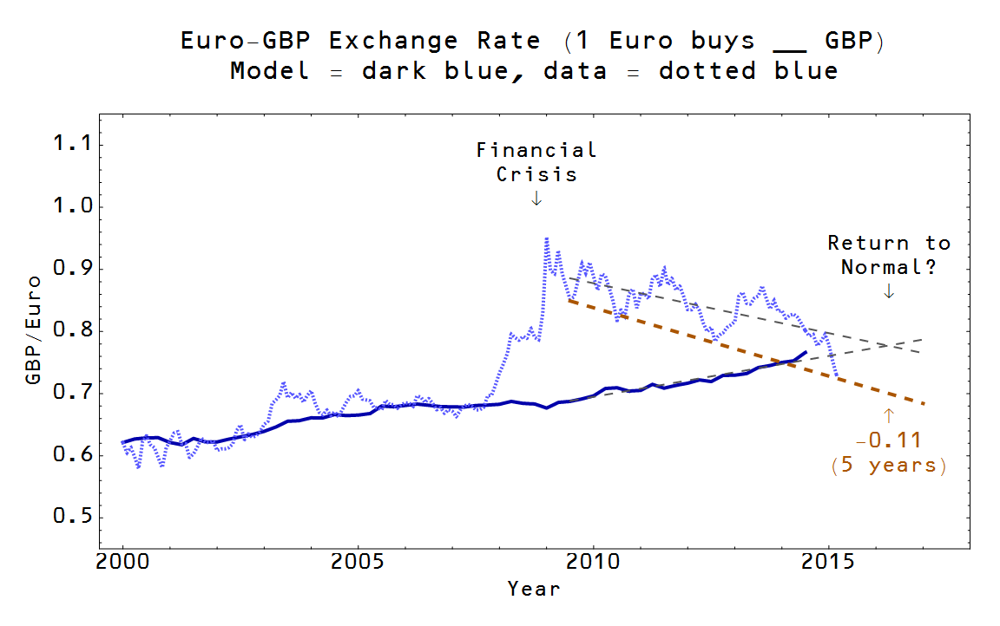

Scott Sumner's big idea is that we should have a high-volume, liquid NGDP futures (prediction) market and use that to determine monetary policy. He frequently suggests that the existence of such a market would help understand macroeconomic conditions (for example, [here](http://www.themoneyillusion.com/?p=30514) with Australia).

Now I am not as convinced about the utility of prediction markets \[1\], but I had the random thought the other day while I was on a flight to New Mexico: _Scott's high-volume, liquid futures market exists and is called the forex market_.

The exchange rate between two countries is effectively (proportional to) a ratio of their aggregate demands \[4\]. The ratio of the price of a dollar to the price of a Euro depends not just on the supply, but the demand for both currencies -- the exchange rate is a general equilibrium solution, not partial equilibrium \[2\]. That is to say, you can look at the exchange rates between each pair of currencies and get a measure the relative NGDP of the two countries. Since exchange rate data is typically available immediately, that gives a forecast of the NGDP number that comes out usually a month (first estimate) to three months (third estimate) after the quarter it represents. You could measure any given currency against a basket of currencies to approximate an absolute measure.

Forex markets are notoriously volatile (see e.g. the [Dornbusch overshooting model](https://en.wikipedia.org/wiki/Overshooting_model)). And one of the reasons, at least from the information equilibrium perspective \[3\], is that it seems traders might have a sign error in their mental model leading to corrections that go the wrong way at first and only gradually return to a normal level (see the picture at the top of this post which is from \[5\]). For example, in a supply and demand diagram an expansion of the monetary base leads to a price drop for a currency. However, in general equilibrium an expansion of the monetary base is (usually) accompanied by a (relative) expansion in the economy. That is to say additional money isn't printed unless there is demand for it. And demand may rise a little bit, just the right amount or too much -- leading to excess inflation, trend inflation or below trend inflation/deflation.

It is possible to fix this by convincing forex markets that they are NGDP futures markets. But that is dependent on the "wrong model" theory \[3, 5\] accounting for most of the volatility.

**Update + 10 min**

I should add that [this is relevant](http://johnhcochrane.blogspot.com/2013/10/bob-shillers-nobel.html). Potentially exchange rates are measuring long run NGDP ratios in the same way P/E ratios measure long run returns which are volatile.

**References (from this blog)**

[Is the market intelligent?](http://informationtransfereconomics.blogspot.com/2015/01/is-market-intelligent.html)
[What do exchange rates measure?](http://informationtransfereconomics.blogspot.com/2014/09/what-do-exchange-rates-measure.html)
[Is market monetarism wrong because the market is wrong?](http://informationtransfereconomics.blogspot.com/2014/11/is-market-monetarism-wrong-because.html)
[Exchange rates and monetary policy](http://informationtransfereconomics.blogspot.com/2015/05/exchange-rates-and-monetary-policy.html)
[Exchange rates and irrational markets](http://informationtransfereconomics.blogspot.com/2015/06/exchange-rates-and-irrational-markets.html)
