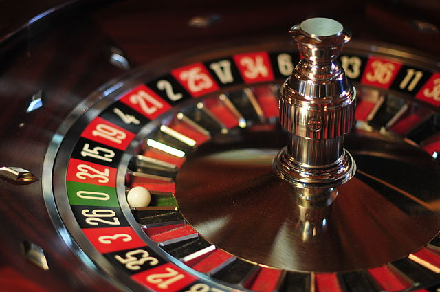
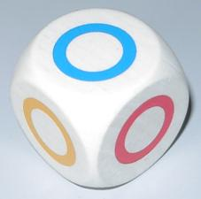

I was asked by [a commenter](http://informationtransfereconomics.blogspot.com/2014/03/how-money-transfers-information.html?showComment=1442437670560#c5491413712748445826) to come up with a good intuitive metaphor for information equilibrium -- something I've been trying to do for awhile now. What popped into my head was a simple dice game. Two six-sided dice are always in information equilibrium with each other as each roll reveals 2.6 bits. The utility maximization approach would require both dice to show the same roll (both roll a 2 or both roll a 4) and matching theory would be something like the numbers on them being close (one rolls a 4 and the other rolls a 3). See e.g. [here](http://informationtransfereconomics.blogspot.com/2015/05/utility-maximization-matching-and.html).

The interesting thing about that metaphor is that the six sided dice don't have to have the same thing on them. One could be a backgammon doubling die or have 6 different colors on it. And that makes sense in economics -- you're not usually exchanging two things that have an exact mapping to each other (e.g. like bacon and money, analogous to colors and numbers on the two dice).

In thinking about that metaphor I realized there is an amazing real world example of an exact conversion of money into information. It's called casino gambling.

You plunk down some money on a number in roulette. The information in a spin of the wheel is log₂ 38 = 5.24 bits. Of course, the payout is based on 36 (neglecting the zero and double zero), so there is some non-ideal information transfer -- a difference of 0.08 bit per spin. So the information in the payout odds is approximately equal to the information revealed by the spin:

_I(S) ≈ I(O)_

Actually we have _I(S) > I(O)_, but let's assume equality for now. The [information equilibrium model](http://informationtransfereconomics.blogspot.com/2015/04/information-theory-and-economics-primer.html) then tells us that (in general equilibrium):

_S ~ Oᵏ_

where _k_ is called the information transfer index. And the the price is

_p ~ Oᵏ ⁻ ¹_

So what does this mean? Well, we have to resort to empirical evidence to establish our parameters. For one thing, the quantity of payouts (supply) is equal to the quantity of spins (demand). So _k = 1_. That means the price is a constant:

_p ~ O¹ ⁻ ¹ ~ O⁰ ~ constant_

The relative odds are the same no matter how much money you put down -- you don't get better or worse odds for playing more than one game. There is no return or growth (actually there is a slow loss due to the non-ideal information transfer). At least in this case.

There are even some partial equilibrium results. For example, in order for the quantity of spins demanded to stay the same given an increase in the number of payouts per spin, the price (the exchange rate for spins to payouts) would have to fall. Basically, the casino would have to provide worse relative odds (lower price) in order to keep the same number spins with an increased number of payouts.

Imagine if the casino was offering two payouts for every spin at the old 36:1 odds? There's no way you'd have the same number of spins. But if the odds offered fell to 18:1, you'd get the same number of spins as before (two 18:1 payouts are equal to one 36:1 payout). Note that the relative odds of the spin (38:1) and the payout odds (18:1) are now 2:1 (the price p is now 1/2).

These are the basics of the information equilibrium model. The model lets you have some freedom in choosing _k_ to fit the empirical data so you can end up with slightly more complicated relationships that the simple linear relationship at the roulette table.

But where the model really makes a difference is when we look at a huge number of roulette tables and a huge number of spins. That's because even if the odds are 38:1, you only win 1 out of every 38 times. You don't win every 38th time. The actual path of any particular player is going to show random fluctuations in total winnings. That is to say the relationships above hold on average with a large number of spins.

No specific player is required to exactly win 1/38th of the time and some may actually go broke even with 38:1 odds \[1\]. And some might get rich. There may be a person that exactly breaks even over time, but there doesn't have to be. There is no specific representative agent. The representative agent that breaks even is [emergent](http://informationtransfereconomics.blogspot.com/2015/09/the-emergent-representative-agent-1.html).

These relationships also hold regardless of whether some players have "a system", or even if they don't know how to play the game. They hold for robots, Vulcans, babies, pirates and whatever other trochees are out there.

Basically, the information equilibrium picture is agnostic about the details of what actually happens. It cares about information content.

**Footnotes:**

\[1\] The fact that people have a finite supply of money means that people will tend to go broke and be unable to play, lowering the overall relative payout -- a factor that would contribute to non-ideal information transfer. Actually, [everyone will eventually go broke](https://en.wikipedia.org/wiki/Gambler%27s_ruin) in this example given a finite supply of money.
