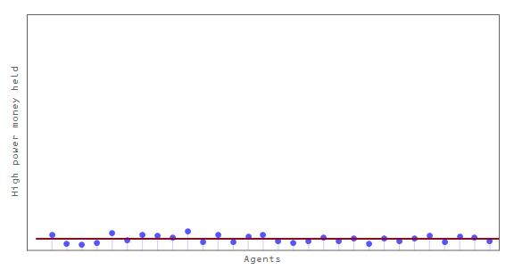
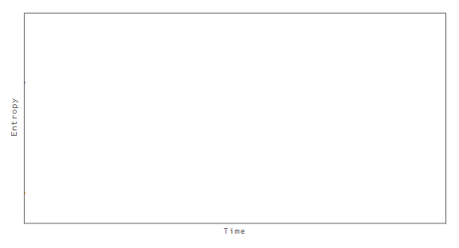

[Roger Farmer](http://rogerfarmerblog.blogspot.com/2015/09/washington-we-have-problem.html) has a picture of QE overlaid with 1-year market inflation expectations (shown above). Something looked [very familiar](http://informationtransfereconomics.blogspot.com/2015/07/updated-graphics-for-entropic-hot.html). I also have an issue with his timing ... he says:

> _From January of 2007, through September of 2008, expected inflation fluctuated between two percent and three and a half percent. When Lehman Brothers declared bankruptcy in September 2008, expected inflation fell by nearly eight hundred basis points in the space of two months and by October of 2008 it reached a low of negative four and half percent._ 

> _Immediately following the Federal Reserve purchase of one point three trillion dollars of new securities, expected inflation went back up into positive territory._

Actually, it appears that the 800 bp drop coincides with the onset of QE. But maybe Roger is referring to the start of the onset of MBS purchases. In any case, this looks a lot like this picture ...

Which shows the simple "hot potato" model linked above (and [here](http://informationtransfereconomics.blogspot.com/2015/07/updated-graphics-for-entropic-hot.html)) -- the total amount of high powered money (yellow) and the entropy of the distribution (blue). Here are the animations from that link above showing the QE as well ...

If we take the entropy as corresponding to inflation expectations, the QE caused the fall in inflation (interest rates). Base reserves weren't distributed in a maximum entropy distribution (probably a Pareto distribution for banks) and instead were coordinated (concentrated among a few banks). This sudden correlation brought on by QE disappeared over time via random transactions.

Note this is analysis of the non-equilibrium dynamics of market expectations of inflation, not actual inflation which appears to have [nothing to do with QE](http://informationtransfereconomics.blogspot.com/2014/11/quantitative-easing-cleanest-experiment.html).
