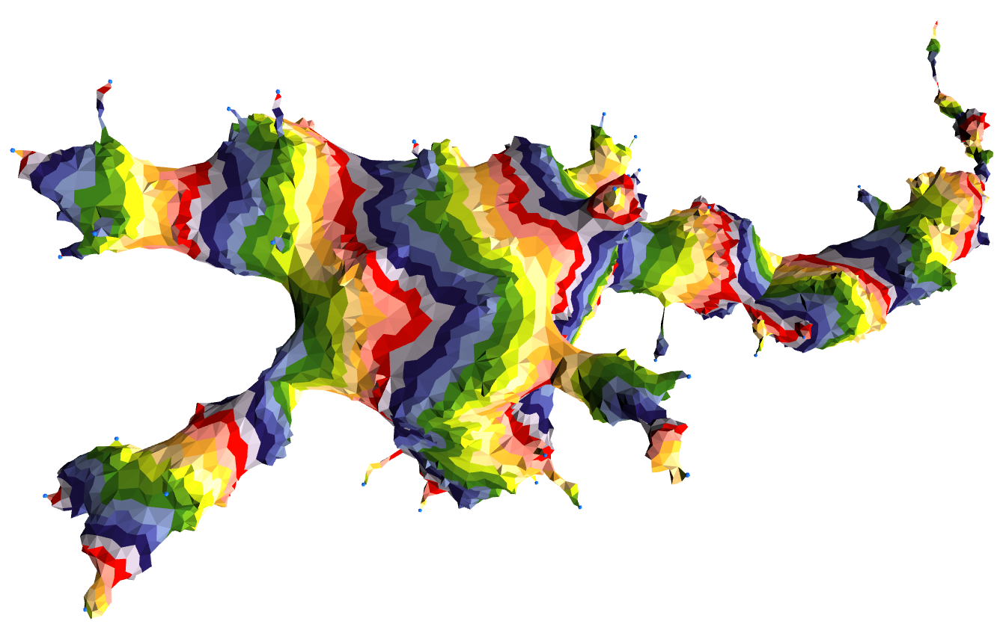

Paul Krugman [mentions gravity models today on his blog](http://krugman.blogs.nytimes.com/2015/09/01/gravity/) which gives me an opportunity to apply the information transfer model to a new economic model.

The model is essentially a Cobb-Douglas function (see e.g. [here](http://informationtransfereconomics.blogspot.com/2015/03/utility-in-information-equilibrium-model.html)) produced from the information equilibrium relationships $T \rightarrow N_{1}$ and $T \rightarrow N_{2}$ where $T$ is the volume of trade and $N_{i}$ is the aggregate demand (NGDP) of country $i$ so that:

This piece is essentially given by Krugman's very nice overview of the argument which is really an information equilibrium argument:

> _Here’s my take: Think about two cities with the same per capita GDP — we can relax that assumption in a minute. They will trade if residents of city A find things being sold by residents of city B that they want, and vice versa._ 

> _So what’s the probability that an A resident will find a B resident with something he or she wants? Applying what one of my old teachers used to call the principle of insignificant reason, a good first guess would be that this probability is proportional to the number of potential sellers — B’s population._ 

> _And how many such desirous buyers will there be? Again applying insignificant reason, a good guess is that it’s proportional to the number of potential buyers — A’s population._ 

> _So other things equal we would expect exports from B to A to be proportional to the product of their populations._ 

> _What if GDP per capita isn’t the same? You can think of this as increasing the “effective” population, both in terms of producers and in terms of consumers. So the attraction is now the product of the GDPs._

> _And there’s also a puzzle about both the effect of distance and the effect of borders, both of which seem larger than concrete costs can explain._

I have some more fundamental issues with distance. The Earth realizes a specific set of nation-states that have a fairly highly spatially correlated wealth distribution (e.g. rich Europe and poor Africa). Distance is therefore going to be correlated with partner NGDP for most countries. But if trade is a significant contributer to NGDP this spatial correlation will be an effect of trade, making it difficult to tease out the relationship -- the exact samples you need (countries with the same GDP at all different distances) are the ones that don't appear in the sample.

However, if distance between countries 1 and 2 is in information equilibrium with NGDP, then we can write down the model $D_{12} \rightarrow N_{1}$ so that

So from an econometric view, you can probably get a form that looks like the gravity model equation. However, I am not entirely sure we can unambiguously associate the effect with distance per se.

PS The figure is a realized universe in a causal dynamical triangulation model of quantum gravity.
