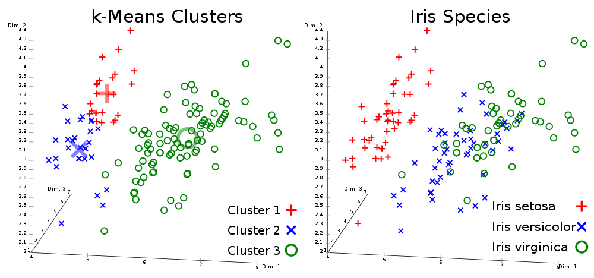

Tom Brown asked my opinion on [Noah Smith's recent piece](http://www.bloombergview.com/articles/2015-09-01/economics-has-a-math-problem) on machine learning. This is actually an area I know something about.

Let me first give a plug for Igor Carron who does an excellent job at curating [his site](http://nuit-blanche.blogspot.com/) dedicated to signal processing, sparse recovery, matrix factorization and machine learning focusing on how many of these technologies are related to each other in a deep way. As an aside, Igor's writing about the publication process is what inspired me to take the information transfer model to the blogs.

Now Noah's point is that interest in machine learning represents a break from the way economic theory has been done in the past. He ends questioning how much influence it will have, so I don't think he is exhibiting boosterish enthusiasm.

However there are several issues with machine learning, a couple of which may exacerbate -- not mitigate -- issues in economic theory.

So what is machine learning? Noah starts out his discussion with the elevator pitch:

> _Machine learning is a broad term for a collection of statistical data analysis techniques that identify key features of the data without committing to a theory. To use an old adage, machine learning “lets the data speak.”_

While this is the elevator pitch, it's a misleading one. Let's use the example of optical character recognition, the kind of problem machine learning techniques actually excel at. For one thing, you don't just let a random [scikit](http://scikit-learn.org/stable/) algorithm loose on Google image results. You'd cull the data for things that are images of letters or writing (as opposed to pictures of bacon), sometimes even breaking them up manually. You'd also choose an algorithm based on the general class of features you'd like to key in on. You get to tell the computer what is important.

That should make it pretty clear that machine learning isn't a theory-free way of letting the data speak. It takes quite a bit of framing, data selection and -- critically -- implicit theorizing to get to results. This is fine if you are trying to design a system that works for a problem humans can solve in their head (recognizing letters) and the implicit model isn't terribly controversial (high contrast lines and shapes in a relatively clutter-free environment). But do you include the monetary base in your machine learning macro model? Or M2? Both?

This is also exactly the problem Paul Pfleiderer, Paul Krugman, Paul Romer and even Noah himself have with current economic theory -- albeit from different directions. \[So many Pauls ...\]

Pfleiderer's chameleon models \[[pdf](https://www.gsb.stanford.edu/sites/default/files/research/documents/Chameleons%20-The%20Misuse%20of%20Theoretical%20Models%20032614.pdf)\] have their obfuscated assumptions that are introduced as "model convenience" but not taken to impugn final results. With machine learning, those assumptions are  implicit and can therefore be even more hidden -- the algorithm found this relationship, not me.

[Krugman advises](http://krugman.blogs.nytimes.com/2014/10/14/the-state-of-macro-six-years-later/)

> _Any time you make any kind of causal statement about economics, you are at least implicitly using a model of how the economy works. And when you refuse to be explicit about that model, you almost always end up – whether you know it or not – de facto using models that are much more simplistic than the crossing curves or whatever your intellectual opponents are using._

Your implicit theorizing now enters through your algorithm and data selection instead of your gut feelings, but it's still implicit.

Romer is critical of a lack of "tight links" between the mathematics of the model and the language used to describe the model. That misleading elevator pitch above is exactly an example of what he calls [mathiness](http://paulromer.net/mathiness/) -- and we should probably call this 'data science-iness' in this context. There is no tight link between the phrase "without committing to a theory" and what is actually happening on your computer.

And [Noah's issues with the HP filter](http://noahpinionblog.blogspot.com/2012/07/steve-williamson-explains-modern-macro.html) almost exactly map to issues with machine learning:

> _But how much do you smooth \[with an HP filter\]? That's a really key question! If you smooth a lot, the "trend" becomes log-linear, meaning that any departure of GDP from a smooth exponential growth path - the kind of growth path of the population of bacteria in a fresh new petri dish - is called a "cycle". But if you don't smooth very much, then almost every bend and dip in GDP is a change in the "trend", and there's almost no "cycle" at all. In other words, YOU, the macroeconomist, get to choose how big of a "cycle" you are trying to explain. The size of the "cycle" is a free parameter._

The issues of how to set up your clustering algorithm are essentially the same -- what is called a cluster is to a great degree in your control.

I'm sure there will be useful applications of machine learning in economics. However the idea of being theory-free is more of a problem for economics than a benefit. The rest of us should be wary.

**Update 21 January 2017**

Fixed broken graphic link at top of post with a different picture.
