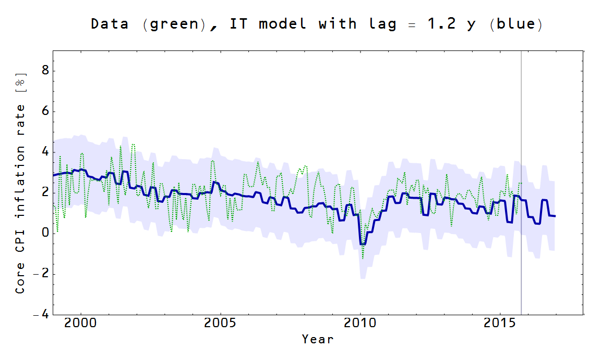
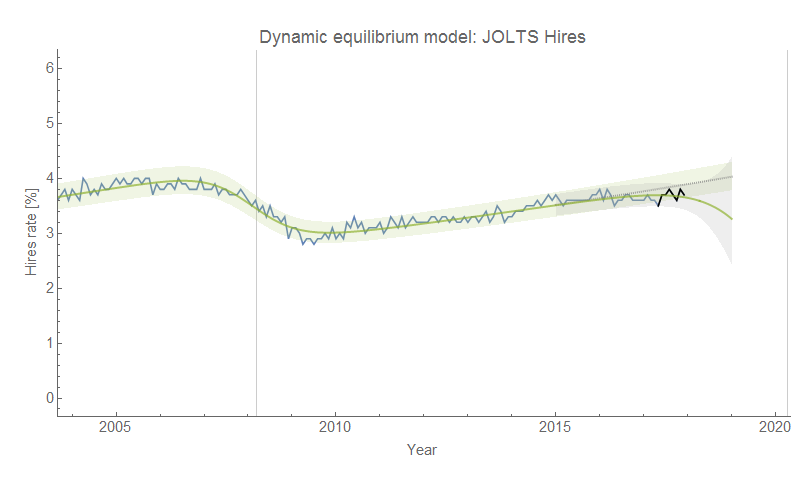

[previous one](https://informationtransfereconomics.blogspot.com/2014/09/information-transfer-prediction.html)

\_\_\_\_\_\_\_\_\_\_\_\_\_\_\_\_\_\_\_\_\_\_\_\_\_\_\_\_\_\_\_\_\_

**Prediction: multiple indicators**

[https://informationtransfereconomics.blogspot.com/2015/09/predictions-doing-well-after-18-months.html](https://informationtransfereconomics.blogspot.com/2015/09/predictions-doing-well-after-18-months.html)
[https://informationtransfereconomics.blogspot.com/2016/04/celebrate-this-blogs-birthday-with.html](https://informationtransfereconomics.blogspot.com/2016/04/celebrate-this-blogs-birthday-with.html)

_Status: Successful__☺_

\_\_\_\_\_\_\_\_\_\_\_\_\_\_\_\_\_\_\_\_\_\_\_\_\_\_\_\_\_\_\_\_\_

**Prediction: interest rates**

[https://informationtransfereconomics.blogspot.com/2015/08/comparison-of-interest-rate-predictions.html](https://informationtransfereconomics.blogspot.com/2015/08/comparison-of-interest-rate-predictions.html)
[https://informationtransfereconomics.blogspot.com/2016/05/doing-economists-work-only-better.html](https://informationtransfereconomics.blogspot.com/2016/05/doing-economists-work-only-better.html)
[https://informationtransfereconomics.blogspot.com/2016/11/the-surge-in-10-year-rate.html](https://informationtransfereconomics.blogspot.com/2016/11/the-surge-in-10-year-rate.html)
[https://informationtransfereconomics.blogspot.com/2017/02/monetary-base-and-interest-rate.html](https://informationtransfereconomics.blogspot.com/2017/02/monetary-base-and-interest-rate.html)
[https://informationtransfereconomics.blogspot.com/2017/08/who-has-two-thumbs-and-really-great.html](https://informationtransfereconomics.blogspot.com/2017/08/who-has-two-thumbs-and-really-great.html)
[https://informationtransfereconomics.blogspot.com/2017/10/10-year-interest-rate-forecasts-in-us.html](https://informationtransfereconomics.blogspot.com/2017/10/10-year-interest-rate-forecasts-in-us.html)

Status: Ongoing

\_\_\_\_\_\_\_\_\_\_\_\_\_\_\_\_\_\_\_\_\_\_\_\_\_\_\_\_\_\_\_\_\_

**Prediction: unemployment rate (vs FRBSF)**

[https://informationtransfereconomics.blogspot.com/2017/01/unemployment-forecasts.html](http://informationtransfereconomics.blogspot.com/2017/01/unemployment-forecasts.html)
[https://informationtransfereconomics.blogspot.com/2017/02/unemployment-forecast-update.html](http://informationtransfereconomics.blogspot.com/2017/02/unemployment-forecast-update.html)
[https://informationtransfereconomics.blogspot.com/2017/04/unemployment-rate-conditional-forecast.html](https://informationtransfereconomics.blogspot.com/2017/04/unemployment-rate-conditional-forecast.html)
[https://informationtransfereconomics.blogspot.com/2017/07/a-few-forecast-updates.html](https://informationtransfereconomics.blogspot.com/2017/07/a-few-forecast-updates.html)
[https://informationtransfereconomics.blogspot.com/2017/09/recession-detection-algorithm-update.html](https://informationtransfereconomics.blogspot.com/2017/09/recession-detection-algorithm-update.html)
[https://informationtransfereconomics.blogspot.com/2018/01/labor-market-update-comparing-forecasts.html](https://informationtransfereconomics.blogspot.com/2018/01/labor-market-update-comparing-forecasts.html)
\[US unemployment rate 2017 through 2018 = 2 years\]
updated 01/2018

Status: Ongoing

\_\_\_\_\_\_\_\_\_\_\_\_\_\_\_\_\_\_\_\_\_\_\_\_\_\_\_\_\_\_\_\_\_

**Prediction: NGDP**

[https://informationtransfereconomics.blogspot.com/2015/07/comparing-ngdp-predictions-with-results.html](https://informationtransfereconomics.blogspot.com/2015/07/comparing-ngdp-predictions-with-results.html)
[https://informationtransfereconomics.blogspot.com/2016/01/predictions-and-prediction-markets.html](https://informationtransfereconomics.blogspot.com/2016/01/predictions-and-prediction-markets.html)
[https://informationtransfereconomics.blogspot.com/2017/01/updating-ngdp-path-prediction.html](https://informationtransfereconomics.blogspot.com/2017/01/updating-ngdp-path-prediction.html)
[https://informationtransfereconomics.blogspot.com/2017/04/update-to-predicted-path-of-ngdp.html](https://informationtransfereconomics.blogspot.com/2017/04/update-to-predicted-path-of-ngdp.html)
[https://informationtransfereconomics.blogspot.com/2018/01/another-successful-forecast-ngdp.html](https://informationtransfereconomics.blogspot.com/2018/01/another-successful-forecast-ngdp.html)

_Status: Successful__☺_

\_\_\_\_\_\_\_\_\_\_\_\_\_\_\_\_\_\_\_\_\_\_\_\_\_\_\_\_\_\_\_\_\_

**Prediction: Inflation versus DSGE model**

[http://informationtransfereconomics.blogspot.com/2015/08/latest-pce-inflation-data.html](http://informationtransfereconomics.blogspot.com/2015/08/latest-pce-inflation-data.html)
[http://informationtransfereconomics.blogspot.com/2015/10/core-pce-inflation-update.html](http://informationtransfereconomics.blogspot.com/2015/10/core-pce-inflation-update.html)
[http://informationtransfereconomics.blogspot.com/2015/11/speaking-of-math.html](http://informationtransfereconomics.blogspot.com/2015/11/speaking-of-math.html)
[http://informationtransfereconomics.blogspot.com/2016/02/model-forecast-update-core-pce-inflation.html](http://informationtransfereconomics.blogspot.com/2016/02/model-forecast-update-core-pce-inflation.html)
[http://informationtransfereconomics.blogspot.com/2016/04/update-to-2014-it-model-inflation.html](http://informationtransfereconomics.blogspot.com/2016/04/update-to-2014-it-model-inflation.html)
[http://informationtransfereconomics.blogspot.com/2016/08/ie-vs-ny-fed-dsge-model-update.html](http://informationtransfereconomics.blogspot.com/2016/08/ie-vs-ny-fed-dsge-model-update.html)
[http://informationtransfereconomics.blogspot.com/2017/01/an-inflation-forecast-comparison-update.html](http://informationtransfereconomics.blogspot.com/2017/01/an-inflation-forecast-comparison-update.html)
[https://informationtransfereconomics.blogspot.com/2017/11/comparing-my-inflation-forecasts-to-data.html](https://informationtransfereconomics.blogspot.com/2017/11/comparing-my-inflation-forecasts-to-data.html)
[https://informationtransfereconomics.blogspot.com/2018/01/losing-my-vestigial-monetarism.html](https://informationtransfereconomics.blogspot.com/2018/01/losing-my-vestigial-monetarism.html)

Status: Rejected ☹

\_\_\_\_\_\_\_\_\_\_\_\_\_\_\_\_\_\_\_\_\_\_\_\_\_\_\_\_\_\_\_\_\_

**Prediction: EU inflation**

[http://informationtransfereconomics.blogspot.com/2015/09/correctly-predicting-eurozone-lowflation.html](http://informationtransfereconomics.blogspot.com/2015/09/correctly-predicting-eurozone-lowflation.html)
[http://informationtransfereconomics.blogspot.com/2016/04/blog-birthday-week-continues-another.html](http://informationtransfereconomics.blogspot.com/2016/04/blog-birthday-week-continues-another.html)

_Status: Successful__☺_

\_\_\_\_\_\_\_\_\_\_\_\_\_\_\_\_\_\_\_\_\_\_\_\_\_\_\_\_\_\_\_\_\_

**Prediction: PCE inflation versus corridor model**

[http://informationtransfereconomics.blogspot.com/2014/08/smooth-move.html](http://informationtransfereconomics.blogspot.com/2014/08/smooth-move.html)
[http://informationtransfereconomics.blogspot.com/2016/02/model-forecast-update-core-pce-inflation.html](http://informationtransfereconomics.blogspot.com/2016/02/model-forecast-update-core-pce-inflation.html)
[http://informationtransfereconomics.blogspot.com/2016/04/update-to-2014-it-model-inflation.html](http://informationtransfereconomics.blogspot.com/2016/04/update-to-2014-it-model-inflation.html)

Status: Ongoing

\_\_\_\_\_\_\_\_\_\_\_\_\_\_\_\_\_\_\_\_\_\_\_\_\_\_\_\_\_\_\_\_\_

**Prediction: Canadian inflation**

[http://informationtransfereconomics.blogspot.com/2015/06/celebrating-500-posts-with-predictive.html](http://informationtransfereconomics.blogspot.com/2015/06/celebrating-500-posts-with-predictive.html)
[http://informationtransfereconomics.blogspot.com/2017/02/worthwhile-canadian-prediction-comes.html](http://informationtransfereconomics.blogspot.com/2017/02/worthwhile-canadian-prediction-comes.html)

_Status: Successful__☺_

\_\_\_\_\_\_\_\_\_\_\_\_\_\_\_\_\_\_\_\_\_\_\_\_\_\_\_\_\_\_\_\_\_

**Prediction: Japanese price level**

[http://informationtransfereconomics.blogspot.com/2015/07/model-prediction-holding-up-for-japan.html](http://informationtransfereconomics.blogspot.com/2015/07/model-prediction-holding-up-for-japan.html)
[http://informationtransfereconomics.blogspot.com/2016/01/updates-to-some-ongoing-forecasts.html](http://informationtransfereconomics.blogspot.com/2016/01/updates-to-some-ongoing-forecasts.html)
[http://informationtransfereconomics.blogspot.com/2016/01/the-bojs-macroeconomic-experiment.html](http://informationtransfereconomics.blogspot.com/2016/01/the-bojs-macroeconomic-experiment.html)
[http://informationtransfereconomics.blogspot.com/2016/02/it-model-forecast-update-for-japan.html](http://informationtransfereconomics.blogspot.com/2016/02/it-model-forecast-update-for-japan.html)
[http://informationtransfereconomics.blogspot.com/2016/08/japan-lack-of-inflation-update.html](http://informationtransfereconomics.blogspot.com/2016/08/japan-lack-of-inflation-update.html)

Status: Ongoing

[http://informationtransfereconomics.blogspot.com/2017/03/the-mystery-of-japans-inflation.html](http://informationtransfereconomics.blogspot.com/2017/03/the-mystery-of-japans-inflation.html)
[http://informationtransfereconomics.blogspot.com/2017/07/a-few-forecast-updates.html](http://informationtransfereconomics.blogspot.com/2017/07/a-few-forecast-updates.html)

Status: Ongoing

\_\_\_\_\_\_\_\_\_\_\_\_\_\_\_\_\_\_\_\_\_\_\_\_\_\_\_\_\_\_\_\_\_

**Prediction: UK exchange rate**

[http://informationtransfereconomics.blogspot.com/2015/06/exchange-rates-and-irrational-markets.html](http://informationtransfereconomics.blogspot.com/2015/06/exchange-rates-and-irrational-markets.html)
[http://informationtransfereconomics.blogspot.com/2016/04/blog-birthday-week-continues-another\_29.html](http://informationtransfereconomics.blogspot.com/2016/04/blog-birthday-week-continues-another_29.html)

_Status: Successful__☺_

\_\_\_\_\_\_\_\_\_\_\_\_\_\_\_\_\_\_\_\_\_\_\_\_\_\_\_\_\_\_\_\_\_

**Prediction: UK inflation**

[http://informationtransfereconomics.blogspot.com/2015/06/forecasts-from-new-bank-of-england-blog.html](http://informationtransfereconomics.blogspot.com/2015/06/forecasts-from-new-bank-of-england-blog.html)
[http://informationtransfereconomics.blogspot.com/2016/05/update-of-uk-inflation-prediction.html](http://informationtransfereconomics.blogspot.com/2016/05/update-of-uk-inflation-prediction.html)

Status: Ongoing

\_\_\_\_\_\_\_\_\_\_\_\_\_\_\_\_\_\_\_\_\_\_\_\_\_\_\_\_\_\_\_\_\_

**Prediction: monetary base/interest rates**

[http://informationtransfereconomics.blogspot.com/2015/12/zirp-is-over-let-experiment-begin.html](http://informationtransfereconomics.blogspot.com/2015/12/zirp-is-over-let-experiment-begin.html)
[http://informationtransfereconomics.blogspot.com/2016/01/post-hike-monetary-base-projection.html](http://informationtransfereconomics.blogspot.com/2016/01/post-hike-monetary-base-projection.html)
[http://informationtransfereconomics.blogspot.com/2016/01/the-10-year-treasury.html](http://informationtransfereconomics.blogspot.com/2016/01/the-10-year-treasury.html)
[http://informationtransfereconomics.blogspot.com/2016/02/the-long-and-short-of-interest-rates.html](http://informationtransfereconomics.blogspot.com/2016/02/the-long-and-short-of-interest-rates.html)
[http://informationtransfereconomics.blogspot.com/2016/03/interest-rate-and-monetary-base-updates.html](http://informationtransfereconomics.blogspot.com/2016/03/interest-rate-and-monetary-base-updates.html)
[http://informationtransfereconomics.blogspot.com/2017/02/monetary-base-and-interest-rate.html](http://informationtransfereconomics.blogspot.com/2017/02/monetary-base-and-interest-rate.html)
[http://informationtransfereconomics.blogspot.com/2017/02/monetary-base-update.html](http://informationtransfereconomics.blogspot.com/2017/02/monetary-base-update.html)
[http://informationtransfereconomics.blogspot.com/2017/07/a-few-forecast-updates.html](http://informationtransfereconomics.blogspot.com/2017/07/a-few-forecast-updates.html)

Status: Ongoing

\_\_\_\_\_\_\_\_\_\_\_\_\_\_\_\_\_\_\_\_\_\_\_\_\_\_\_\_\_\_\_\_\_

**Prediction: lag model of CPI inflation**

[http://informationtransfereconomics.blogspot.com/2015/11/cpi-inflation-predictions-and.html](http://informationtransfereconomics.blogspot.com/2015/11/cpi-inflation-predictions-and.html)
[http://informationtransfereconomics.blogspot.com/2016/01/updates-to-some-ongoing-forecasts.html](http://informationtransfereconomics.blogspot.com/2016/01/updates-to-some-ongoing-forecasts.html)

Status: Rejected (t < 1 year) ☹
Status: Ongoing, (t > 1 year)

\_\_\_\_\_\_\_\_\_\_\_\_\_\_\_\_\_\_\_\_\_\_\_\_\_\_\_\_\_\_\_\_\_

**Prediction: Swiss CPI** 

[https://informationtransfereconomics.blogspot.com/2015/01/floating-swiss-franc-wont-change-price.html](https://informationtransfereconomics.blogspot.com/2015/01/floating-swiss-franc-wont-change-price.html)
[https://informationtransfereconomics.blogspot.com/2016/02/another-win-for-it-model-switzerland.html](https://informationtransfereconomics.blogspot.com/2016/02/another-win-for-it-model-switzerland.html)

_Status: Successful_ _☺_

\_\_\_\_\_\_\_\_\_\_\_\_\_\_\_\_\_\_\_\_\_\_\_\_\_\_\_\_\_\_\_\_\_

**Prediction: CLF participation rate**

[https://informationtransfereconomics.blogspot.com/2017/09/date-update-civilian-labor-force.html](https://informationtransfereconomics.blogspot.com/2017/09/date-update-civilian-labor-force.html)
[https://informationtransfereconomics.blogspot.com/2018/01/labor-market-update-comparing-forecasts.html](https://informationtransfereconomics.blogspot.com/2018/01/labor-market-update-comparing-forecasts.html)

\[US CLF participation rate\]
updated 01/2018

Status: Ongoing

\_\_\_\_\_\_\_\_\_\_\_\_\_\_\_\_\_\_\_\_\_\_\_\_\_\_\_\_\_\_\_\_\_

**Prediction: JOLTS**

[https://informationtransfereconomics.blogspot.com/2017/07/jolts-leading-indicators.html](https://informationtransfereconomics.blogspot.com/2017/07/jolts-leading-indicators.html)
[https://informationtransfereconomics.blogspot.com/2018/01/happy-jolts-data-day.html](https://informationtransfereconomics.blogspot.com/2018/01/happy-jolts-data-day.html)

\[US JOLTS data\]

updated 01/2018

Status: Ongoing

\_\_\_\_\_\_\_\_\_\_\_\_\_\_\_\_\_\_\_\_\_\_\_\_\_\_\_\_\_\_\_\_\_

**Prediction: US rental vacancies**

[https://informationtransfereconomics.blogspot.com/2017/04/dynamic-equilibrium-rental-vacancy-rate.html](https://informationtransfereconomics.blogspot.com/2017/04/dynamic-equilibrium-rental-vacancy-rate.html)
\[US rental vacancies\]
updated 4/2017

Status: Ongoing

\_\_\_\_\_\_\_\_\_\_\_\_\_\_\_\_\_\_\_\_\_\_\_\_\_\_\_\_\_\_\_\_\_

Let me know if I've forgotten any ...
