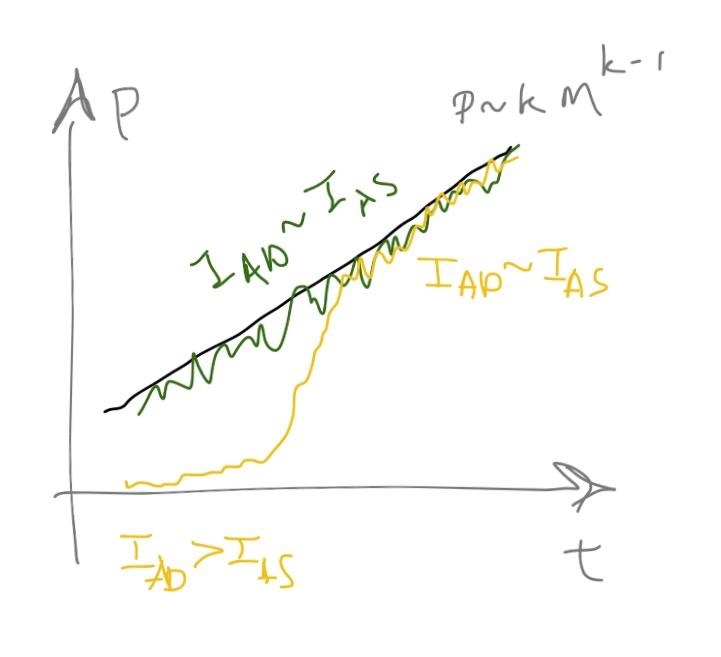

I am turning one of my [comment responses](http://informationtransfereconomics.blogspot.com/2015/09/do-ngdp-futures-markets-already-exist.html?showComment=1441994625382#c8994346016771491458) into a post because I think it has broader interest and relates to [this post on the emergent representative agent](http://informationtransfereconomics.blogspot.com/2015/09/the-emergent-representative-agent-1.html). Commenter Jamie discusses what does and doesn't contribute to GDP -- a discussion that was briefly the [topic of the blogs](http://equitablegrowth.org/2015/06/04/must-read-matthew-yglesias-gdp-measures-gdp/) earlier this summer.

Let's count Jamie's examples that contribute to GDP as "consumption" _C_ and those that don't as "other". If we have two time periods consumption goods 1 and 2 the consumption by people is going to be constrained by

_C₁ + C₂ ≤ GDP_

The actually realized consumption in an economy is likely to be less -- if _C₁ = σ₁_ and _C₂ = σ₂_, then we have:

_σ₁ + σ₂ < GDP_

_σ₁ + σ₂ + ɛ = GDP_

where _ɛ_ is that "other stuff" that is not a part of GDP (_ɛ_ is the distance from the budget constraint line). I drew a picture of this scenario here:

In the two period good case, the ensemble average would give you a point in the middle of the triangle with _ɛ > 0_ and _σ₁ + σ₂ < GDP_.

However! (And this is pretty neat -- it depends on the mathematical properties of [higher dimensional spaces](http://www.penzba.co.uk/cgi-bin/PvsNP.py?SpikeySpheres).)

If you have a lot of consumption periods goods _C₁, C₂, C₃, ... Cn_ subject to the budget constraint _Σ Ci ≤ GDP_, then the ensemble average (expected value) is

_ɛ' + Σ σi = GDP_

with _ɛ' ≈ 0_ simply because most of the points in the higher dimensional space are near the budget constraint (now a hyperplane). This scenario is illustrated here:

The ensemble average (the "representative agent" at the blue point) spends all of their consumption on things that count towards GDP, but individual agents (e.g. _σi_) do not necessarily do so.

**Update 9/13/2015:**

I changed the problem to be a single time period and instead had _i_ index different consumption goods. The intertemporal version doesn't really illustrate the point I was trying to make.
