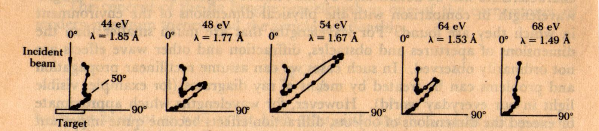

[Simon Wren-Lewis](http://mainlymacro.blogspot.com/2015/09/haldane-on-alternatives-to-qe-and-one.html) quotes Andrew Haldane (chief economist at the Bank of England):

> _QE’s effectiveness as a monetary instrument seems likely to be highly state-contingent, and hence uncertain, at least relative to interest rates. This uncertainty is not just the result of the more limited evidence base on QE than on interest rates. Rather, it is an intrinsic feature of the transmission mechanism of QE._

Haldane continues at the link on Wren-Lewis's blog:

> _All monetary interventions rely for their efficacy on market imperfections. The non-neutrality of interest rates relies on imperfections in goods and labour markets. Stickiness in goods prices and wages ... allow shifts in nominal interest rates to influence real activity. The effectiveness of QE relies on these goods and labour market frictions too. But it relies, in addition, on imperfections in asset markets._

Also at the link, Haldane says:

> _All of which has direct implications for the transmission mechanism for QE. If asset frictions are highly state-dependent and volatile, so too will be the efficacy of QE. Estimates of the impact of QE during periods of high risk premia and disturbed financial conditions may be very different than when asset markets are tranquil and risk premia low._

Let me see if I can sum up here. The effect of QE on interest rates depends on:

-   Price stickiness in goods and labor markets
-   Frictions in goods and labor markets
-   Imperfections in asset markets
-   Risk premia in asset markets
-   State-dependent asset frictions
-   ... etc (more at the link)

The more obvious conclusion, Mr. Haldane, is that QE doesn't work the way you thought ... like, at all. I'm going to put out a bold claim here that adding effect X isn't going to suddenly take you from not being able to describe the data at all to describing it really well.

Imagine if [Davisson and Germer](https://en.wikipedia.org/wiki/Davisson%E2%80%93Germer_experiment) upon discovering scattering peaks from their nickel-oxide crystal target had said that "electron scattering seems likely to be highly state-contingent"? And imagine if they started to add a bunch of very complicated electromagnetic effects coupling electrons to light waves in order to reproduce the diffraction pattern?

Lucky for us, they didn't and instead used their experiment to back up de Broglie's wave-particle theory. \[FYI, the data from that experiment is shown in the picture at the top of the post.\]

QE doesn't [seem that complicated to me](http://informationtransfereconomics.blogspot.com/2014/11/quantitative-easing-cleanest-experiment.html). And [it even works](http://informationtransfereconomics.blogspot.com/2015/04/monetary-regime-change-in-uk.html) for the UK:

The macroeconomic theory everyone seems to be working with (still) is the Wicksellian natural rate of interest. Paul Krugman [mentioned it today](http://krugman.blogs.nytimes.com/2015/09/21/nutcases-and-knut-cases/). It really does create a unifying picture the various views of quantitative easing. Imagine it as the last common ancestor of Austrian, Keynesian and monetarist theories of economics. It proposes the existence of a (not directly observable) natural rate of interest where if rates are below it, inflation accelerates and if rates are above it, inflation decelerates.

Everyone seemed to be operating under the assumption that QE would, _ceteris paribus_, lower interest rates below the natural rate, causing inflation to accelerate. The failure of inflation to accelerate has been rationalized in several ways (not all mutually exclusive):

1.  Not enough QE
2.  It will: next month, next year, ...
3.  Going below the natural rate requires negative nominal rates
4.  QE is expected to be taken away
5.  QE depends on conditions
6.  QE has nonlinear effects on the natural rate

There are more (including [Mark Sadowski's theory](http://informationtransfereconomics.blogspot.com/2015/07/the-sadowski-theory-of-money.html) that QE has actually has lead to inflation at a tiny fraction of the rate predicted by the quantity theory of money), including a #7 that I'll get to later.

No one seems to be arguing for number 1; (almost) everyone thinks the trillions of dollars (in the US) and billions of pounds (in the UK) should have shown something if they were going to.

Number 2 includes the permahawks, the inflationistas, the Austrians and people at Zero Hedge. This view is not irrefutable _per se_, but it's been almost a decade. Long and variable lags, indeed.

Number 3 is the liquidity trap argument.

Number 4 is part of the thinking in a version of the liquidity trap argument (Krugman's 'credible promise of irresponsibility'), but is also the monetarist view.

Number 5 is Haldane's view above, but is not limited to him.

Number 6 can be included in 5, but is also implicit in the calls for a more complicated macroeconomic theory that takes into account financial markets, behavioral factors and non-linear models.

All this leaves out the idea:

> 7\. The Wicksellian view is wrong.

This might be hard to take. Paul Krugman says at the link above: 

> _As I’ve been trying to point out – and as others, notably Ben Bernanke, have also tried to point out – **such monetary wisdom as we possess** starts with Knut Wicksell’s concept of the natural interest rate._

Emphasis mine \[3\]. But it's been around for over a hundred years. It wasn't really based on data (I checked Wicksell's _Interest and Prices_).  Actually, you could easily make this theory fit any data you'd like. Look at interest rates set by the central bank. If there is (accelerating) inflation, interest rates are below the "natural rate" and if there isn't, rates are above the "natural rate". Since there's no indicator of what the natural rate is besides its supposed effect on inflation \[1\].

That is of course unless interest rates head down to zero (or very low values) and you still get disinflation. In that case the Wicksellian rate has to be very negative today and in the US we've been above it since the 1980s (hence the constantly falling inflation). With QE, we've kind of pushed the Wicksellian rate off the bottom of the graph \[2\].

Maybe it's time to stop coming up with new frictions or expectations and just give up on the idea of a natural rate of interest. 

PS I just found out Knut Wicksell and I have the same birthday.

**Footnotes:**

\[1\] It's similar to the market monetarist view where the indicator of the stance of monetary policy is determined by the variable it's supposed to affect ... NGDP.

\[2\] Interestingly, that's also a problem with market monetarism ... the economy has grown, requiring a larger monetary base, so no one can expect the central bank to take back all of the QE, hence some of the QE should have produced inflation. If the inflation rate is falling, it must mean that the inflation rate without the QE would have fallen a lot more.

\[3\] And after writing this, I saw that Mark Thoma put out a bunch of tweets (including a link to Krugman) making references to the natural rate. E.g. [this one](https://twitter.com/MarkThoma/status/646057744236068864).
