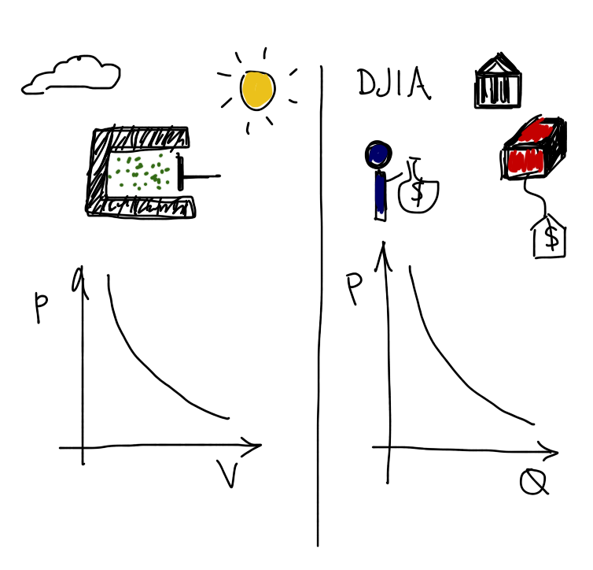
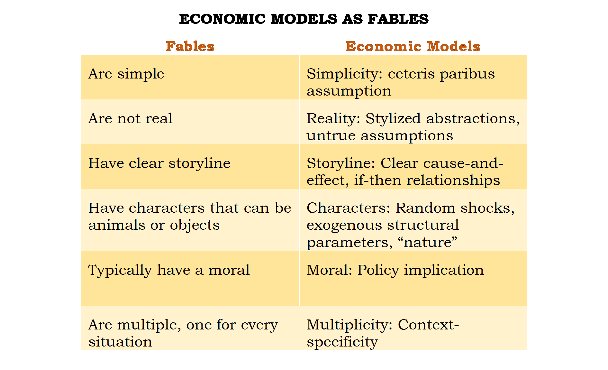
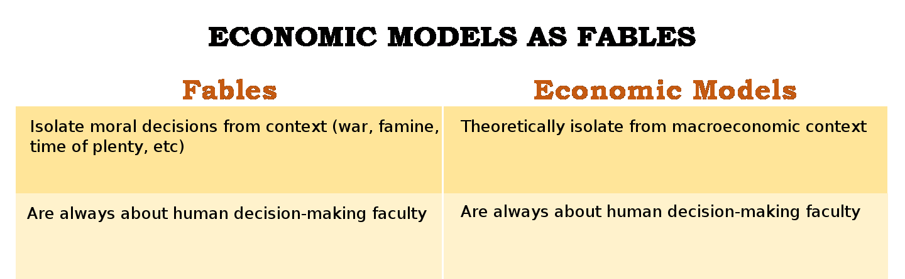

I think I saw [this](http://www.neaydinonat.com/blog/?p=1046) in a couple of places, but I clicked on [this tweet from Noah Smith](https://twitter.com/Noahpinion/status/640244459976937472). Reading this (p)review of Dani Rodrik's view of economics by N. Emrah Aydınonat, I couldn't help think of [Kartik Athreya's view](http://informationtransfereconomics.blogspot.com/2014/06/great-review-of-big-ideas-in.html) of macro. As I haven't read the book yet, I admit I may not have the full story. But let's assume the linked (p)review is accurate. I have two major points, one about frameworks and one about how my critique of economics differs from most other critiques (and thus isn't addressed by Rodrik). The second is dependent on the first. First, we have Rodrik's view of what economic models are:

> _Rodrik argues that models are simplifications. Economic models isolate specific mechanisms and how these mechanisms work under certain conditions. These conditions are specified by the assumptions of the model._ 

> _Rodrik’s account of models has a close resemblance to Uskali Mäki’s account of models. The method of isolation helps economists theoretically remove the influence of some elements on a set of other elements in a given situation, so that they can focus on their desired set of relations in isolation. This makes models similar to experiments. In laboratory experiments, scientists physically isolate the environment from the influence of other factors in order to study the relationships they wish to understand. So, they engage in material isolation. Models are similar to experiments in that they utilize isolation; but that is theoretical isolation rather than material isolation._

I don't think this could have been put in a better way to illustrate what is wrong with this view and how lucky scientists turned out to be. Our basic human intuition that effects tend not to pass through barriers and that increased distance from something diminishes its effect turned out to be right in most physical theories of the world. That is to say even without a theoretical framework for how the world worked, our intuition on what reduced the impact of extraneous influence was right.

In the illustration at the top of this post, I have a pressure vessel with a piston (left) and an economic transaction (right). The general model is isothermal compression/expansion on the left and say a demand curve on the right. The external factors in the physical process, like changing external temperatures or sources of energy/entropy, are mitigated by physically blocking them from the apparatus. The external factors economic model, like macroeconomic conditions and monetary policy, are removed by theoretical fiat.

The thing is, in order to remove something theoretically, you have to have to have an understanding of how the system works in the first place. Nowadays, that piston is theoretically isolated from external factors — in textbooks. That's because we understand thermodynamics. But scientists were lucky that physical isolation with barriers and distance was exactly the kind of isolation required to understand thermodynamic systems.

Essentially, economists need to have the correct [theoretical framework](http://informationtransfereconomics.blogspot.com/2015/05/frameworks-and-bohr-model-analogy.html) in order to theoretically isolate systems (models). Otherwise, this procedure, is in a word, _garbage_.

Scientists were able to boot-strap themselves into the theory because our physical intuitions matched up with the correct theory. In economics, there are all kinds of behavioral biases (endowment effect, money illusion) that our intuitions on how to isolate the system (theoretically or experimentally) should be treated with suspicion.

**So that is my first point:** you need the correct [theoretical framework](http://informationtransfereconomics.blogspot.com/2015/05/frameworks-and-bohr-model-analogy.html) in order to theoretically isolate systems. As an aside, I think this is part of the reason it's so hard to truly demonstrate supply and demand with classroom experiments (see [here](http://informationtransfereconomics.blogspot.com/2015/01/im-not-sure-economists-understand.html) or [here](http://informationtransfereconomics.blogspot.com/2015/01/is-demand-curve-shaped-by-human.html)). We don't know how to isolate the system, so we don't really know how to build a small piece of it. 

But there is another bit of economic intuition that _always_ gets included that I think is a major impasse to theoretically isolating the system: human behavior (via utility maximization or behavioral economics). This is my second point; let's start with this incredible condensation of different criticisms of economics:

> _To cut the long story short, heterodox economists and other social scientists have long argued that economics is disconnected from reality. They thought that it is way too abstract, unrealistic, value laden, atomistic, reductionist etc. Many still argue that that—because of these reasons—economic models cannot explain real world phenomena. That economic models are too abstract and unrealistic—also, mathematical and sometimes mathy—is still the most popular criticism against mainstream economics. And it is in fact true that theoretical models in economics utilize unrealistic assumptions: Perfect rationality, perfect foresight, perfect competition, etc.; you name it! Economics also ignore obviously important explanatory—historical, sociological, institutional, psychological, biological, neural, etc.—factors. In fact, economic models look like fictional worlds, fairy tales, or just so stories that have nothing to do with the real world. But does this mean that economics is useless?_

None of these are my critique of economic theory. The model I am putting forward is abstract, reductionist, mathematical (information theory) ... ignores history, institutions, behavioral factors ... makes unrealistic assumptions (ideal information transfer) ... it even posits a flow of something completely unobservable (information). I've actually [written about](http://informationtransfereconomics.blogspot.com/2015/04/theres-no-natural-constituency-for.html) how this makes my ideas unattractive to the heterodox world.

**This is my second point:** I agree with Rodrik that this list is not what is wrong with economics. What's wrong is that nearly everybody (orthodox and heterodox) agrees human decision-making is central. No one is challenging that assumption, and I think it may be leading economists astray.

In Aydınonat's (p)review, he presents one of Rodrik's slides comparing economic models to fables:

Given my critique above, there are two entries that are missing from the table:

Since we are familiar with moral thinking as humans, the isolation in a fable is justified. We intuitively know that the astronomer who falls in the well isn't representing a scientist working on a cure for cancer. We have a moral framework with which to consider fables (actually people from different cultures have different fables that can have shocking outcomes when considered by other cultures — because we don't have identical moral frameworks). But we don't have a successful economic framework at all; [for example](http://informationtransfereconomics.blogspot.com/2015/05/leeches-rant.html), we don't know what money is or agree what a recession is.

Noah Smith mentioned [recently](http://informationtransfereconomics.blogspot.com/2015/08/is-human-agency-noahs-big-unchallenged.html) that the existence of a trade-off between realistic assumptions and explanatory power of the theory — and that the reason may be big unchallenged assumptions in the theory. As I said at the link, maybe the centrality of human decision-making is that unchallenged assumption.

Basically, including human decision-making by default limits the class of theories you can come up with and not knowing the correct theoretical framework means any theoretical isolation of effects is just a mathematical game unless you guessed the correct theoretical framework. Since part of that guess invariably includes human decision-making, which may be unnecessary if the information transfer model is correct, all economic models may be garbage.

It turns out that they're not entirely garbage, though. The [relationship between utility maximization and entropy maximization](http://informationtransfereconomics.blogspot.com/2015/03/utility-in-information-equilibrium-model.html) sweeps in to save a lot of economic theory. So does the relationship between information equilibrium and supply and demand — [along with several traditional macroeconomic models.](http://informationtransfereconomics.blogspot.com/2015/08/information-equilibrium-as-economic.html)

Economists may have had some of the luck scientists had.

...

**Update 9/10/2015**

Dani Rodrik has [an article at Project Syndicate](http://www.project-syndicate.org/commentary/economists-versus-economics-by-dani-rodrik-2015-09) in which he says:

> _Economics is not the kind of science in which there could ever be one true model that works best in all contexts._

How does he know that? Well, it seems he thinks it logically follows from this:

> _The social world differs from the physical world because it is man-made and hence almost infinitely malleable._

Is it? How does he know that? Empirical evidence? It's really hard for me to look at [this graph](https://research.stlouisfed.org/fred2/series/GDP) and say that it represents a complex aggregation of infinitely malleable economic agents and institutions. It looks like exponential growth with some fluctuations to me (as I [said during the first month of this blog](http://informationtransfereconomics.blogspot.com/2013/04/the-philosophical-motivations.html)). Assuming that kind of complexity is assuming [intractability](http://informationtransfereconomics.blogspot.com/2014/06/what-if-money-was-made-of-vinegar.html). Actually, this is exactly my point in [my Brad DeLong-style "Socratic dialog"](http://informationtransfereconomics.blogspot.com/2015/01/a-socratic-dialog-on-information.html):

> **econ**: \[...\] And we as a profession really like the assumption that at the root of all economics is a complex ocean of human decisions and expectations. What the representative agent thinks determines the course of the economy.
> **info**: Isn't there a contradiction between the complexity of human decisions and a story with a representative agent?
> **econ**: Nope.
> **info**: That doesn't sound very scientific. And the statement that macro data is uninformative is dependent of the assumed complexity of your models. If you think the models have a lot of dimensions, like millions of agents or an infinite number of expected paths of NGDP consistent with current conditions, then the data is uninformative. If you think RGDP is an exponential curve with a constant slope on a log chart, then the macro data is completely informative!
> **econ**: But of course the macroeconomy is complicated! People are complicated and the economy is made of people!
> **info**: An oxygen molecule is a really complicated diatomic system of electrons and quarks confined in baryons held together by meson fields, but an ideal gas is really simple. All the details of quantum mechanics, Yang-Mills theories with mass gaps and _SU(3)xSU(2)xU(1)_ symmetry come down to a single number.
> **econ**: But the economy's really complex!
> **info**: It's about 260 J/kg K ...
> **econ**: I said complex!
> **info**: I guess I'll just keep writing on my blog ...
> **econ**: Good luck with your theory! Remember, think: "complex"!
> **info**: More like intractable.
> **econ**: What was that?
> **info**: Nothing.

...

**Update 13 January 2016**

A good example would be if the Earth's magnetic field had been much stronger, it would have taken a lot longer to figure out the magnetic effects of electricity. Faraday was able to figure it out because even the feeble electric currents he was able to produce created large magnetic fields relative to the Earth's magnetic field.
