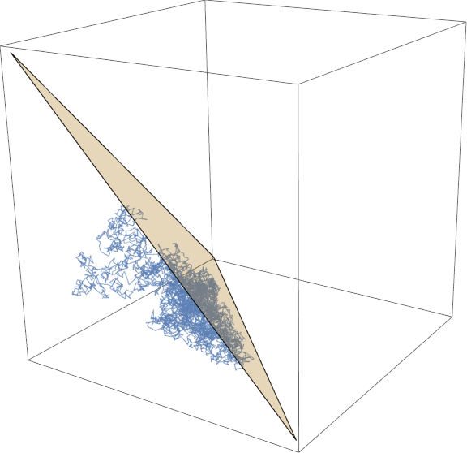
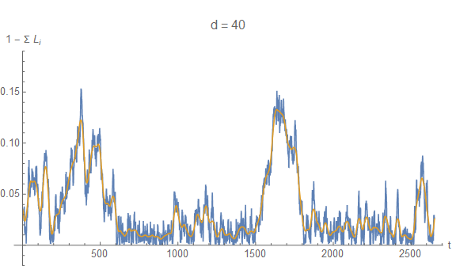

As part of my [outline of paper #2](http://informationtransfereconomics.blogspot.com/2015/10/utility-maximization-and-entropy.html), I put together a couple of posts that create an interesting result. I [previously built](http://informationtransfereconomics.blogspot.com/2015/06/minimac-as-information-equilibrium-model.html) a version of MINIMAC (mini macro model) as described by Paul Krugman [here](http://web.mit.edu/krugman/www/MINIMAC.html) as an information equilibrium/maximum entropy model. One consequence of that model is that you can derive a [natural rate of unemployment](http://informationtransfereconomics.blogspot.com/2015/06/maximum-entropy-and-natural-rate-of.html) fairly simply.

If we treat the problem as a [random walk inside the simplex](http://informationtransfereconomics.blogspot.com/2015/09/a-random-walk-inside-simplex.html) (bounded by the labor supply, pictured at the top), we get a simple model of spikes in the unemployment rate (shown for a d = 40 dimensional simplex):

This is to say that you could get spikes in unemployment for no reason whatsoever ... it's just randomly moving around the employment state space. I think I'd still lean towards [this model](http://informationtransfereconomics.blogspot.com/2015/03/entropy-and-unemployment.html), however.
