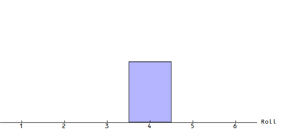
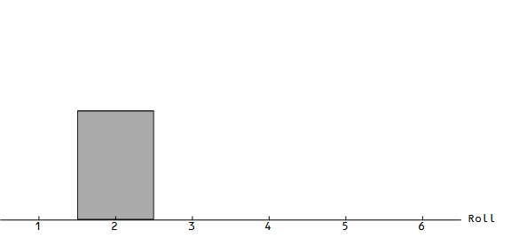

I forgot to add the animations [for the previous post](http://informationtransfereconomics.blogspot.com/2015/10/in-comments-with-ken-duda-on-info-eq.html); here are the two sets of rolling dice approaching a uniform (empirical) distribution as the number of rolls goes to infinity:

