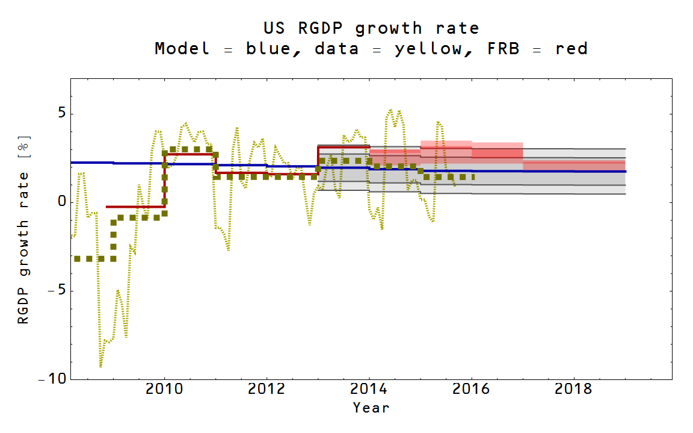

The new core PCE inflation data is out today and I currently [have two head-to-heads comparisons](http://informationtransfereconomics.blogspot.com/2015/09/prediction-aggregation-redux.html) of the IT model with the FOMC forecasts and the forecast of the NY Fed DSGE model. Here are the latest results:

The IT  model continues to do as well as a smoothed version of the data constant inflation model (right graph, blue and green lines). The difference between the NY Fed DSGE model and the IT model is still not significant (the blue and red distributions aren't sufficiently separated to say the models are distinct). Note that the IT model here only has two (independent) parameters, while the DSGE model has something close to 29. It is true that the DSGE model describes more macro variables, but that also means that the inflation rate depends on more than the monetary base (minus reserves).

However, the FOMC was pretty much wrong -- and they control monetary policy! I'll wait until the full year's data comes in to make a call, but 3% inflation for Q4 seems unlikely to me.

**Update 11/3/2015:**

The RGDP growth result is not quite as bad for the FOMC, but the IT model is still better:

