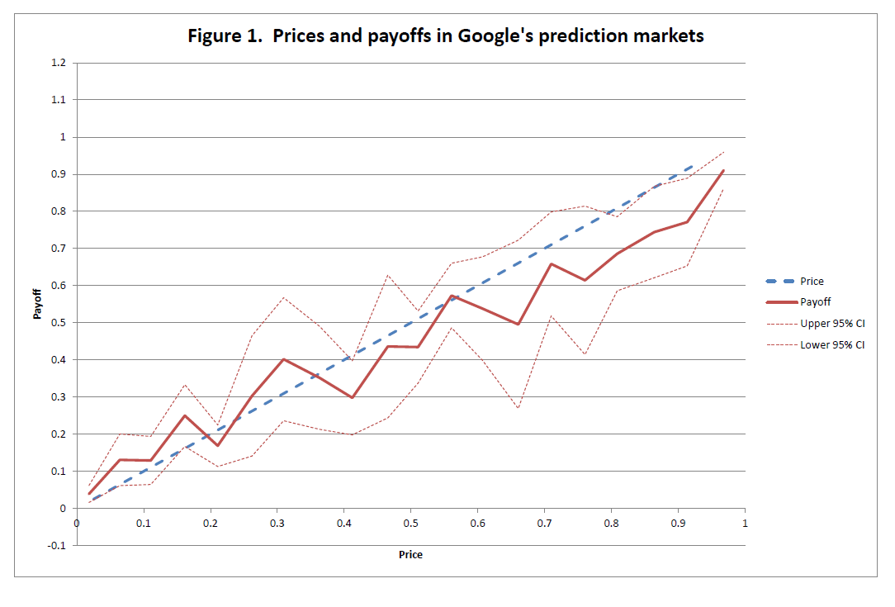
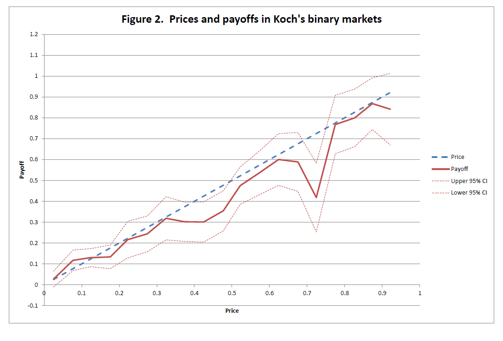
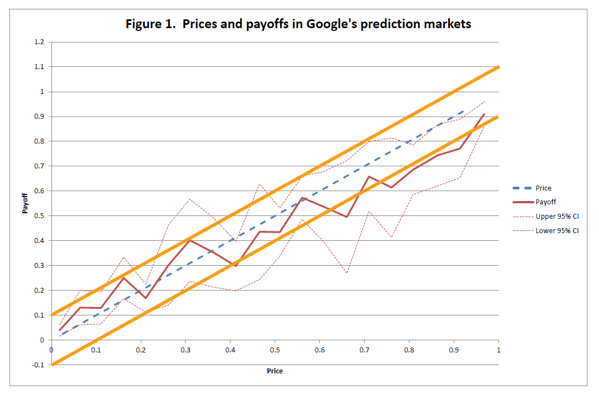
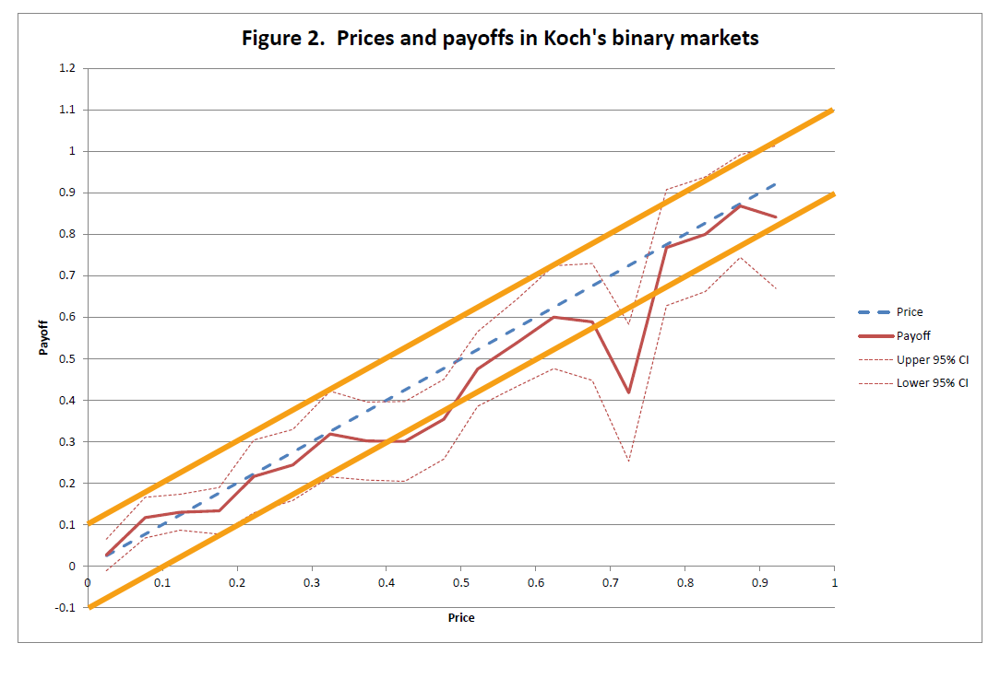

[Alex Tabarrok](http://marginalrevolution.com/marginalrevolution/2015/10/corporate-prediction-markets-work-well.html) linked to a (gated) paper on how "corporate prediction markets work well" as Tabarrok puts it. Robin Hanson in comments says that it depends on what you mean by "worked" — the companies in question discontinued the prediction markets. Anyway, I found an ungated older version \[[pdf](http://www.tinbergen.nl/wp-content/uploads/2013/10/Zitzewitz_Oct29.pdf), broken, now [here](http://www.erim.eur.nl/fileadmin/erim_content/documents/Zitzewitz_Oct29.pdf)\] (it actually points to Koch Industries as the anonymous Firm X in the final paper) and had a look.

Anyway, one thing it points to as evidence of functioning markets are a couple of figures where (scaled) price of the security is roughly equal to the (scaled) payoff:

> _Figures \[1 and 2\] graph the future value of securities, conditional on current price for binary securities at Google \[and\] Koch ... respectively. The prices and future values of binary securities range from 0 to 1, and trades are divided into 20 bins (0-0.05, 0.05-0.1, etc.) based on their trade price.The average trade price and ultimate payoffs for each bin are graphed on the x and y-axes, respectively. A 95% confidence interval for the average payoff is also graphed, along with a 45-degree line for comparison. ..._ 

> _Google and Koch’s markets appear approximately well-calibrated. Both markets exhibit an apparent underpricing of securities with prices below 0.2, and an overpricing for securities above that price level, but this is slight, especially for Koch._

So following the $\hat{p}_{i} = \hat{p}_{j}$ with scaled $p_{i}$ (price in period $i$) indicated with a hat and scaled $p_{j}$ (payoff in period $j$) is some indication the market is forecasting well? That's odd because in the maximum entropy picture, that's exactly what you get with random market exchanges. If we go back to the [maximum entropy asset pricing equation](http://informationtransfereconomics.blogspot.com/2015/05/the-basic-asset-pricing-equation-as.html):

Or more transparently for our purposes, equation (4) right before it

If we scale $p_{i}$ and $p_{j}$ we can remove the pricing kernel so that

The only assumption is that there are a lot of time periods between $i$ and $j$. In the Google example, there were 10 time periods (dimensions $d$), so we should expect deviation from the previous formula that is on the order of

which is about what we see. The Koch Industries markets had 58 periods which means about 2% error, but that market only had 57 participants as opposed to Google's 1,465 which would add roughly errors of 13% and 3%, respectively (using the $1/\sqrt{N}$ [heuristic](https://en.wikipedia.org/wiki/Central_limit_theorem#Classical_CLT)). Adding these in quadrature, we get 13% for Koch and 9% for Google for a back-of-the-envelope error calculation. Since these data are scaled, that means about 0.1 for both markets (after rounding). I added the error bars in orange to the data:

Works pretty well for back of the envelope! Systematic low prices are indicative of [non-ideal information transfer](http://informationtransfereconomics.blogspot.com/2015/05/utility-maximization-matching-and.html).
