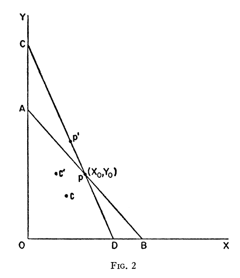

> _The second graph is my maximum entropy version of the [Diamond-Dybvig model](http://informationtransfereconomics.blogspot.com/2015/04/diamond-dybvig-as-maximum-entropy-model.html), but NR and B correspond to p' and p in Figure 2 from Gary Becker's paper below._

[David Glasner identified](http://uneasymoney.com/2015/10/12/representative-agents-homunculi-and-faith-based-macroeconomics/) the argument I was making [here](http://informationtransfereconomics.blogspot.com/2015/09/the-emergent-representative-agent-1.html) (and in the links [here](http://informationtransfereconomics.blogspot.com/2015/10/utility-maximization-and-entropy.html)) as one made by Gary Becker in 1962; here's the comment from David:

> _Jason, Thanks for the link and your follow up post as well. Your argument reminds of the paper "Irrational Behavior and Economic Theory" published in JPE in 1962 and reprinted in Becker's The Economic Approach to Human Behavior in which he showed that budget constraints were sufficient to imply negatively sloped demand curves and other standard microeconomic results. He credited Alchian's 1950 paper in JPE "Uncertainty, Evolution, and Economic Theory" for anticipating his argument. As I recall, Israel Kirzner wrote a comment published by JPE criticizing Becker for not sticking with utility maximization. It might help you to use Becker’s argument as a way of improving your communication with economists who, if they are like me, have trouble comprehending arguments that aren't made in the language we're accustomed to speaking. One other point to consider is that in an intertemporal context with incomplete markets there is no such thing as a true budget constraint because the prices in the budget constraint are largely expected prices not actual prices, so if prices turn out to differ from those that were expected, budget constraints may be violated (households or firms go bankrupt)._

Regarding the language, I [completely agree](http://informationtransfereconomics.blogspot.com/2014/09/the-great-stagnation-information.html) that is an issue. Regarding the intertemporal budget constraint, a post is forthcoming (though it basically involves combining these three posts [\[1\]](http://informationtransfereconomics.blogspot.com/2014/05/the-effect-of-expectations-in-economics.html), [\[2\]](http://informationtransfereconomics.blogspot.com/2014/11/expectations-rational-or-otherwise-and.html), [\[3\]](http://informationtransfereconomics.blogspot.com/2015/06/the-euler-equation-as-maximum-entropy.html)).

[pdf](http://puhep1.princeton.edu/~kirkmcd/examples/EP/gellmann_pr_125_1067_62.pdf)

**1)** \[I give\] _an argument that if the number of different goods \[or intertemporal periods\] d being optimized (the number of axes) is large, there is no need to restrict to the budget constraint (as ‘maximization’ happens automatically as d → ∞)_

> If opportunities were initially restricted to the budget line _AB_ in Figure 2 \[reprinted above\], the average consumption of many households would be close to _p_, the midpoint of _AB_, with different households uniformly distributed around _p_.

And later:

> Inefficient impulsive households might assign equal probabilities to all points in the opportunity set, not just to those on the boundary. The average consumption of a large number of these households would almost certainly be at the set's center of gravity, with households uniformly distributed around this point. ... For example, point _c_ in Figure 2 \[reprinted above\] would be the center of _OAB_ and _c'_, to the left and above _c_, would be the center of _OCD_.

The existence of a large number of goods (or intertemporal periods) _d_ leads to the average being near _p_ without restricting to the line _AB_. As _d → ∞_, we have _c  → p_ because most of the points in a high dimensional volume are near the surface, not the interior.

**2)**_an interpretation of the equilibrium in terms of entropy_

When Becker says uniformly distributed (and equal probabilities) in the quotes above, he is making a maximum entropy (least informative prior distribution) argument. Therefore, [information equilibrium relationships](http://informationtransfereconomics.blogspot.com/2015/08/information-equilibrium-as-economic.html) will apply.

**3)**_the possibility of falling away from the ‘maximum’._

A simple random walk around the simplex leads to cases where occasionally the budget constraint isn't saturated as illustrated (for a single period and _d_ >> 1 goods markets) at [this link](http://informationtransfereconomics.blogspot.com/2015/09/a-random-walk-inside-simplex.html).

**Update:**

I would like to emphasize that while Becker refers to agent actions as irrational (in the title) or "Inefficient" or "impulsive", I take the view that those actions may just be more complex than we can model efficiently ... for example, so complex as to appear random from an outside viewer.

**Update, the second:**

[This Socratic dialog](http://informationtransfereconomics.blogspot.com/2015/02/a-socratic-dialog-on-simple-model-of.html) could be seen as Gary Becker arguing with Kirzner ...
