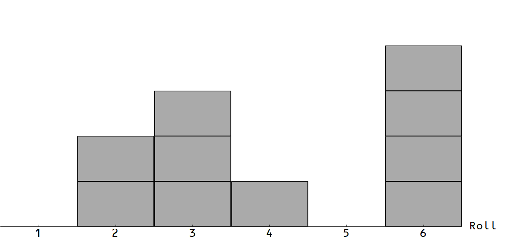
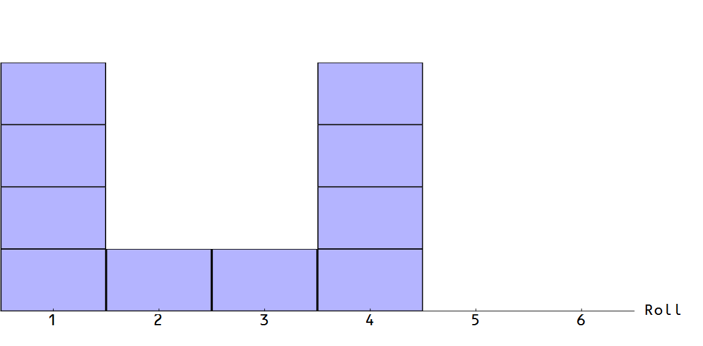
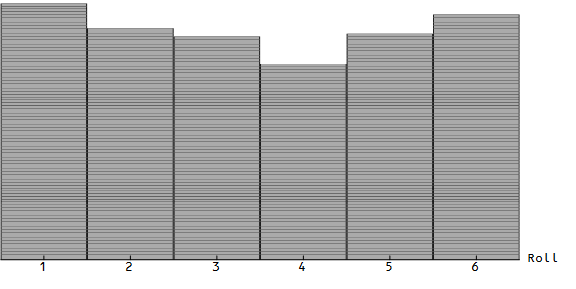
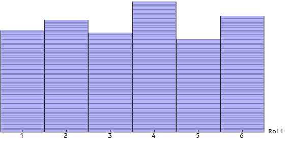
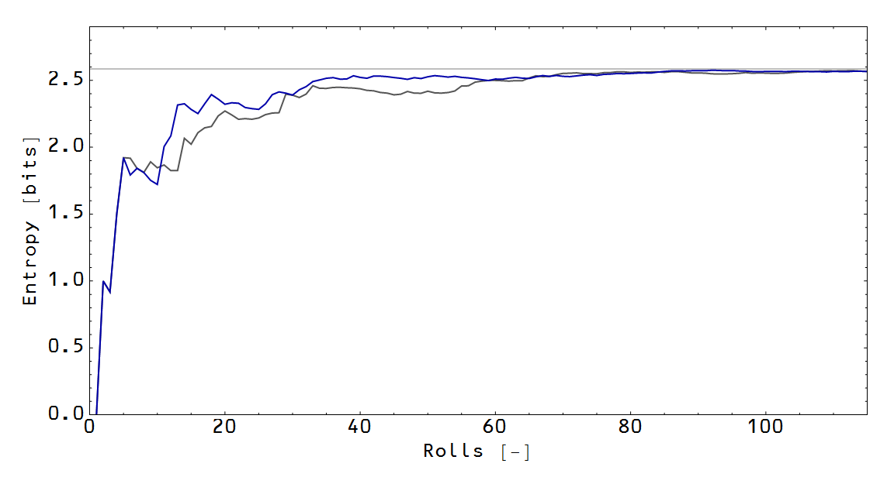
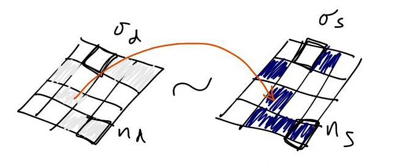

**Update:** [animations](http://informationtransfereconomics.blogspot.com/2015/10/a-uniform-distribution-arises.html)!

In comments with Ken Duda on the [Info EQ 101 post](http://informationtransfereconomics.blogspot.com/2015/10/info-eq-101.html), I realized that the way I've been presenting the example allows confusion between _σ_ and _n_ to occur and also loses out on some important details. So let's set up an example where you roll a six-sided die (_σ_ \= 6) five hundred times (_n_ \= 500) each for "supply" (_ns_) and "demand" (_nd_). This represents 500 widgets being supplied by 6 firms that are going to be allocated among 6 different firms (demand).

_log₂ 6__**n**_ _**n** log₂ 6_

This is why we must assume _nd, ns_ >> 1 (many rolls of the die). Only then do the empirical distributions approximate the theoretical (uniform) distribution (and therefore each other). We can imagine these distributions as the distribution of widgets supplied and the distribution of widgets demanded. They are not equal for _nd, ns_ ~ 1 and you have cases of too many goods supplied for one firm and too few goods supplied to another.

We can also see the empirical information entropy of the two distributions are 1) not exactly equal to each other and 2) not equal to the theoretical entropy of _log₂ 6_ (per widget, gray line):

However all three of these become approximately equal when _nd, ns_ >> 1 (e.g. after 500 rolls). The [KL divergence](https://en.wikipedia.org/wiki/Kullback%E2%80%93Leibler_divergence) also gets smaller (note: log scale) when _nd, ns_ >> 1:

Now the 4x4 boards I drew in the [previous post](http://informationtransfereconomics.blogspot.com/2015/10/info-eq-101.html) represent a 16-sided die roll (_σ_ \= 16) and I showed only about 6 rolls. It looked like this:

In the limit of a large number of rolls _nd, ns_ >> 1 (where information equilibrium becomes a good model), it should look more like this:

