Also on my flight yesterday, I started writing up what I would say in a chalkboard lecture (or brown bag seminar) about information equilibrium.

> **Update:** see [the addendum](http://informationtransfereconomics.blogspot.com/2015/10/in-comments-with-ken-duda-on-info-eq.html) for a bit more on some issues glossed over on the first segment relating to comments from Ken Duda below.

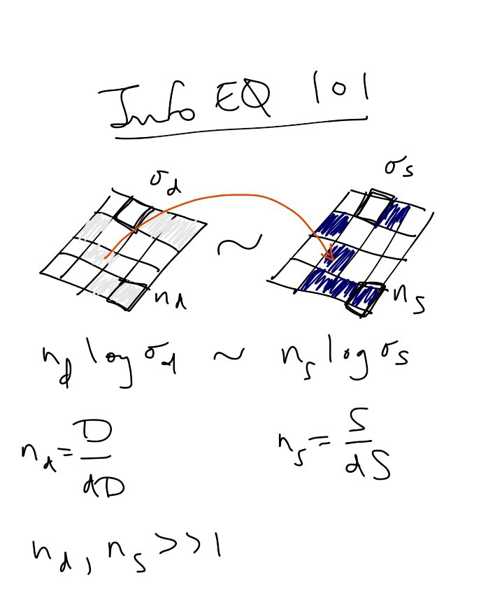

At its heart, information equilibrium is about matching up probability distributions so that the probability distribution of demand matches up with the probability distribution of supply. More accurately, we'd say the information revealed by samples from one distribution is equal to the information revealed by samples from another. Let's say we have _nd_ demand widgets on one board and _ns_ supply widgets on another. The probability of a widget appearing on a square is _1/σ_, so the information in revealing a widget on a square is _\- log 1/σ = log σ_. The information in _n_ of those widgets is _n log σ_.

Let's say the information in the two boards is equal so that _nd log σd = ns log σs_. Take the number of demand widgets to be large so that a single widget is an infinitesimal _dD_; in that case we can write _nd = D/dD_ and _ns = S/dS_.

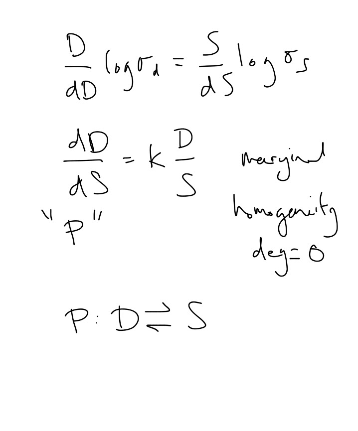

Let's substitute these new infinitesimal relationships and rearrange to form a differential equation. Let's call the ratio of the information due to the number of board positions _log σd/log σs_ the information transfer index _k_.

We say the derivative defines an abstract price _P_.

Note the key properties of this equation: it's a marginal relationship and it satisfies homogeneity of degree zero.

We'll call this an information equilibrium relationship and use the notation _P : D ⇄ S_.

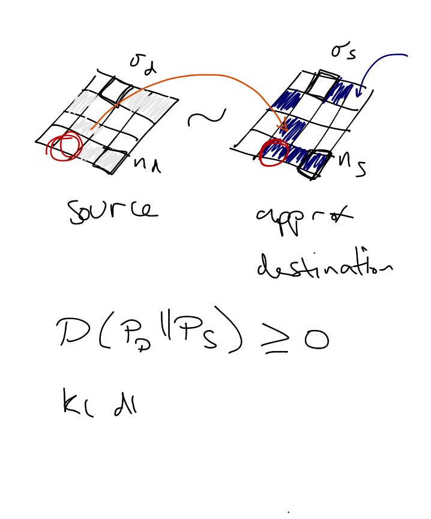

Note that the distributions on our boards don't exactly have to match up. But you don't sell a widget if there's no demand and you don't sell as many widgets as you can (with no wasted widgets) unless you match the supply distribution with the demand distribution.

We can call the demand distribution the source distribution, or information source and the supply distribution the destination distribution. It functions as an approximation to the Platonic source distribution.

You could measure the information loss using the [Kullback-Liebler divergence](https://en.wikipedia.org/wiki/Kullback%E2%80%93Leibler_divergence). However, information loss has a consequence for our differential equation.

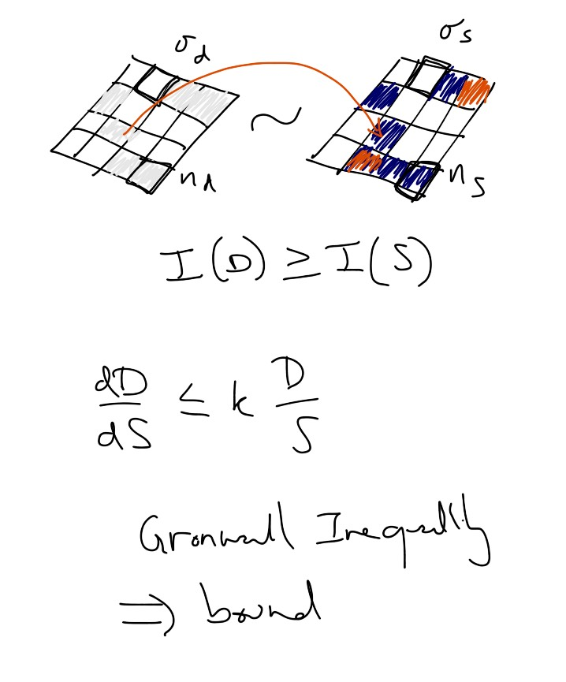

Since the information in the source is the best a destination (receiver) can receive, the information in the demand distribution is in general greater than the information in the supply distribution (or more technically it takes extra bits to decode a D signal using S than it does using D). When these differ, we call this non-ideal information transfer.

Non-ideal information transfer changes our differential equation into a differential inequality.

Which means (via [Gronwall's inequality](https://en.wikipedia.org/wiki/Gr%C3%B6nwall%27s_inequality)) that our solutions to the Diff Eq are just bounds on the non-ideal case.

What are those solutions?

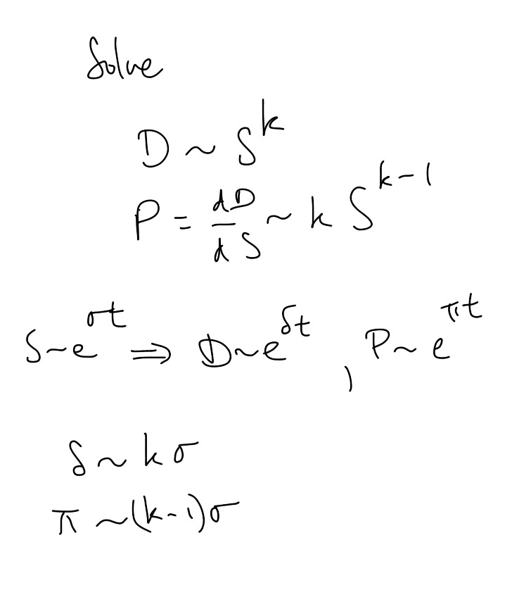

The first solution is where you take both supply and demand to vary together. This corresponds to general equilibrium. The solution is just a power law.

If we say our supply variables is an exponential as a function of time with supply growth rate _σ_, then demand and price are also exponentials with growth rates _δ ~ k σ_ and _π ~ (k - 1) σ_, respectively.

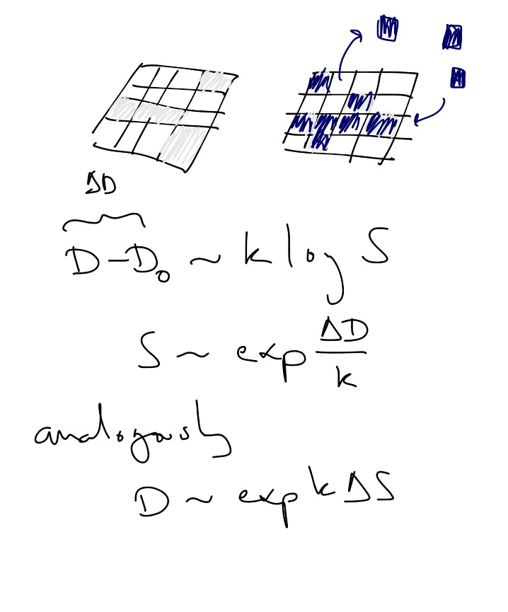

There are two other solutions we can get out of this equation. If we take supply to adjust more quickly than demand when it deviates from some initial value _D0_ (representing partial equilibrium in economics -- in thermodynamics, we'd say were in contact with a ["supply bath"](http://informationtransfereconomics.blogspot.com/2014/06/is-supply-curve-flat.html)), then we get a different exponential solution.  The same goes for a demand bath and supply adjusting slowly.

Use _ΔS_ and _ΔD_ for _S - S0_ and _D - D0_, respectively.

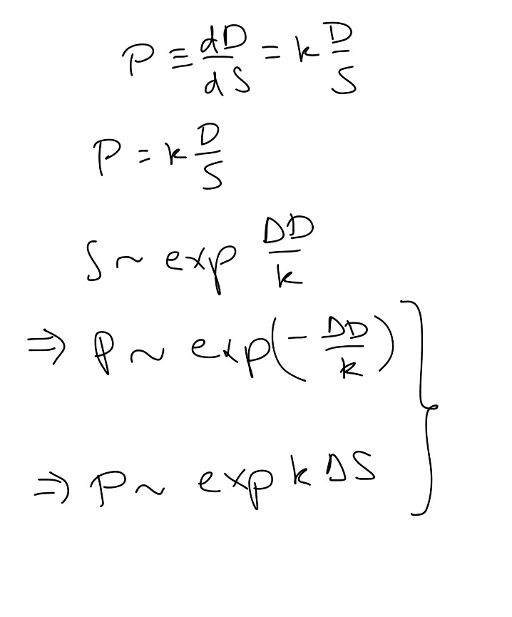

If we relate our partial equilibrium solutions to the definition of price we come up with relationships that give us supply and demand curves. 

These should be interpreted in terms of price changes (the are shifts along the supply and demand curves). If price goes down, demand goes up. If price goes up, supply goes up.

Shifts of the curves involve changing the values of _D0_ and _S0_.

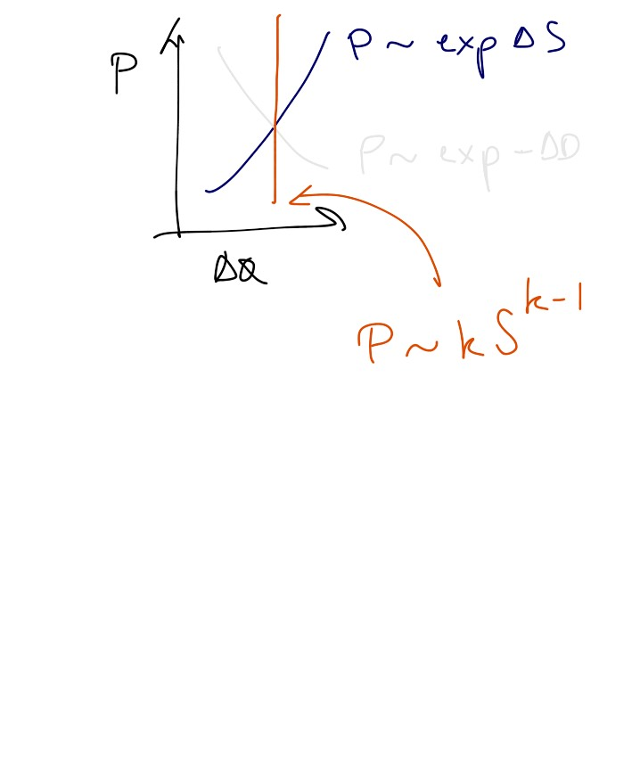

From this we recover the basic Marshallian supply and demand diagram with information transfer index _k_ relating to the price elasticities.

Our general solution also appears on this graph, but for that one _ΔS = 0_ and _ΔD = 0_ since we're in general, not partial equilibrium. We'll relate this to the long run aggregate supply curve in a minute.

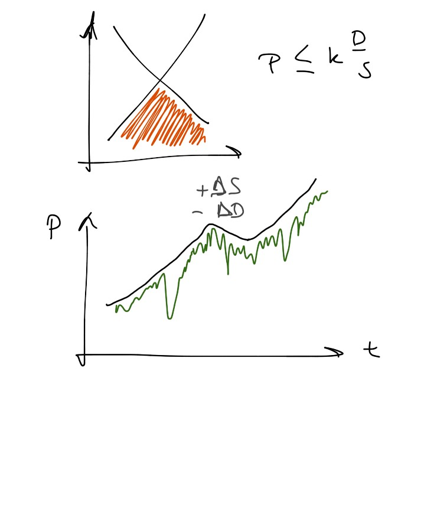

Note that if we have non-ideal information transfer, these solutions all become bounds on the market price, so the price can appear anywhere in this orange triangle.

If we take information equilibrium to hold approximately, we could get a price path (green) that has a bound (black). Normal growth here is punctuated by both a bout of more serious non-ideal information transfer (a recession?) and then a fast (and brief) change supply or demand (a big discovery of oil or a carbon tax, respectively).

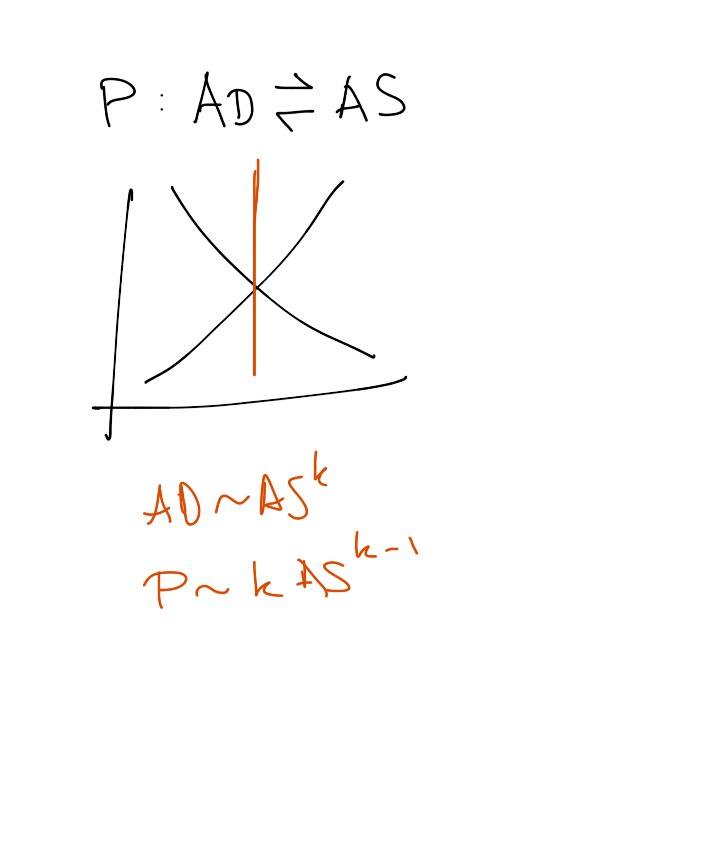

Since we really haven't specified anything about the widgets, we could easily take these to be aggregate demand widgets and aggregate supply widgets and _P_ to be the price level.

We have the same solutions to the info eq diff eq again, with the supply curve representing the short run aggregate supple (SRAS) curve and the general equilibrium solution representing the long run aggregate supply (LRAS) curve.

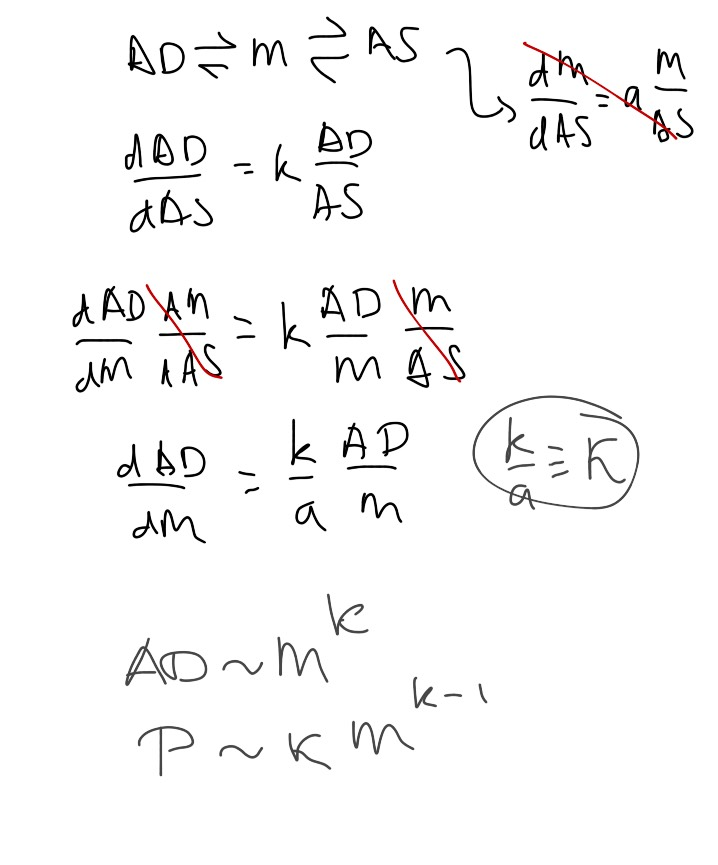

What if we have a more realistic system where aggregate demand is in information equilibrium with money and money is in info eq with aggregate supply?

Using the chain rule, we can show that the model is encompassed in a new information equilibrium relationship holds between AD and money (the AS relationship drops out in equilibrium) with a new information transfer index.

And we have the same general eq solution to the information equilibrium condition where AD grows with the money supply and so does the price level.

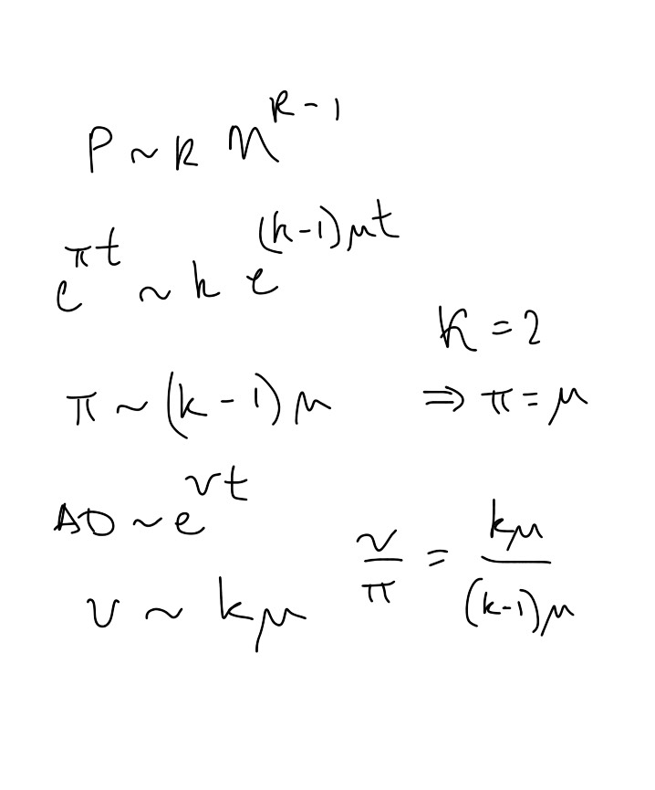

Let's say the money supply grows exponentially (as we did earlier) at a rate _μ_, inflation (price level growth) is _π_ and nominal (AD) growth is _ν_.

Then _π ~ (k - 1) μ_ and _ν ~ k μ_

Note that if _k_ = 2, inflation equals the money supply growth rate.

What else?

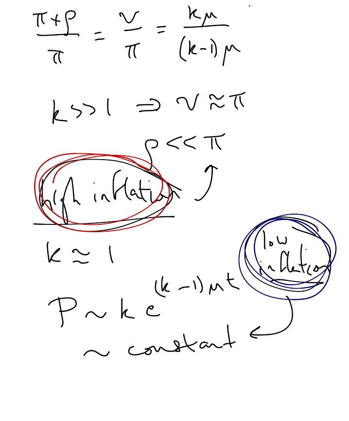

Let's say nominal growth is _ν = ρ + π_, where _ρ_ is real growth and look at the ratio ν/π and write it in terms of the information transfer index and the growth rate of the money supply (which drops out).

If _k_ is very large, then _ν ≈ π_, which implies that real growth _ρ_ is small compared to inflation. That means large information transfer index is a high inflation limit.

Conversely, if the information transfer index is about 1, then the price level is roughly constant (the time dependence drops out to leading order). A low inflation limit.
