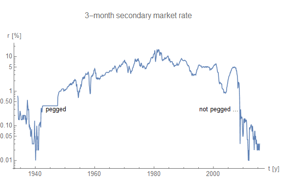

John Cochrane [has a new working paper](http://johnhcochrane.blogspot.com/2015/10/do-higher-interest-rates-raise-or-lower.html) where he looks at interest rate dynamics. I thought I'd do some simulations with the information equilibrium model -- in particular [the DSGE form of it](http://informationtransfereconomics.blogspot.com/2014/12/an-information-transfer-dsge-model.html). First, as noticed by Ken Duda in comments at Cochrane's post (and Cochrane cedes), we don't really have an interest rate peg in the US today. In fact, I think pegged interest rates are important to whether or not interest rate targets can generate inflation (see [here](http://informationtransfereconomics.blogspot.com/2015/10/pegged-interest-rates-hyperinflation.html) and [here](http://informationtransfereconomics.blogspot.com/2015/04/will-uk-be-first-to-exit-great-recession.html)). It's actually fairly obvious in the (short term) interest rate data when rates were pegged and when they weren't:

With that out of the way, let's get to the results of the simulation. I looked at the effect of increasing the monetary base on (nominal) output, inflation and (nominal) interest rates using the DSGE form of the IT model. That means that we're taking the IT index _k = 1/ κ_ to be constant. Therefore we're neglecting the impact of a changing index, which is [the primary reason](http://informationtransfereconomics.blogspot.com/2014/03/the-effects-that-move-interest-rates.html) interest rates start off rising with the monetary base, but then start to fall with the inflection point some time in the 1980s. I normalized all the values to 1 at the first time step _t_ \= 1. And one last thing -- I took the nominal shocks (σ at the DSGE form link) to be zero.

_k_ _κ_

Expanding the base causes interest rates, output and inflation to rise. The rise in inflation is proportional to the rise in the base -- recall _log P ~ (k - 1) log M_. And output rises more than inflation -- expansionary monetary policy causes economic expansion. When _k_ \> 1, there is a tendency for _k_ to fall since the increase of _log n_ is smaller than the increase of _log m_ if _n > m_. Which leads us to our next scenario.

When  _k_ is near 1 (meaning _κ_ is near 1), like the situation in the US today, we have the following behavior:

Monetary expansion leads to lower interest rates and only a small amount of inflation and output. This is not quite the neo-Fisherite result since we still have inflation. In fact, this is the typical IS-LM result: monetary expansion lowers interest rates and raises output.

Finally, we have the case that may represent Japan with _k_ < 1:

Monetary expansion leads to falling inflation, falling interest rates and falling output.  This is the neo-Fisherite result where inflation follows interest rates. Remember, this is output measured in money, [not actual widgets](http://informationtransfereconomics.blogspot.com/2015/10/what-is-real-growth.html). Also note that if we include nominal shocks, that puts a floor on the growth of _n_ roughly equal to [the growth of the labor force](http://informationtransfereconomics.blogspot.com/2015/08/employment-doesnt-depend-of-inflation.html). If the labor force is growing at a rate of 1%, then _n_ won't go below 1% on average (the same for 0% or -1%, as a shrinking labor force may be more relevant for some countries).

Those are cases I've talked about before (in much more confusing ways [\[1\]](http://informationtransfereconomics.blogspot.com/2014/01/strange-new-monetary-worlds.html), [\[2\]](http://informationtransfereconomics.blogspot.com/2014/09/the-liquidity-effect-and.html)), but with the same basic results.

PS Here is the (very simple) code (onset of monetary expansion at _t_ \= 2, well, _ii_ \= 2). To get the other results, I used _k_ \= 1.1 and _k_ \= 0.9

