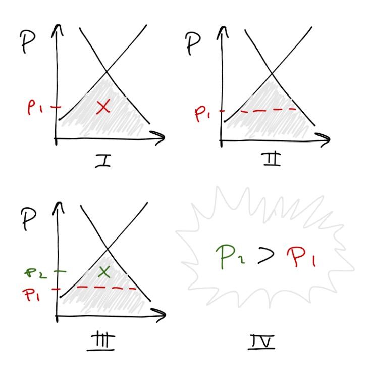

In comments on [the previous post](http://informationtransfereconomics.blogspot.com/2015/10/rejection-1.html), I entertained the possibility of writing a book -- but what would it be about? Equations kill sales (or so I hear), so after some thought I came up with the idea of something like a inverse _Freakonomics_: discussion of the many things that economists think are irrational behavior or cognitive biases, but actually make sense from an information transfer standpoint. Unfortunately I had only one example so far ([money illusion](http://informationtransfereconomics.blogspot.com/2015/03/real-vs-nominal.html)), so on my flight home last night I tried to come up with another.

It turns out the [endowment effect](https://en.wikipedia.org/wiki/Endowment_effect) makes perfect sense if you are dealing with [non-ideal information transfer](http://informationtransfereconomics.blogspot.com/2015/01/is-market-intelligent.html).

In the case of non-ideal information transfer, you end up with a price that [falls below the supply and demand curves](http://informationtransfereconomics.blogspot.com/2013/04/sticky-prices-from-non-ideal.html). Let's take it to be the maximum entropy point (see e.g. [here](http://informationtransfereconomics.blogspot.com/2014/06/seattles-new-minimum-wage-and.html)). This is illustrated in the graph labeled _I_ below:

So the initial sale price _p₁_ that you buy at creates a new bound for how non-ideal that transaction should be in graph _II_. You know that the price shouldn't fall below _p₁_, therefore your asking price might appear near the maximum entropy point in the new smaller space above the red line at  _p₂_ as shown in graph _III_. It's below the equilibrium -- the intersection of the supply and demand curves -- and so could potentially be accepted. Therefore (_IV_), we find that the price you're willing to sell something is higher than the price at which you purchased it: _p₂_ > _p₁_.

Interestingly, this would lead to gradually more and more ideal information transfer as more and more market transactions took place (asking prices above the equilibrium wouldn't get accepted). Therefore maybe the endowment effect is not a problematic cognitive bias, but rather _the reason for the existence of markets_. If people were more willing to take bad deals (didn't have an endowment effect, less loss aversion), you could get a feedback that goes the other way leading to zero prices and broken markets.
